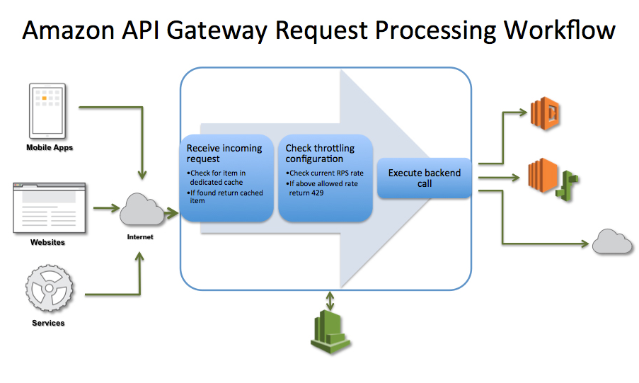
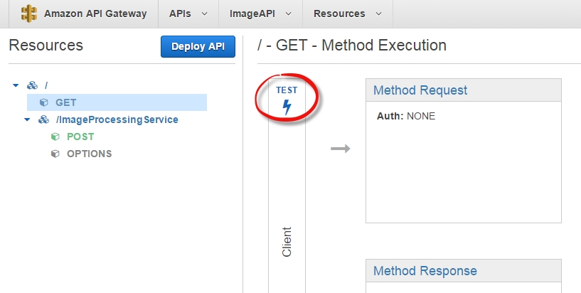

### API Gateway

API Gateway，顾名思义是指外部调用系统 API 的一个入口（事实上是唯一入口）。我们先来看没有 API Gateway，有什么问题：

1. 系统提供的 API 的粒度往往和客户端需要的不同，客户端可能需要与多个服务进行交互。
2. API 服务实例的数量和它们的位置（主机，端口等）可能变化。
3. API 接口可能随时间改变。

所有这些都是因为客户端与系统本身紧耦合而造成的，我们应用架构模式，把系统和客户端解耦，我们通过额外独立出来的一层来解决这个问题，这就是 API Gateway。它是所有客户端请求的入口，并且有着一致的外观（外观模式的应用）和不同粒度的接口，当请求到来时，API Gateway 要做的是把请求代理或路由到合适的服务组件上，再把服务组件返回的数据返回给客户端。这样，系统提供的 API 可以随时调整，因为并没有暴露在外，而且 API Gateway 还可以缓存部分数据达到访问的优化，等等。

用一句话概括就是，一切都可以通过 API 获得，而那个入口就是 API Gateway。我们来看下 Amazon API Gateway 的工作流示意图和用户界面：

Todo:
http://microservices.io/patterns/apigateway.html
http://www.d1net.com/cloud/vendors/359931.html
http://www.oracle.com/us/products/middleware/identity-management/api-gateway/overview/index.html