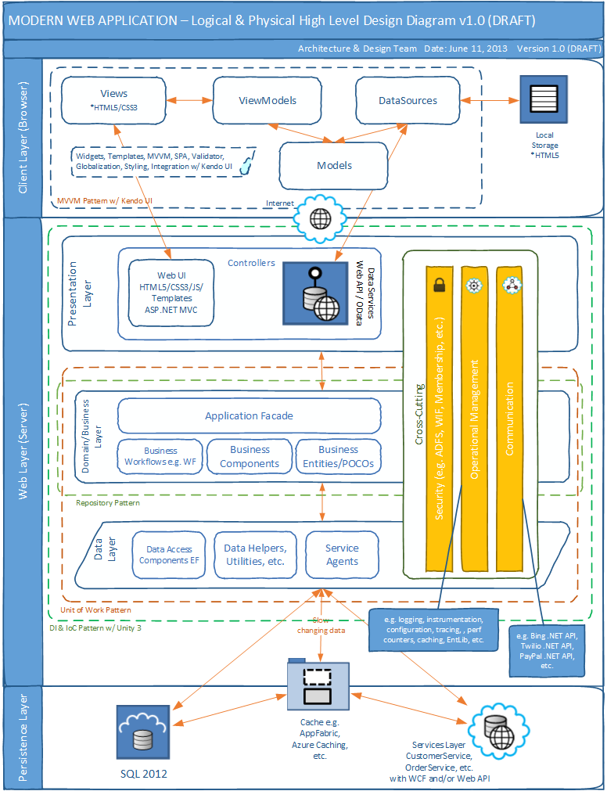

# Layered

---

**免责声明**：本文并不能让你明白代码怎么写，更不会教你写一个系统。本文只限于从概念角度阐述应用于典型企业级应用的架构原则，而且也并不是金科玉律，只是经验总结。如果你喜欢理解概念层面的东西，那么可以继续往下看。

---

分层架构模式是一种最常用的架构模式，因其符合大多数公司的 IT 组织结构，是一种自然的选择。一般情况，这种架构模式把一个系统分为多层，从上到下依次可以分为：表现层（Web Tier），消息传递层（Messaging Tier），业务层（App Tier），持久化层和物理存储层。

需要注意，每一层都是封闭（closed）或叫隔离（layers of isolation）的，即一个 原始的 request 必须经过上层才能到达下层，不能跨层访问，依赖只能存在于邻层之间；有些时候，也可以把某一层设为开放（open）的，来应付某些特殊场景。接下来，我们来看下每层具体负责做什么。

+ **表现层（Web Tier）**：理想情况下，表现层只需要负责 UI 展示和前端交互即可。表现层与后端的数据交换，交给表现层之下的消息传递层来完成。

+ **消息层（Messaging Tier）**：消息层负责外界以及表现层和系统后端的数据交换，比如第三方 HTTP 调用，收发邮件、传真以及 Portal 和后端的数据交换等等。消息层需包含一个请求分发模块（request dispatch module），其负责接收网络请求（web request），初步处理请求，并根据请求业务的不同转发到不同的业务层组件（business component）上，再返回业务层返回的结果给外界调用段或表现层供其展示。目前，以 JSON 为载体的 RESTful API 被更多的采用，但任何其他格式的消息（比如 XML，EDI 等）都是允许的。这里涉及到另一个主题，即 [API Gateway](API Gateway)，产品开放平台化的前提，所有 API 调用都经过 API Gateway，然后到达后端相应逻辑组件，API Gateway 属于消息传递层的一部分。

+ **业务层（App Tier）**：业务层也叫应用层，负责接收业务请求（business request），处理业务逻辑，并调用持久化层的接口进行数据的持久化。

+ -- *控制层* --

+ **持久化层**：持久化层负责接收持久化数据的请求（internal request），然后调用更加底层的物理存储接口（比如 Raw SQL），对数据进行持久化。一般 ORM 框架会被应用来实现面向对象和关系型数据结构的映射。更多细节，请查看 [Persistence](Persistence) 主题。

+ **物理存储层**：物理存储层负责真正的数据存储，就是把数据存储到数据库或文件系统等实体存储介质上。就数据库来说，数据可以按原来的样式（文档式的）以二进制（blob）直接存储，如果数据之后还需要被取出来处理，则可以解析成具体的关系型结构分表分字段存储。

分层架构模式的显而易见的好处是分层解耦，初步降低了系统架构的复杂性。我们来看一个例子：

分层架构的弊端也是非常明显，一个开始很清晰简洁的系统，很可能随着业务复杂性的升级，最终变成一个 monolithic application，以致非常难以维护。接下来我们分别看下每一层具体的职责。

## 业务层

业务层也叫应用层，主要负责处理业务逻辑。向上为消息层或表现层提供数据，向下操作数据模型对象（model）完成数据操作，业务层不直接和数据存储层打交道。我们以 B2B 典型业务 Orders & Invoices 来分析企业级应用在处理业务逻辑的时候，一般会涉及到的几个基本概念。下文中，我们用文档代指订单发票等电子实体，买方和卖方的交易过程可以看作是交换各种文档的过程。

### 数据交换（Data Exchange）

一个系统不同模块之间必然需要数据交换，我们可以通过以下几种方式实现数据交换的目的：

1. HTTP request；
2. 数据库作为数据交换的媒介；
3. 共享 Java 对象。

HTTP Post 的请求应是严格定义的数据格式，比如 XML（比如 Ariba cXML），JSON 以及 EDI 等。从程序角度来看，数据库可以通过两种方式来操作，一种是 ORM 映射，操作对象即操作数据库，另一种是直接通过数据库层面的调用，比如程序调用存储过程或函数等，这种方式不涉及映射关系，可以执行任何操作。共享 Java 对象并不是最优选择，因为这样导致不同模块耦合在一起，不利于维护和扩展。其中，只有 HTTP Post 是真正的分离解耦。业务系统中，往往不同的业务方（比如买家和卖家）需要在数据层面也要进行隔离，这时候通过数据库作为媒介进行数据交换显然是不可行的，所以唯一的选择就是 HTTP Post 方式。

在后文中，我们把数据交换的媒介，无论是数据库还是 HTTP request 等其它方式，统称为**数据交换区域**。

### 队列（Queue）

基于数据交换区域，我们还需要对数据的顺序进行管理，这时候我们就用到了队列的概念，队列的底层就是数据交换区域。以数据库为例，对队列的操作分别对应如下数据库操作：

- enqueue 对应数据库的 insert 操作；
- dequeue 对应数据库的 select and delete（可能是 soft delete） 操作；
- requeue 对应数据库的 update 操作。

队列应该看作是数据的来源，存放在队列中的数据，我们称作条目（item）。后文我们把队列当作直接的数据来源，但要记住队列的底层是数据交换区域。除作为原始数据来源的队列，还有一种类型的队列，称作**作为数据暂存的队列**，也叫内存队列，即数据生产者把产生的数据放入一个队列，数据消费者从该队列里拿出来后续处理，一般会用到多个队列来达到不同生产者和消费者之间的交互。而针对一个生产者，往往有多个消费者与其对应，提高并发性。这就是典型的“**生产者/消费者**”模型。

### 消息泵（Loader，也称作 Looper、Poller、Producer）

消息泵负责不断地从数据队列中拾取条目，加载到程序上下文，供后续处理。在消息泵拾取条目之前，可能需要对条目进行一些状态的设置，比如把条目的状态从 Queued 改成 Processing。那么供消息泵拾取的数据队列中的条目是哪儿来的呢？最普遍的情况是用户通过图形界面或其他接口操作的时候生成的，还有就是位于当前应用程序上游的其它应用程序生成的等等，而且这时候条目会有一个初始状态，比如 Queued。此外，消息泵还可能需要对取到的条目进行一些包装和预处理等，比如生成工作条目（workitem）等。最后，消息泵把工作条目放入内存队列，让工作者（Worker）接着处理。

消息泵本身必须是一个线程。

### 工作者（Worker，也称作 Consumer）

工作者负责处理更加具体的业务请求。工作者从内存队列（消息泵放入工作条目的队列）取出工作条目进行处理。就比如我们开头说的那个例子，工作者处理工作条目，并最终把文档从卖方发到买方，以及相关消息提醒邮件通知等操作，中间还可以加入其它业务相关操作，比如 invoice sign、legalization 等。等所有业务处理完毕，还需要修改数据队列的条目的状态，比如从 Processing 改成 Processed。这里是业务处理的核心模块。

工作者本身必须是一个线程。为了提高并发，工作者往往不止一个。

### 处理程序（Handler）

工作者的工具就是处理程序。工作者用处理程序来处理更加细化的业务逻辑，比如解析数据格式以及有效性验证等。上述例子中，处理程序同时也是 XML 解析器，解析 XML 的同时做相关数据操作以及有效性验证等。处理程序往往不止一个，这里是业务处理密集区。

### 传播（Propogation）

工作者处理工作条目，并把文档（比如在卖方生成的）从卖方发到买方，这一过程我们给它一个名字就叫传播，其中包含复制文档并传到别处的意思。注意，这个概念只是一个概念，并不具备编程层面的体现，这个传播过程，可能就是工作条目里的一段代码，通过 HTTP request 或者其它方式发给买方。

### 处理器（Processor）

处理器就相当于工作者的地位，但工作者是一个线程，不断从队列里获取工作条目执行，而处理器则是伺服的状态。外部发来请求（比如 HTTP request），处理器开始处理相关任务，处理完毕一个任务条目，则停止直到下一个请求的到来。因此，处理器本身不需要是一个线程。

处理器也会用到处理程序（Handler）来处理更加细化的业务逻辑，比如数据报文的解析等。就上述例子而言，工作者处理工作条目，并最终把文档从卖方发到买方，其实就是发一个请求（HTTP request）给买方的处理器，买方处理器接到请求，开始解析数据报文，并持久化相关数据和文档（这些文档是卖方发过来的文档，一式两份分别存在于卖方和买方的持久化数据区域），当然同时包含一些文档以及数据区域的状态设置。可以看出，处理器在这里的角色非常类似工作者，只是它们的工作状态不一样而已，一个是轮询，一个是伺服。

### 路由（Routing）

路由，顾名思义就是把目标对象（这里指文档），定向到目的地的过程，简单说就是决定去哪儿的过程。一般文档需要被路由到外部系统，但也有直接“路由”到当前系统内部的情况：

+ Online，也即当前系统，用户可以通过界面直接查看；
+ 通过某种数据交换协议（Ariba cXML、EDI 等）路由到外部系统；
+ 通过 HTTP 发送到某个网络地址；
+ 通过邮件、传真等形式直接发给用户；
+ 数据交换区域，供其它系统获取。

路由是数据离开当前系统的最后一步，也是系统集成的“焊点”。

### 作业（Task）

那些时间不敏感的任务，我们可以先放在队列里，然后由专门负责执行作业的进程来执行。执行作业也需要一个作业泵拾取作业，然后分发给作业执行者（可以是上文提到的工作者），然后执行者根据作业类型（Java Task、URL request 等）的不同分类处理。最后，修改队列里的作业的状态，比如从 Processing 改成 Processed 等。

作业是独立于主流程的额外的逻辑完成方式，所以要作为作业执行的任务必然逻辑比较独立和完整。

### 监控器（Monitor）

消息泵是整个工作流程的发起点，工作者是核心处理模块，我们需要确保消息泵以及后续处理模块的健壮性和错误恢复能力，这就需要监控。监控器监控队列条目的状态，如果处理超时（比如，状态为 Processing 且超过最大时限），则重置成 Queued 状态，以使其可以重新被取出来再处理一次，直到达到最大重试次数而以失败告终（状态会被置成 Failed），或者成功处理（状态被置成 Processed）。

监控器是一个独立的线程，定时去查看数据源队列的条目的状态。

### 后台程序（Daemon）

后台程序类似于后台独立作业，也是独立在后台运行完成具有独立性的工作，但一般用于更高级别的任务，比如数据同步等。

后台程序是一个独立的线程。

// TODO This subject should be revised to an article later.
参考:
软件架构模式(Layered Arch)
SAP 白皮书
Chris Richardson
知乎·程序人生
题图：
https://pixabay.com/go/?t=list-shutterstock&id=405078397
