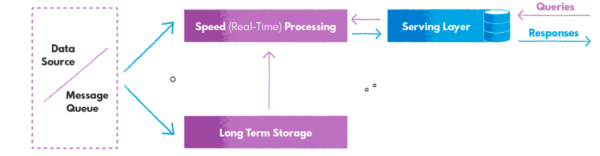
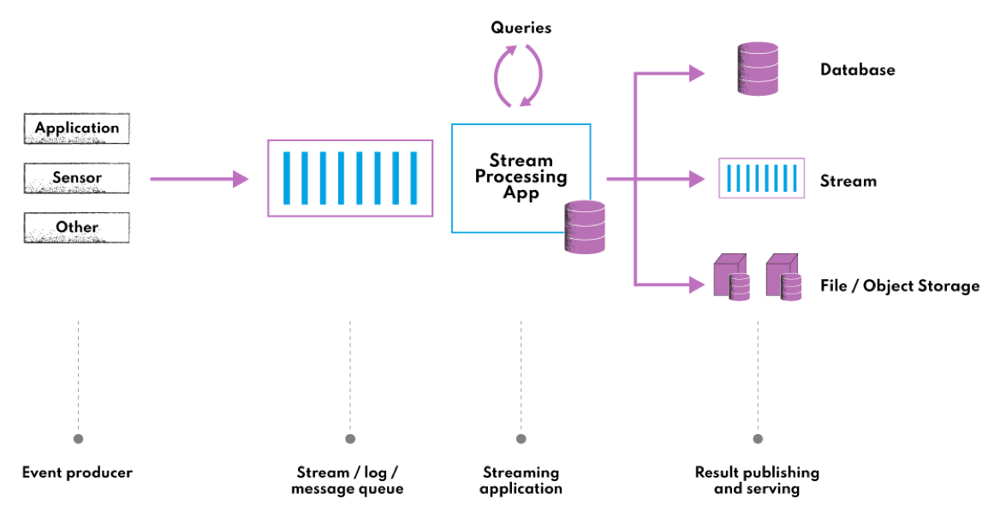
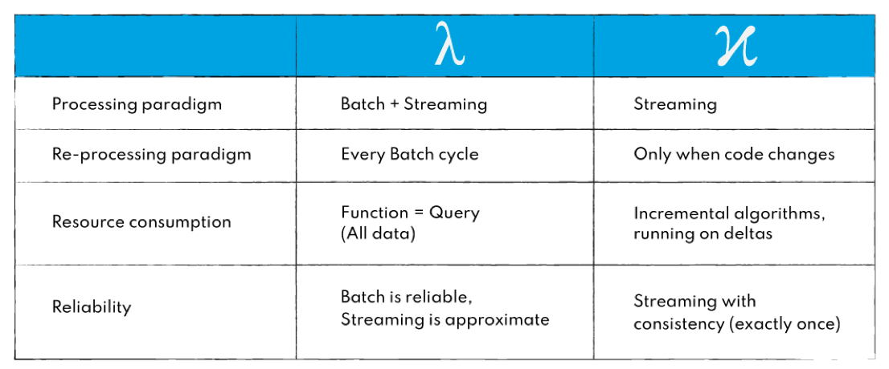

# 数仓架构——有批也有流的世界

## 批 & 流

批先独立成长起来，然后流的需求出现。

### 混合批流——第一代架构

Lambda(λ) 架构是最简单最容易自然长成的批流架构，但问题也很突出：

① 相同业务逻辑就批和流进行两次编程，最终维护两个代码库，两个研发团队。

② 批流分别独立处理和输出结果，数据一致性是潜在风险（原因如不同的代码缺陷）。

### 流式架构（或批流一体架构）——第二代架构

Kappa(κ) 架构的核心是流式处理，不再有独立的批处理。

来源：https://nexocode.com/blog/posts/kappa-architecture/

但问题是，供事后分析的离线数据或批视图（Batch View）怎么存储。批存储介质需要满足如下特性：

① 支持大规模数据集 - 至少是分布式存储介质。

② 支持事务性增删改 - 因为要通过流式计算生成离线数据。

③ 自动按时间封版 - 自动按时间（比如天级或小时级）分区。

#### Kappa(κ) vs. Lambda(λ)

来源：https://nexocode.com/blog/posts/lambda-vs-kappa-architecture/
