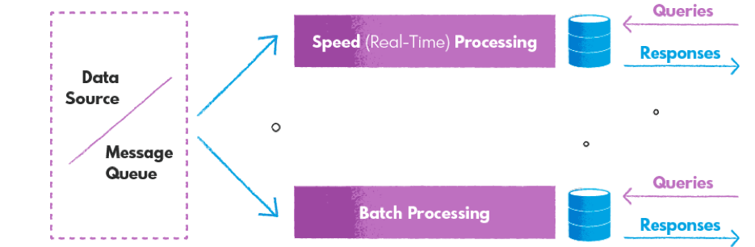
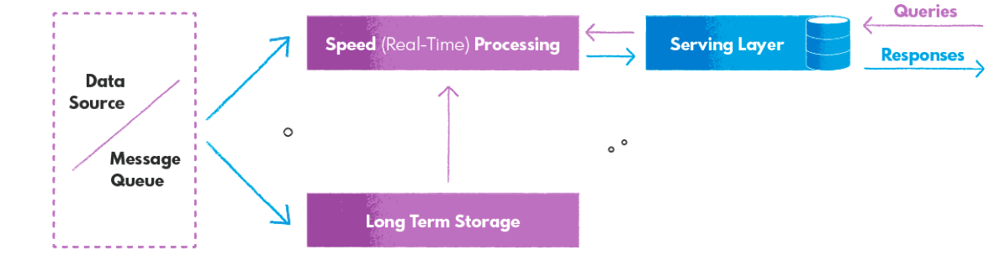
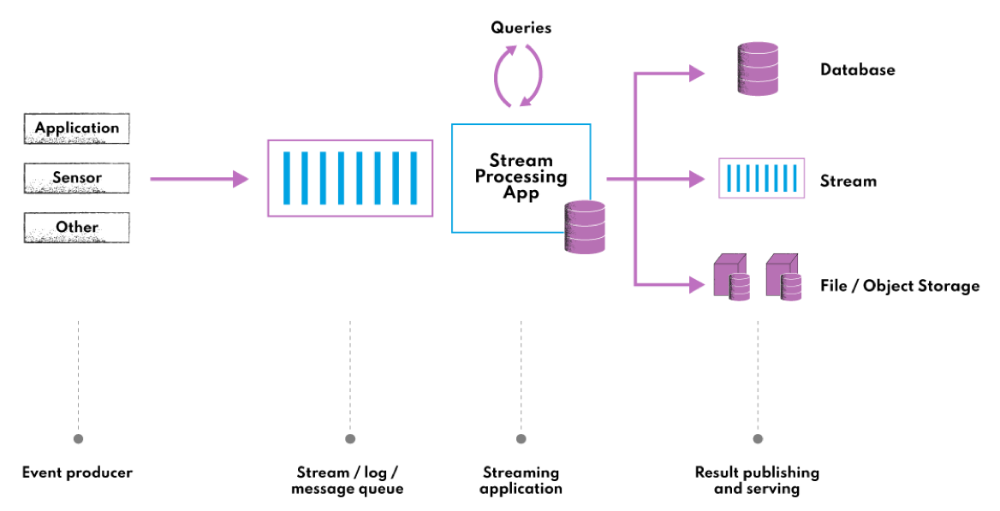
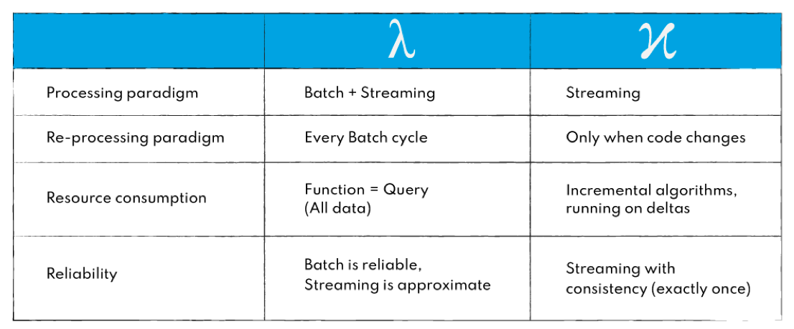
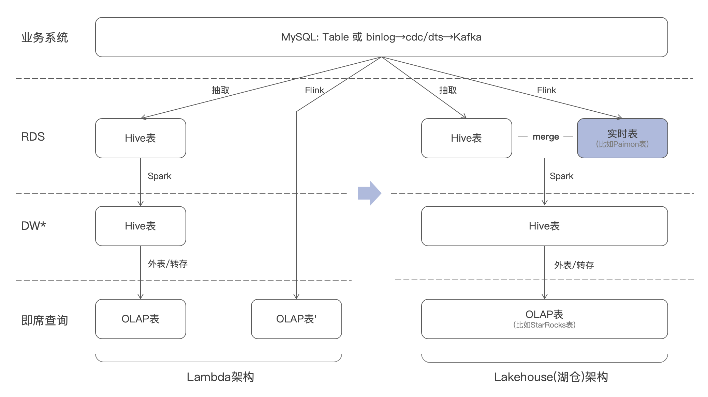

# 数仓架构——有批也有流的世界

## 批 & 流

批先独立成长起来，然后流的需求出现。

### 独立批流——第一代架构

Lambda(λ) 架构是最简单最容易自然长成的批流架构，但问题也很突出：

① 相同业务逻辑就批和流进行两次编程，最终维护两个代码库，两个研发团队。

② 批流分别独立处理和输出结果，数据一致性是潜在风险（原因如不同的代码缺陷）。



### 批流一体——第二代架构

Kappa(κ) 架构的核心是流式处理，不再有独立的批处理。





来源：https://nexocode.com/blog/posts/kappa-architecture/

但问题是，供事后分析的离线数据或批视图（Batch View）怎么存储。批存储介质应该是一个 Analytics SQL Database，且需要满足如下特性：

① 支持大规模数据集（Large-Volume） - 至少是分布式存储介质。

② 支持事务型增删改（ACID） - 因为要通过流式计算生成离线数据。

③ 支持高并发写（可以低并发读，High-Performance） - 因为要通过流式计算不断更新数据集。

④ 自动按时间封版同时还能追溯历史变更 - 自动按时间（比如天级或小时级）分区。

⑤ 支持 SQL 查询 - 业务人员更熟悉 SQL。

备选存储介质：

- 实时表或开放表格式（Open Table Formats，比如 Delta Lake、Apache Iceberg、Apache Hudi、Apache Paimon）
- ~~Apache Doris~~
- ~~Apache Phoenix(HBase)~~
- ~~Apache Ignite - As a SQL Database~~
- ~~Apache Pinot（Shopify's use-case）~~
- ~~Apache Kudu~~

> Delta Lake
> 
> ACID Transactions: Protect your data with serializability, the strongest level of isolation.
> DML Operations: SQL, Scala/Java and Python APIs to **merge, update and delete datasets**.
> 
> 
> Apache Iceberg
> 
> Iceberg is a high-performance format for huge analytic tables. Iceberg brings the reliability and simplicity of **SQL tables** to big data, while making it possible for engines like Spark, Trino, Flink, Presto, Hive and Impala to safely work with the same tables, at the same time. Iceberg supports flexible SQL commands to **merge new data, update existing rows, and perform targeted deletes**. Iceberg can eagerly rewrite data files for read performance, or it can use delete deltas for faster updates.
> 
> 
> Apache Hudi
> 
> Hudi brings **transactions** to data lakes.
> Hudi brings **row-level updates/deletes** to data lakes.
> Hudi brings CDC and indexes to data lakes.
> 
> 
> Apache Paimon
> 
> A **lake format** that enables building a Realtime Lakehouse Architecture with Flink and Spark for both streaming and batch operations. Innovatively combines lake format and LSM structure, bringing **realtime streaming updates** into the lake architecture.
> 
> Real-time **Updates**: **Primary-key table** supports real-time streaming updates of large amounts of data. Real-time query within 1 minute.
> 
> Flexible Updates: Defining Merge Engines, **update records** however you like. Deduplicate to keep last row, or partial-update, or aggregate records, or first-row, you decide.


重要参考：[Kappa Architecture is Mainstream Replacing Lambda](Kappa-Architecture-is-Mainstream-Replacing-Lambda-Kai-Waehner.pdf)

#### Kappa(κ) vs. Lambda(λ)



来源：https://nexocode.com/blog/posts/lambda-vs-kappa-architecture/

## 湖仓（Lakehouse）

**湖仓**这一命名并不能准确体现同时支持离线和实时的数据仓库的核心概念，就像其渊源之一数据湖这一概念也不能传达任何有价值的信息一样。

更准确的命名是——**离线实时一体数仓**，简称一体数仓。但湖仓已经是既定命名事实，故保留此叫法。但数据湖、湖表等叫法直接弃用，数据湖概念大于实质弃用，湖表用实时表替代。

话说回来，湖仓的核心变革在于**实时表或开放表格式**的引入，实时表或开放表格式之于实时数仓，就相当于 Hive 之于离线数仓，其为实时数据带来了**结构**，从而在数仓范畴让实时数据读写成为可能。



### 实时表接入步骤

以阿里云大数据平台为例，说明接入实时表（以 Paimon 表为例）——即实时表入仓——所需步骤。

#### 一、业务库 MySQL 表 → Kafka

创建数据同步（DTS）任务，在表维度创建任务，区分全量还是增量同步等。

#### 二、Kafka → Paimon 表

创建 Flink 任务，在业务库维度创建任务，任务启动（选择无状态启动）前，需要先通过离线数据表初始化 Paimon 表。

**Flink SQL**

```sql
QkVHSU4gU1RBVEVNRU5UIFNFVDsKSU5TRVJUIElOVE8gYGp1emktcGFpbW9uLWxha2Vob3VzZS1jYXRhbG9nYC5vZHMub2RzX2FmdGVybG9hbl9sYXdfbGF3X2hlbHBlcl9mc19kZWJ0X3N0b3JlX3J0X2ZkClNFTEVDVAogICAgQ0FTVChKU09OX1ZBTFVFKHZhbHVlX2RhdGEsJyRbMF0uaWQnKSBBUyBCSUdJTlQpICAgICAgQVMgICAgYGlkYCAgCiAgICAsSlNPTl9WQUxVRSh2YWx1ZV9kYXRhLCckWzBdLm9yZGVyX2lkJykgICAgICAgICAgICAgICBBUyAgICBgb3JkZXJfaWRgCiAgICAsSlNPTl9WQUxVRSh2YWx1ZV9kYXRhLCckWzBdLmRlYnRfZmxhZycpICAgICAgICAgICAgICBBUyAgICBgZGVidF9mbGFnYAogICAgLEpTT05fVkFMVUUodmFsdWVfZGF0YSwnJFswXS5kZWJ0X2NvZGUnKSAgICAgICAgICAgICAgQVMgICAgYGRlYnRfY29kZWAKICAgICxKU09OX1ZBTFVFKHZhbHVlX2RhdGEsJyRbMF0uZGVidF9uYW1lJykgICAgICAgICAgICAgIEFTICAgIGBkZWJ0X25hbWVgCiAgICAsSlNPTl9WQUxVRSh2YWx1ZV9kYXRhLCckWzBdLmRlYnRfZGF0ZScpICAgICAgICAgICAgICBBUyAgICBgZGVidF9kYXRlYAogICAgLEpTT05fVkFMVUUodmFsdWVfZGF0YSwnJFswXS5jYXBpdGFsX25hbWUnKSAgICAgICAgICAgQVMgICAgYGNhcGl0YWxfbmFtZWAKICAgICxKU09OX1ZBTFVFKHZhbHVlX2RhdGEsJyRbMF0uY2FwaXRhbF9jb2RlJykgICAgICAgICAgIEFTICAgIGBjYXBpdGFsX2NvZGVgCiAgICAsSlNPTl9WQUxVRSh2YWx1ZV9kYXRhLCckWzBdLmRlYnRfdHJhbnNmZXJvcicpICAgICAgICBBUyAgICBgZGVidF90cmFuc2Zlcm9yYAogICAgLEpTT05fVkFMVUUodmFsdWVfZGF0YSwnJFswXS5ndWFyYW50ZWVfc2lkZScpICAgICAgICAgQVMgICAgYGd1YXJhbnRlZV9zaWRlYAogICAgLEpTT05fVkFMVUUodmFsdWVfZGF0YSwnJFswXS50aGlyZF9uYW1lJykgICAgICAgICAgICAgQVMgICAgYHRoaXJkX25hbWVgCiAgICAsSlNPTl9WQUxVRSh2YWx1ZV9kYXRhLCckWzBdLmRlYnRfYXNzaWduZWUnKSAgICAgICAgICBBUyAgICBgZGVidF9hc3NpZ25lZWAKICAgICxDQVNUKEpTT05fVkFMVUUodmFsdWVfZGF0YSwnJFswXS5kZWJ0X3ByaW5jaXBhbCcpIEFTIERPVUJMRSkgQVMgICAgYGRlYnRfcHJpbmNpcGFsYAogICAgLENBU1QoSlNPTl9WQUxVRSh2YWx1ZV9kYXRhLCckWzBdLmRlYnRfaW50ZXJlc3QnKSBBUyBET1VCTEUpICAgICAgICAgIEFTICAgIGBkZWJ0X2ludGVyZXN0YAogICAgLENBU1QoSlNPTl9WQUxVRSh2YWx1ZV9kYXRhLCckWzBdLmRlYnRfcGVuYWx0eV9pbnRlcmVzdCcpIEFTIERPVUJMRSkgIEFTICAgIGBkZWJ0X3BlbmFsdHlfaW50ZXJlc3RgCiAgICAsQ0FTVChKU09OX1ZBTFVFKHZhbHVlX2RhdGEsJyRbMF0uZGVidF9hc3NpZ25lZV9mZWUnKSBBUyBET1VCTEUpICAgICAgQVMgICAgYGRlYnRfYXNzaWduZWVfZmVlYAogICAgLEpTT05fVkFMVUUodmFsdWVfZGF0YSwnJFswXS5kZWJ0X25vdGljZV90eXBlJykgICAgICAgQVMgICAgYGRlYnRfbm90aWNlX3R5cGVgCiAgICAsSlNPTl9WQUxVRSh2YWx1ZV9kYXRhLCckWzBdLmRlYnRfbm90aWNlX3RpbWUnKSAgICAgICBBUyAgICBgZGVidF9ub3RpY2VfdGltZWAKICAgICxKU09OX1ZBTFVFKHZhbHVlX2RhdGEsJyRbMF0uZGVidF9iZW5lZml0JykgICAgICAgICAgIEFTICAgIGBkZWJ0X2JlbmVmaXRgCiAgICAsSlNPTl9WQUxVRSh2YWx1ZV9kYXRhLCckWzBdLmRlYnRfZmlsZScpICAgICAgICAgICAgICBBUyAgICBgZGVidF9maWxlYAogICAgLEpTT05fVkFMVUUodmFsdWVfZGF0YSwnJFswXS5kZWJ0X3R5cGVfbmFtZScpICAgICAgICAgQVMgICAgYGRlYnRfdHlwZV9uYW1lYAogICAgLENBU1QoSlNPTl9WQUxVRSh2YWx1ZV9kYXRhLCckWzBdLmRlYnRfdGFnJykgQVMgSU5UKSAgQVMgICAgYGRlYnRfdGFnYAogICAgLEpTT05fVkFMVUUodmFsdWVfZGF0YSwnJFswXS5kZWJ0X2xvYW5fcHJvb2YnKSAgICAgICAgQVMgICAgYGRlYnRfbG9hbl9wcm9vZmAKICAgICxKU09OX1ZBTFVFKHZhbHVlX2RhdGEsJyRbMF0uYmF0Y2hfbnVtYmVyJykgICAgICAgICAgIEFTICAgIGBiYXRjaF9udW1iZXJgCiAgICAsSlNPTl9WQUxVRSh2YWx1ZV9kYXRhLCckWzBdLm1lc3NhZ2VfdGVtcGxhdGUnKSAgICAgICBBUyAgICBgbWVzc2FnZV90ZW1wbGF0ZWAKICAgICxDQVNUKEpTT05fVkFMVUUodmFsdWVfZGF0YSwnJFswXS5zZW5kX3N0YXRlJykgQVMgVElOWUlOVCkgICAgICAgICAgICBBUyAgICBgc2VuZF9zdGF0ZWAKICAgICxKU09OX1ZBTFVFKHZhbHVlX2RhdGEsJyRbMF0uc3R1ZmYnKSAgICAgICAgICAgICAgICAgIEFTICAgIGBzdHVmZmAKICAgICxKU09OX1ZBTFVFKHZhbHVlX2RhdGEsJyRbMF0udHJvdWJsZScpICAgICAgICAgICAgICAgIEFTICAgIGB0cm91YmxlYAogICAgLEpTT05fVkFMVUUodmFsdWVfZGF0YSwnJFswXS5wcycpICAgICAgICAgICAgICAgICAgICAgQVMgICAgYHBzYAogICAgLEpTT05fVkFMVUUodmFsdWVfZGF0YSwnJFswXS5jb21wYW55X2NvZGUnKSAgICAgICAgICAgQVMgICAgYGNvbXBhbnlfY29kZWAKICAgICxKU09OX1ZBTFVFKHZhbHVlX2RhdGEsJyRbMF0uZmlsZV9uYW1lJykgICAgICAgICAgICAgIEFTICAgIGBmaWxlX25hbWVgCiAgICAsQ0FTVChKU09OX1ZBTFVFKHZhbHVlX2RhdGEsJyRbMF0uZGVidF90eXBlJykgQVMgVElOWUlOVCkgICAgICAgICAgICAgIEFTICAgYGRlYnRfdHlwZWAKICAgICxKU09OX1ZBTFVFKHZhbHVlX2RhdGEsJyRbMF0uY3JlYXRlZF9ieScpICAgICAgICAgICAgIEFTICAgIGBjcmVhdGVkX2J5YAogICAgLEpTT05fVkFMVUUodmFsdWVfZGF0YSwnJFswXS51cGRhdGVkX2J5JykgICAgICAgICAgICAgQVMgICAgYHVwZGF0ZWRfYnlgCiAgICAsSlNPTl9WQUxVRSh2YWx1ZV9kYXRhLCckWzBdLmNyZWF0ZWRfdGltZScpICAgICAgICAgICBBUyAgICBgY3JlYXRlZF90aW1lYAogICAgLEpTT05fVkFMVUUodmFsdWVfZGF0YSwnJFswXS51cGRhdGVkX3RpbWUnKSAgICAgICAgICAgQVMgICAgYHVwZGF0ZWRfdGltZWAKICAgICxDQVNUKEpTT05fVkFMVUUodmFsdWVfZGF0YSwnJFswXS5pc19kZWxldGVkJykgQVMgVElOWUlOVCkgICAgICAgICAgICAgQVMgICBgaXNfZGVsZXRlZGAKICAgICxKU09OX1ZBTFVFKHZhbHVlX2RhdGEsJyRbMF0uY2hhbm5lbF9pZCcpICAgICAgICAgICAgIEFTICAgIGBjaGFubmVsX2lkYAogICAgLHZhbHVlX3RzIEFTIHRzCiAgICAsdmFsdWVfaWQgQVMgZHRzX2lkCiAgICAsdmFsdWVfdHlwZSBBUyBiaW5sb2dfcnRfb3BlcmF0ZV9kZGwKICAgIApGUk9NIGBqdXppLWthZmthYC5rYWZrYS5iaWdkYXRhX3RhYmxlX2xhd19oZWxwZXJfZnNfZGVidF9zdG9yZSAvKitPUFRJT05TKCdzY2FuLnN0YXJ0dXAubW9kZSc9J2VhcmxpZXN0LW9mZnNldCcsICdwcm9wZXJ0aWVzLmdyb3VwLmlkJz0nUGFpbW9uX3N5bmNfb2RzX2xhd19oZWxwZXJfZnNfZGVidF9zdG9yZScpKi8KOwpFTkQ7
```

**增量表**

```sql
dXNlIGNhdGFsb2cgYGp1emktcGFpbW9uLWxha2Vob3VzZS1jYXRhbG9nYDsKCkNSRUFURSBUQUJMRSBvZHMub2RzX2FmdGVybG9hbl9sYXdfY29udHJhY3RfYmFzZV9jb250cmFjdF9idXNpbmVzc19ydF9pZCAoCiAgICAgYGlkYCBiaWdpbnQKICAgICxgY29udHJhY3RfbnVtYmVyYCBzdHJpbmcKICAgICxgY3VzdG9tZXJfaWRgIGJpZ2ludAogICAgLGBvcmRlcl9pZGAgc3RyaW5nCiAgICAsYGNvbnRyYWN0X3ZlcnNpb25gIHN0cmluZwogICAgLGBjb250cmFjdF9pZGAgYmlnaW50CiAgICAsYGNvbnRyYWN0X2NvZGVgIHN0cmluZwogICAgLGBvd25lcl90eXBlYCB0aW55aW50CiAgICAsYG93bmVyX2NvZGVgIHN0cmluZwogICAgLGBjYXBpdGFsX2NvZGVgIHN0cmluZwogICAgLGBqdXJpc2RpY3Rpb25gIHN0cmluZwogICAgLGByZW1hcmtgIHN0cmluZwogICAgLGBjb250cmFjdF9uYW1lYCBzdHJpbmcKICAgICxgY29udHJhY3RfdHlwZWAgaW50CiAgICAsYHNpZ25fc2VyaWFsX251bWJlcmAgc3RyaW5nCiAgICAsYHNpZ25fc291cmNlYCBzdHJpbmcKICAgICxgc2lnbl9zdGF0dXNgIHRpbnlpbnQKICAgICxgc2lnbl90aW1lYCB0aW1lc3RhbXAoMCkKICAgICxgc2lnbl90eXBlYCB0aW55aW50CiAgICAsYG9zc191cmxgIHN0cmluZwogICAgLGBoaXNfdXJsYCBzdHJpbmcKICAgICxgdGVtcGxhdGVfb3NzX3VybGAgc3RyaW5nCiAgICAsYGFwcGxpY2F0aW9uX25hbWVgIHN0cmluZwogICAgLGBpc19jYWxsYmFja2AgdGlueWludAogICAgLGBjcmVhdGVfdGltZWAgdGltZXN0YW1wKDApCiAgICAsYHVwZGF0ZV90aW1lYCB0aW1lc3RhbXAoMCkKICAgICx0cyAgICAgICAgICAgICAgICAgICAgYmlnaW50CiAgICAsZHRzX2lkIGJpZ2ludAogICAgLGJpbmxvZ19ydF9vcGVyYXRlX2RkbCBzdHJpbmcKICAgICxkdCBzdHJpbmcKICAgICxQUklNQVJZIEtFWSAoaWQsIGR0KSBOT1QgRU5GT1JDRUQKKSBQQVJUSVRJT05FRCBCWSAoZHQpCldJVEggKAogICAgJ2J1Y2tldCcgPSAnNScgLS3liIbmobbkuKrmlbDvvIzlj6/ku6Xoh6rlt7HosIPmlbQKICAgICwnc25hcHNob3QubnVtLXJldGFpbmVkLm1pbicgPSAnNScKICAgICwnc25hcHNob3QudGltZS1yZXRhaW5lZCcgPSAnMjRoJwogICAgLCdjaGFuZ2Vsb2ctcHJvZHVjZXInID0gJ2lucHV0JwogICAgLCdtZXJnZS1lbmdpbmUnID0gJ2RlZHVwbGljYXRlJwogICAgLCdzZXF1ZW5jZS5maWVsZCcgPSAnZHRzX2lkJyAgLS3lm7rlrprlhpnms5XvvIznoa7kv53lvLrkuIDoh7TmgKcKICAgICwnd3JpdGUtYnVmZmVyLXNpemUnID0gJzEyOG1iJwogICAgLCdwYXJ0aXRpb24uZXhwaXJhdGlvbi10aW1lJyA9ICczMWQnIC0t55Sf5ZG95ZGo5pyf5pe26Ze077yM6Ieq6KGM5a6a5LmJCiAgICAsJ3BhcnRpdGlvbi50aW1lc3RhbXAtcGF0dGVybicgPSAnJGR0JwogICAgLCdwYXJ0aXRpb24udGltZXN0YW1wLWZvcm1hdHRlcicgPSAneXl5eS1NTS1kZCcgCik7
```

**全量表**

```sql
dXNlIGNhdGFsb2cgYGp1emktcGFpbW9uLWxha2Vob3VzZS1jYXRhbG9nYDsKCkNSRUFURSBUQUJMRSBvZHMub2RzX3Jtc19hZmxvYW5fY29sbGVjdGlvbl9vcmdfZGVwX3RlYW1fcnRfZmQKKAogICAgYGlkYCBiaWdpbnQKICAgICxgYml6X25hbWVgIHN0cmluZwogICAgLGBiaXpfdHlwZWAgdGlueWludAogICAgLGBiaXpfc3RhdHVzYCB0aW55aW50CiAgICAsYHN0YXRlYCBpbnQKICAgICxgcGFyZW50X2lkYCBiaWdpbnQKICAgICxgb3JnX2lkYCBiaWdpbnQKICAgICxgY3JlYXRlX3RpbWVgIHRpbWVzdGFtcCgwKQogICAgLGB1cGRhdGVfdGltZWAgdGltZXN0YW1wKDApCiAgICAsYGNyZWF0ZV9ieWAgYmlnaW50CiAgICAsYHVwZGF0ZV9ieWAgYmlnaW50CiAgICAsYGJpel9kZXNjYCBzdHJpbmcKICAgICxgZHV5YW5fcmVmZXJfaWRgIGJpZ2ludAogICAgLGBidXNpbmVzc19ub2Agc3RyaW5nCiAgICAsYHVuZGVyX3RlYW1gIHRpbnlpbnQKICAgICxgaXNfYWdlbnRgIGludAogICAgLGBpc19iYW5rX2FnZW50YCBpbnQKICAgICxgZGVwX2NvZGVgIHN0cmluZwogICAgLGBkZXBfYWRkcmAgc3RyaW5nCiAgICAsYHJlZl9uYW1lYCBzdHJpbmcKICAgICxgcmVmX3Bob25lX25vYCBzdHJpbmcKICAgICxgZGVzZW5zaXRpemF0aW9uYCB0aW55aW50CiAgICAsYHRlYW1fbm9gIHN0cmluZwogICAgLGBlbmRfc2VxYCBpbnQKICAgICxgZGVsYXlfc2VxYCBpbnQKICAgICxgZnVuY3Rpb25faWRzYCBzdHJpbmcKICAgICxgYWNjb3VudF9hZ2VfZmllbGRzYCBzdHJpbmcKICAgICxgdmlzaXRfYmFzZV9mZWVgIGJpZ2ludAogICAgLGBlbWFpbGAgc3RyaW5nCiAgICAsYGJ1c2luZXNzX3R5cGVzYCBzdHJpbmcKICAgICxgb3JnX3R5cGVgIHRpbnlpbnQKICAgICx0cyAgICAgICAgICAgICAgICAgICAgYmlnaW50CiAgICAsZHRzX2lkIGJpZ2ludAogICAgLGJpbmxvZ19ydF9vcGVyYXRlX2RkbCBzdHJpbmcKICAgICxQUklNQVJZIEtFWSAoaWQpIE5PVCBFTkZPUkNFRAopIAp3aXRoICgKICAgICdidWNrZXQnID0gJzUnCiAgICAsJ3NuYXBzaG90Lm51bS1yZXRhaW5lZC5taW4nID0gJzUnCiAgICAsJ3NuYXBzaG90LnRpbWUtcmV0YWluZWQnID0gJzI0aCcKICAgICwnY2hhbmdlbG9nLXByb2R1Y2VyJyA9ICdpbnB1dCcKICAgICwnbWVyZ2UtZW5naW5lJyA9ICdkZWR1cGxpY2F0ZScKICAgICwnc2VxdWVuY2UuZmllbGQnID0gJ2R0c19pZCcKICAgICwnd3JpdGUtYnVmZmVyLXNpemUnID0gJzEyOG1iJwopOw==
```
