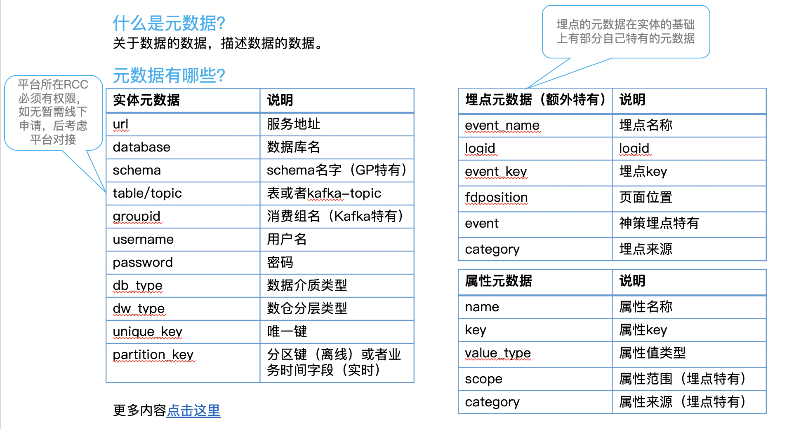
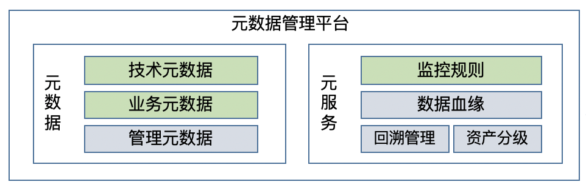

# 数据管理

## 元数据

### 元数据定义

### 元数据管理

元数据管理工具的核心在于基于上述高度抽象的概念，分别就：

- 技术元数据
- 业务元数据
- 管理元数据

开发高度适配所有业务实体和存储介质的系统。

元数据是质量中心和数据血缘的基础。

## 数据血缘

数据血缘有多种实现方式，比如自动解析 SQL。本文讨论现定于上报血缘的方式。

另外，就数据血缘的粒度，也有不同需求，本文讨论表（或同等含义）粒度。

### 节点定义——血缘节点和关系

数据血缘开发的第一步是确定血缘的节点。

### 血缘收集

上报的方式的好处在于，一个中心式的数据血缘平台，可以支持各种来源的不同数据的血缘管理。

### 存储方式

数据血缘建设的重点在于存储方式方选择。一般图数据是比较不错的技术选型。有时候出于成本考虑也会通过关系型数据库来模拟图数据的效果。

下图展示的是基于 MySQL 的数据血缘存储结构设计：

