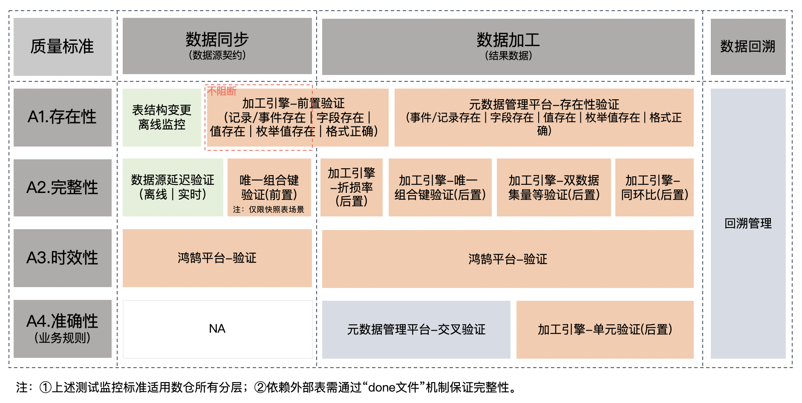
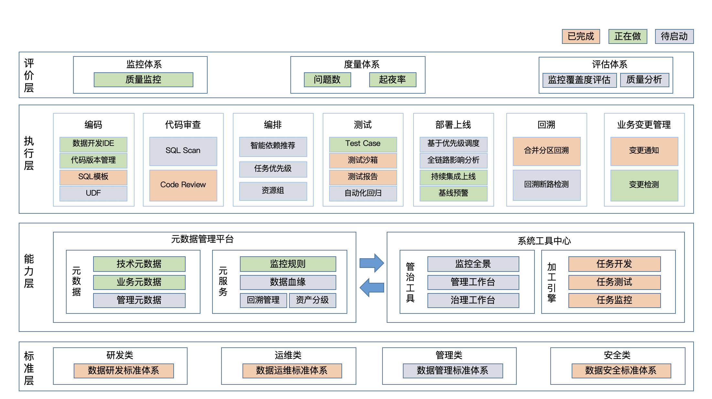
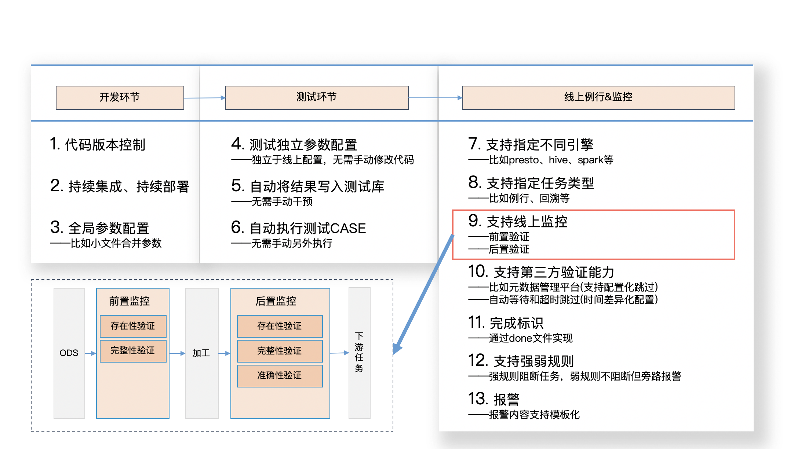
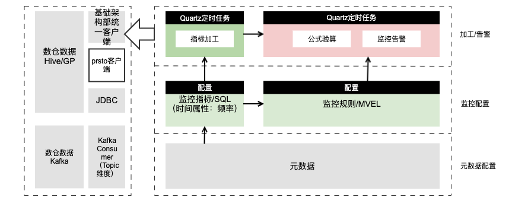
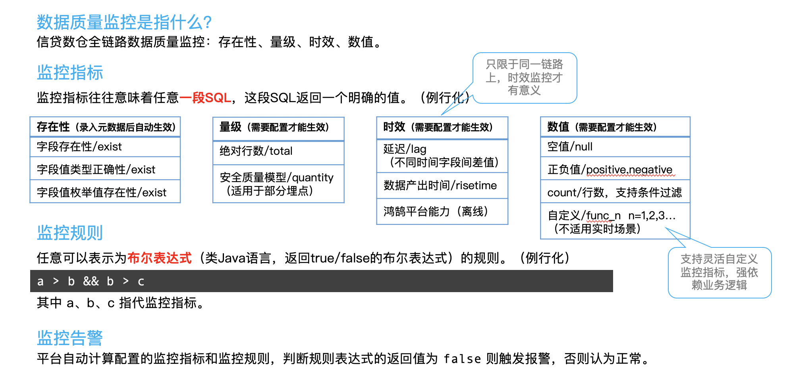
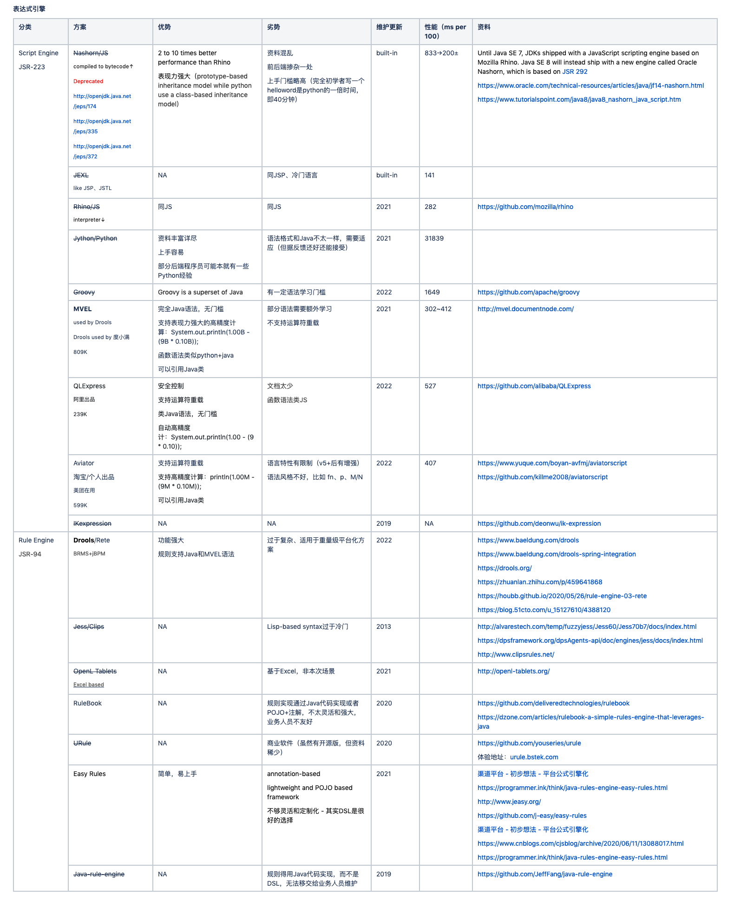
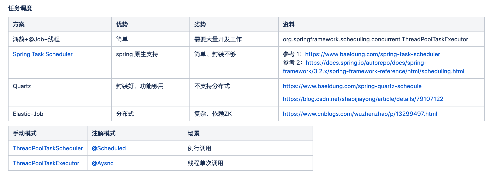

# 数据质量或治理

本文侧重于讨论离线数据质量和治理。

## 数据质量标准

## 数据质量全景

## 数据质量实现

### 开发流程规范

规范化的开发流程是保证数据质量的第一步。具体不详述。

### 数据线上监控

数据任务上线后的监控是保证数据质量的第二步。

**就地监控——数据加工引擎**

数据在加工的时候进行及时监控（就地监控）和拦截是保证质量的主要方式。实现如下（loan-data-warehouse-python - 用 Python 实现）：

针对实时数据，也需要应用类似的前（①过滤②脏数据分流）后（①结果检查）置逻辑，不同的是操作对象是无边界的数据流。

注：本文不提供针对实时数据的监控框架，加工引擎只适用于离线加工，但针对实时数据原理相同。

**质量中心——离线监控工具**

除了就地监控之外，作为第三方的集中式质量中心的作用也是很有必要的。实现如下（metadata-corndog - 用 Java 实现）：

其中核心点在于：①实体的抽象②监控指标的设计③规则表达式。

注：规则引擎推荐 MVEL 或者 Drools/Rete。后者功能强大但过于复杂，适用于重量级平台化方案。前者完全支持 Java 语法，支持表现力强大的高精度计算（`System.out.println(1.00B - (9B * 0.10B));`），函数语法类似 Python + Java，可以引用 Java 类。更对关于规则引擎选型如下：

另外需要注意的一个技术点——是**任务调度**。因为监控平台相当于一个调度器，需要就用户配置的例行化执行周期和时间动态启停任务，所以需要一个调度框架的支持。推荐 Quartz 并附具体选型过程如下：

**质量中心——实时监控工具**

实时监控和离线监控有些不同，但上述离线平台架构同样也可用于实时数据流。核心在于在离线的环境下实时数据实体的主动持续监听。

上述架构的实现原理简述如下：

首先，实时数据实体复用离线数据实体的配置结构，也就是说首次启动实时监控可能有延迟，比如几分钟。

其次，一旦探测到有实时数据实体配置，则自动启动一个实时数据的常驻消费者线程（比如 Kafka-Consumer）。

最后，该消费线程持续消费实时数据流，并计算监控指标，并核验监控规则等。

## 数据治理

数据治理和数据质量密不可分。数据治理具体可包括：数据生命周期（数据保留策略、无用表或数据下线）、非标依赖路径、耗时任务优化、资产目录梳理、冗余数据消除等。

### 离线任务优化

离线任务查询加工效率低下，考虑：

①切换计算引擎

②资源或队列隔离（独立资源或加资源）

③考虑水平分表 - by常用where条件进行拆分

④考虑垂直分表 - 适用表比较稀疏（大量的空值和0值）的场景

注：外表的 `insert` 需搭配 `hivedgs.insert_existing_partitions_behavior='OVERWRITE'` 使用，设置该参数则分区级覆盖，不设置该参数，则新增；外表禁止使用 `delete` 操作。
