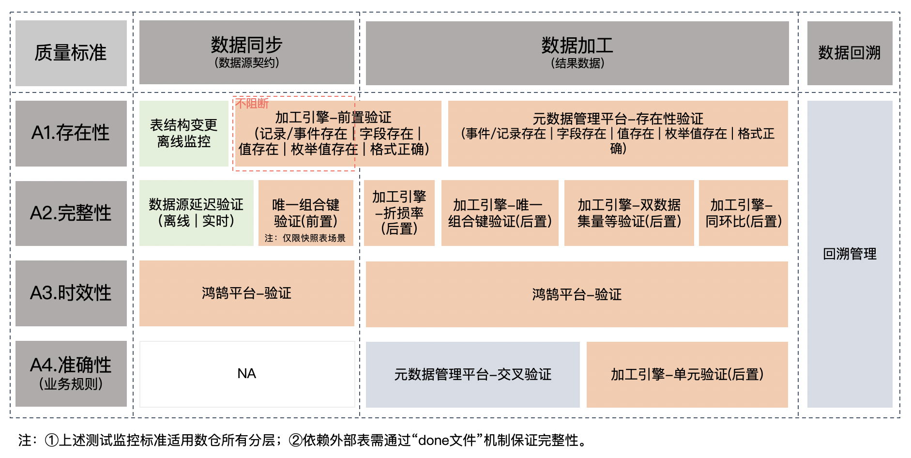
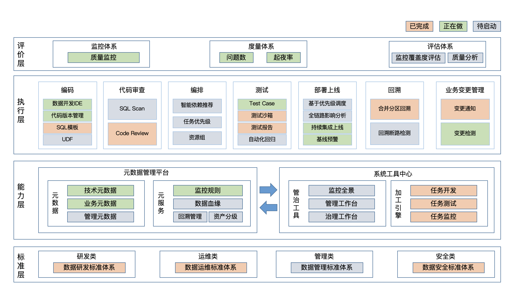
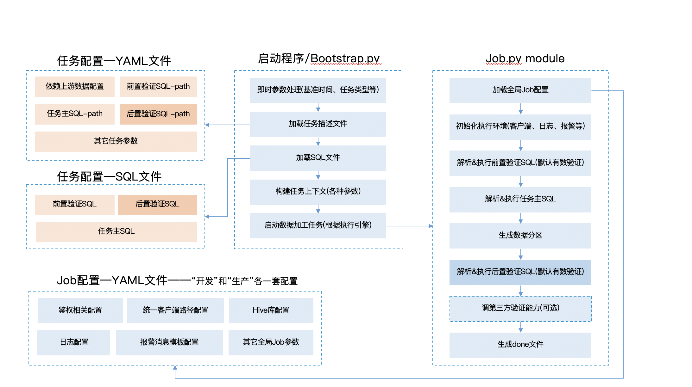
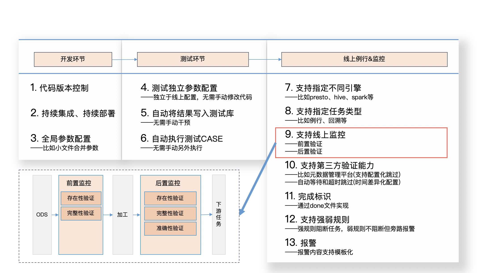
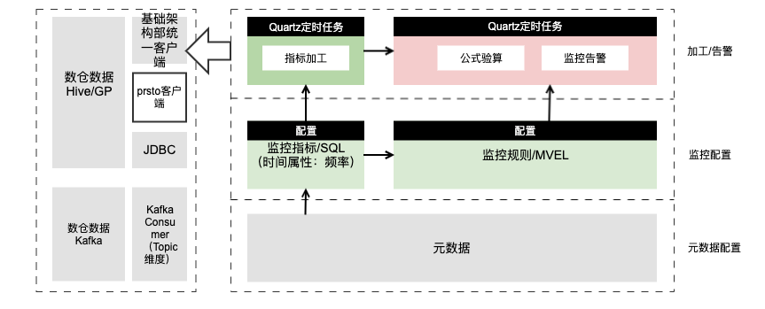
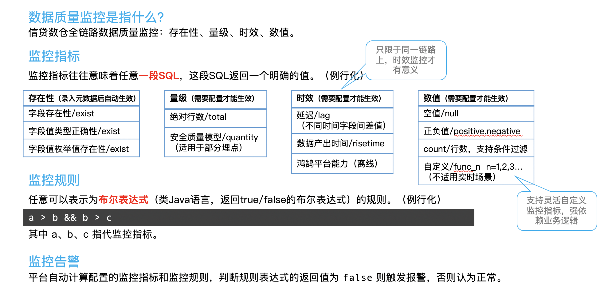
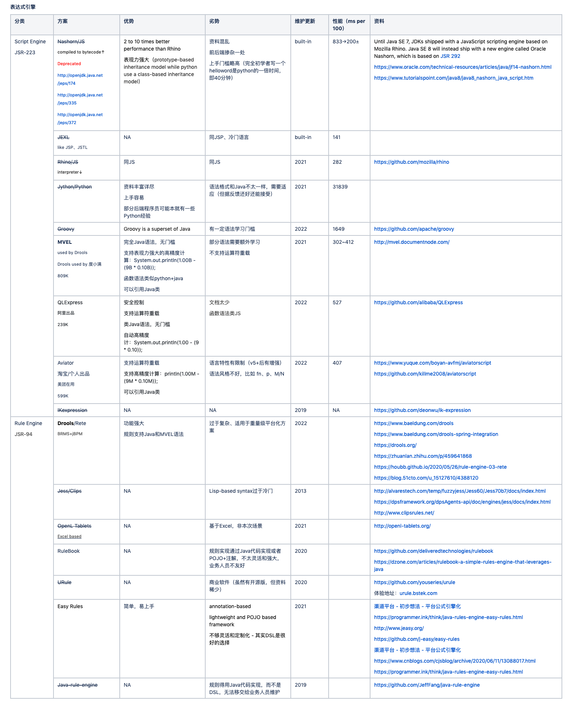
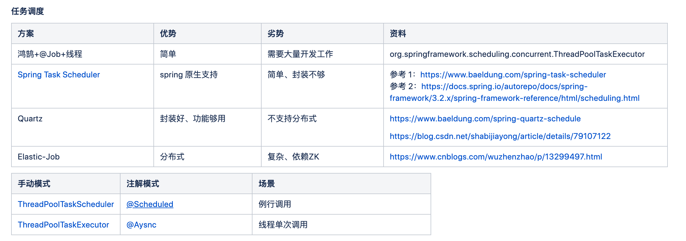

# 数据质量和治理

本文侧重于讨论离线数据质量和治理。

## 数据质量标准



## 数据质量全景



## 数据质量实现

### 开发流程规范

规范化的开发流程是保证数据质量的第一步。具体不详述。

### 数据线上监控

数据任务上线后的监控是保证数据质量的第二步。

**就地监控——数据加工引擎**

数据在加工的时候进行及时监控（就地监控）和拦截是保证质量的主要方式。实现如下（loan-data-warehouse-python - 用 Python 实现）：





针对实时数据，也需要应用类似的前（①过滤②脏数据分流）后（①结果检查）置逻辑，不同的是操作对象是无边界的数据流。

注：本文不提供针对实时数据的监控框架，加工引擎只适用于离线加工，但针对实时数据原理相同。

**质量中心——离线监控工具**

除了就地监控之外，作为第三方的集中式质量中心的作用也是很有必要的。实现如下（metadata-corndog - 用 Java 实现）：



其中核心点在于：①实体的抽象②监控指标的设计③规则表达式。



注：规则引擎推荐 MVEL 或者 Drools/Rete。后者功能强大但过于复杂，适用于重量级平台化方案。前者完全支持 Java 语法，支持表现力强大的高精度计算（`System.out.println(1.00B - (9B * 0.10B));`），函数语法类似 Python + Java，可以引用 Java 类。更对关于规则引擎选型如下：



另外需要注意的一个技术点——是**任务调度**。因为监控平台相当于一个调度器，需要就用户配置的例行化执行周期和时间动态启停任务，所以需要一个调度框架的支持。推荐 Quartz 并附具体选型过程如下：



**质量中心——实时监控工具**

实时监控和离线监控有些不同，但上述离线平台架构同样也可用于实时数据流。核心在于在离线的环境下实时数据实体的主动持续监听。

上述架构的实现原理简述如下：

首先，实时数据实体复用离线数据实体的配置结构，也就是说首次启动实时监控可能有延迟，比如几分钟。

其次，一旦探测到有实时数据实体配置，则自动启动一个实时数据的常驻消费者线程（比如 Kafka-Consumer）。

最后，该消费线程持续消费实时数据流，并计算监控指标，并核验监控规则等。

## 数据治理

数据治理和数据质量密不可分。数据治理具体可包括：数据生命周期（数据保留策略、无用表或数据下线）、非标依赖路径、耗时任务优化、资产目录梳理、冗余数据消除等。

### 离线任务优化

离线任务加工效率低下，考虑：

①切换计算引擎。

②资源或队列隔离（独立资源或加资源）。

③考虑水平分表：by常用where条件进行拆分。

④考虑垂直分表：适用表比较稀疏（大量的空值和0值）的场景。

注：外表的 `insert` 需搭配 `hivedgs.insert_existing_partitions_behavior='OVERWRITE'` 使用，设置该参数则分区级覆盖，不设置该参数，则新增；外表禁止使用 `delete` 操作。

⑤对于存在`null`值的字段，统一`coalesce`成对应字段类型。

⑥所有日期类型用`string`存储。

#### Hive 任务优化

Hive 任务加工效率低下，考虑：

①限制资源/参数设置。

```sql
-- Map: 设置 Mapper 的数量/并行度
set tez.grouping.split-count=10;

-- Reduce: 设置 Reducer 的最大数量/并行度
set hive.exec.reducers.max=10;
```

②任务分级：可以通过调度时间或虚拟依赖实现。

③拆分任务：拆分大任务为中小任务，减少同时计算需要的内存和时间消耗，避免单一任务占用太长时间的资源。

④减少嵌套：避免子查询嵌套过深，可复用中间结果可以用临时表（CTE/with子句），减少嵌套层次。

⑤限定分区：查看使用表有哪些分区字段，除了日期字段也要限定其它分区字段。

⑥先过滤再关联：先过滤再关联，过滤空值等无效数据，根据业务逻辑尽可能减少数据量，避免 select *。

⑦避免范围关联：避免范围关联，要用等值关联。范围关联限定转为条件过滤。

⑧任务独立：一个任务最好只写一张表，这样好排查管理。

一个优化后的样例：

```sql
LS1AZXhjbHVkZV9vdXRwdXQ9U0hfTU9ERUxfRkVBVFVSRV9ETS5kbV9mXzAyLmRtX2ZfMDJfY2xpY2tfY29udGVudF9qaWVrdWFuX3RlbXAxX2RmCi0tQGV4Y2x1ZGVfb3V0cHV0PVNIX01PREVMX0ZFQVRVUkVfRE0uZG1fZl8wMi5kbV9mXzAyX2NsaWNrX2NvbnRlbnRfamlla3Vhbl90ZW1wMl9kZgotLUBleGNsdWRlX2lucHV0PVNIX01PREVMX0ZFQVRVUkVfRE0uZG1fZl8wMi5kbV9mXzAyX3dpZGVfdGFibGVfY3VzdG9tZXJfZ3JvdXBfZGYKCi0tQGV4Y2x1ZGVfaW5wdXQ9U0hfTU9ERUxfRkVBVFVSRV9ETS5kaW0uZGltX3B1Yl91c2VyX2ZkCi0tQGV4Y2x1ZGVfaW5wdXQ9U0hfTU9ERUxfRkVBVFVSRV9ETS5kd2QuZHdkX2JlaGF2aW9ybG9nX2V2ZW50c19sb2dzCi0tRU1SIEhpdmUKLS0qKioqKioqKioqKioqKioqKioqKioqKioqKioqKioqKioqKioqKioqKioqKioqKioqKioqKioqKioqKioqKioqKioqKi0tCi0tYXV0aG9yOnpoYW5nc2hhb3BpbmcKLS1jcmVhdGUgdGltZToyMDI1LTAyLTEwIDEwOjQxOjUyCi0tRU1SIEhpdmUg5Lu75Yqh5Y+q6IO96L+Q6KGM5Zyo54us5Lqr6LWE5rqQ57uE5LiKCi0tKioqKioqKioqKioqKioqKioqKioqKioqKioqKioqKioqKioqKioqKioqKioqKioqKioqKioqKioqKioqKioqKioqKiotLQoKLS0gQ29udGFpbmVyOiDorr7nva7mr4/kuKogVGV6IENvbnRhaW5lciDlhoXlrZjlpKflsI/vvIzljZXkvY1NQu+8jOm7mOiupDQwOTZNQu+8jOaMiemcgOiwg+aVtApzZXQgaGl2ZS50ZXouY29udGFpbmVyLnNpemU9NjE0NDsKCi0tIE1hcDog6K6+572uIE1hcHBlciDnmoTmlbDph48v5bm26KGM5bqmCnNldCB0ZXouZ3JvdXBpbmcuc3BsaXQtY291bnQ9MTA7Ci0tIFJlZHVjZTog6K6+572uIFJlZHVjZXIg55qE5pyA5aSn5pWw6YePL+W5tuihjOW6pgpzZXQgaGl2ZS5leGVjLnJlZHVjZXJzLm1heD0xMDsKCmRyb3AgdGFibGUgaWYgZXhpc3RzIGRtX2ZfMDIuZG1fZl8wMl9jbGlja19jb250ZW50X2ppZWt1YW5fdGVtcDFfZGZfbGl1amlhbndlaSA7CmNyZWF0ZSB0YWJsZSBkbV9mXzAyLmRtX2ZfMDJfY2xpY2tfY29udGVudF9qaWVrdWFuX3RlbXAxX2RmX2xpdWppYW53ZWkgYXMKCndpdGggZXZlbnRzIGFzICgKc2VsZWN0IAogICAgICBhYTEuZGlzdGluY3RfaWQgYXMgdXNlcl9pZAogICAgLCBhYTEuZXZlbnQgYXMgZXZlbnQKICAgICwgYWExLmlwIGFzIGlwCiAgICAsIGFhMS5tYW51ZmFjdHVyZXIgYXMgbWFudWZhY3R1cmVyCiAgICAsIGNhc2Ugd2hlbiBhYTEudGl0bGUgaW4oJ+WAn+asvummlumhtScsJ+ahlOWtkOmmlumhtScsJ+ahlOWtkOmmlumhtS3mnKrnmbvlvZUnLCfmoZTlrZDpppbpobUt5b6F56Gu6K6k6ZmN6aKd6YeN5o+Q6K6i5Y2VJywn5qGU5a2Q6aaW6aG1LeW+heehruiupOmHjeaPkOiuouWNlScpIHRoZW4gJ+WAn+asvummlumhtScKICAgIHdoZW4gYWExLnRpdGxlIGluKCfnoa7orqTlgJ/mrL4nLCfnoa7orqTlgJ/mrL7pobUnKSB0aGVuICfnoa7orqTlgJ/mrL4nCiAgICB3aGVuIGFhMS50aXRsZSBpbign6YCJ5oup6L+Y5qy+5pa55byPLeiejeaLheWNoScsJ+mAieaLqei/mOasvuaWueW8jycpIHRoZW4gJ+i/mOasvuaWueW8jycKICAgICAgICAgICAgICAgICAgICAgICAgICAgICAgICBlbHNlICflgJ/mrL7nlLPor7cnIGVuZCBhcyB0aXRsZQogICAgLCB0b19kYXRlKGZyb21fdW5peHRpbWUoY2FzdChzdWJzdHIoYWExLmB0aW1lYCwxLDEwKSBhcyBiaWdpbnQpLCd5eXl5LU1NLWRkIEhIOm1tOnNzJykpIGFzIGNyZWF0ZV9kYXRlCiAgICAsIGZyb21fdW5peHRpbWUoY2FzdChzdWJzdHIoYWExLmB0aW1lYCwxLDEwKSBhcyBiaWdpbnQpLCd5eXl5LU1NLWRkIEhIOm1tOnNzJykgICAgICAgICAgYXMgY3JlYXRlX3RpbWUKICAgICwgYWExLmR0CmZyb20gZHdkLmR3ZF9iZWhhdmlvcmxvZ19ldmVudHNfbG9ncyBhYTEgCndoZXJlIGFhMS5ldmVudD0namllS3VhblllV3VDbGljaycKYW5kIGFhMS5pc19sb2dpbl9pZCA9ICd0cnVlJwphbmQgYWExLmRpc3RpbmN0X2lkIGlzIG5vdCBudWxsCmFuZCBhYTEuZHQgPj0gdG9fZGF0ZShkYXRlX3N1YignJHt0b2RheX0nICwgOTApKQphbmQgYWExLmR0IDwgJyR7dG9kYXl9JyAKYW5kIGZyb21fdW5peHRpbWUoY2FzdChzdWJzdHIoYWExLmB0aW1lYCwxLDEwKSBhcyBiaWdpbnQpLCd5eXl5LU1NLWRkJykgPCAnJHt0b2RheX0nCmFuZCBmcm9tX3VuaXh0aW1lKGNhc3Qoc3Vic3RyKGFhMS5gdGltZWAsMSwxMCkgYXMgYmlnaW50KSwneXl5eS1NTS1kZCcpID49IHRvX2RhdGUoZGF0ZV9zdWIoJyR7dG9kYXl9JyAsIDkwKSkKKSwKCnVzZXJzIGFzICgKc2VsZWN0IGFhMi5pZF9ub19kZXMsCmFhMi51c2VyX2lkCmZyb20gZGltLmRpbV9wdWJfdXNlcl9mZCBhYTIKd2hlcmUgYWEyLmR0ID0gJyR7eWVzdGVyZGF5fScKYW5kIGFhMi5pZF9ub19kZXMgaXMgbm90IG51bGwKKQoKc2VsZWN0IGlkX25vX2RlcwogICAgICwgb2JzZXJ2YXRpb25fZGF0ZQogICAgICwgZXZlbnQKICAgICAsIHRpdGxlCiAgICAgLCBpcAogICAgICwgbWFudWZhY3R1cmVyCiAgICAgLCBjcmVhdGVfdGltZQogICAgICwgY3JlYXRlX2RhdGUKICAgICAsIHVzZXJfaWQKICAgICAsIGR0CiAgICAgLCB1bml4X3RpbWVzdGFtcChsZWFkKGNyZWF0ZV90aW1lLDEsbnVsbCkgb3ZlcihwYXJ0aXRpb24gYnkgaWRfbm9fZGVzLGNyZWF0ZV9kYXRlIG9yZGVyIGJ5IGNyZWF0ZV90aW1lIGFzYyxkdCBhc2MpKS0gdW5peF90aW1lc3RhbXAoY3JlYXRlX3RpbWUpICBhcyBjbGlja190aW1lX3MKICAgICAsIGlmKGNyZWF0ZV9kYXRlID49IHRvX2RhdGUoZGF0ZV9hZGQoJyR7dG9kYXl9JywgLTcpKSwgMSwgMCkgIGFzIGlzX2luXzdkCiAgICAgLCBpZihjcmVhdGVfZGF0ZSA+PSB0b19kYXRlKGRhdGVfYWRkKCcke3RvZGF5fScsIC0xNSkpLCAxLCAwKSBhcyBpc19pbl8xNWQKICAgICAsIGlmKGNyZWF0ZV9kYXRlID49IHRvX2RhdGUoZGF0ZV9hZGQoJyR7dG9kYXl9JywgLTMwKSksIDEsIDApIGFzIGlzX2luXzMwZAogICAgICwgaWYoY3JlYXRlX2RhdGUgPj0gdG9fZGF0ZShkYXRlX2FkZCgnJHt0b2RheX0nLCAtNjApKSwgMSwgMCkgYXMgaXNfaW5fNjBkCiAgICAgLCBpZihjcmVhdGVfZGF0ZSA+PSB0b19kYXRlKGRhdGVfYWRkKCcke3RvZGF5fScsIC05MCkpLCAxLCAwKSBhcyBpc19pbl85MGQgIApmcm9tICgKICAgICAgIHNlbGVjdCBpZF9ub19kZXMKICAgICAgICAgICAsICcke3RvZGF5fScgYXMgb2JzZXJ2YXRpb25fZGF0ZQogICAgICAgICAgICwgZXZlbnQKICAgICAgICAgICAsIHRpdGxlCiAgICAgICAgICAgLCBpcAogICAgICAgICAgICwgbWFudWZhY3R1cmVyCiAgICAgICAgICAgLCBjcmVhdGVfdGltZQogICAgICAgICAgICwgY3JlYXRlX2RhdGUKICAgICAgICAgICAsIHVzZXJfaWQKICAgICAgICAgICAsIGR0CiAgICAgICBmcm9tICgKICAgICAgICAgICAgIHNlbGVjdCBhYTIuaWRfbm9fZGVzCiAgICAgICAgICAgICAgICAgICwgYWExLnVzZXJfaWQKICAgICAgICAgICAgICAgICAgLCBhYTEuZXZlbnQKICAgICAgICAgICAgICAgICAgLCBhYTEuaXAKICAgICAgICAgICAgICAgICAgLCBhYTEubWFudWZhY3R1cmVyCiAgICAgICAgICAgICAgICAgICwgYWExLnRpdGxlCiAgICAgICAgICAgICAgICAgICwgYWExLmNyZWF0ZV9kYXRlCiAgICAgICAgICAgICAgICAgICwgYWExLmNyZWF0ZV90aW1lCiAgICAgICAgICAgICAgICAgICwgYWExLmR0CiAgICAgICAgICAgICBmcm9tIGV2ZW50cyBhYTEKICAgICAgICAgICAgIGxlZnQgam9pbiB1c2VycyBhYTIgb24gYWEyLnVzZXJfaWQgPSBjYXN0KGFhMS51c2VyX2lkIGFzIGJpZ2ludCkKICAgICAgICkgYgopIGEgOwo=
```

### 离线高时效方案

离线一般是每天调度一次，在某些业务场景下，需要提升时效，选择每小时或指定小时调度。但小时调度（多周期）的问题也比较多，实现起来较复杂，比如需要采用二级分区的方式。我们来看个样例：

```sql

```

其它关于小时级方案的实现细节，可以参考：`新小时级任务方案.pdf`。

### 二级分区一致性使用方法

如果是二级分区，需要获取当前最大分区，需要考虑分区获取一致性问题。

**使用 group by dt,hr order by dt desc,hr desc;**

```sql
c2VsZWN0IAonZG0uZG1fY29sbF9sZWdhbF9jb2xsZWN0aW9uX2Rpc3RfY2FzZV9pbml0X2RldGFpbHNfZmgnIGFzIHRhYmxlX25hbWUKLGR0IGFzIGN1cnJlbnRfZHQKLGhyIGFzIGN1cnJlbnRfaHIKLGN1cnJlbnRfdGltZXN0YW1wKCkgYXMgY3JlYXRlZAosJycgYXMgZXh0ZW5zaW9uCiwn5oq95qC35Lu75YqhSUQnIGFzIGNvZGUKZnJvbSBkbS5kbV9jb2xsX2xlZ2FsX2NvbGxlY3Rpb25fZGlzdF9jYXNlX2luaXRfZGV0YWlsc19maAp3aGVyZSBkdCA+PSBkYXRlX2FkZChjdXJyZW50X2RhdGUoKSwtMikKb3JkZXIgYnkgZHQgZGVzYywgaHIgZGVzYwpsaW1pdCAx
```

**使用 max(concat(dt,',',hr))；**

```sql
c2VsZWN0IAonZG0uZG1fY29sbF9sZWdhbF9jb2xsZWN0aW9uX2Rpc3RfY2FzZV9pbml0X2RldGFpbHNfZmgnIGFzIHRhYmxlX25hbWUKLHNwbGl0KGR0X2hyLCcsJylbMF0gYXMgY3VycmVudF9kdAosc3BsaXQoZHRfaHIsJywnKVsxXSBhcyBjdXJyZW50X2hyCixjdXJyZW50X3RpbWVzdGFtcCgpIGFzIGNyZWF0ZWQKLCcnIGFzIGV4dGVuc2lvbgosJ+aKveagt+S7u+WKoUlEJyBhcyBjb2RlCmZyb20gKAogICAgc2VsZWN0IG1heChjb25jYXQoZHQsJywnLGhyKSkgYXMgZHRfaHIgCiAgICBmcm9tIGRtLmRtX2NvbGxfbGVnYWxfY29sbGVjdGlvbl9kaXN0X2Nhc2VfaW5pdF9kZXRhaWxzX2ZoCiAgICB3aGVyZSBkdCA+PSBkYXRlX2FkZChjdXJyZW50X2RhdGUoKSwtMykKKQ==
```

**使用[内存表暂存（cache table）](https://spark.apache.org/docs/latest/sql-ref-syntax-aux-cache-cache-table.html)**

```sql
Ci0tZXhwbGFpbiAKCi0tIHdpdGggc2Vzc2lvbl9zdG9yYWdlIGFzICgKLS0gICAgIHNlbGVjdCBtYXgoZHQpIGFzIG1heF9kdCBmcm9tIGRtLmRtX2NvbGxfbGVnYWxfY29sbGVjdGlvbl9kaXN0X2Nhc2VfaW5pdF9kZXRhaWxzX2ZoX2RldiB3aGVyZSBkdD49ZGF0ZV9zdWIoY3VycmVudF9kYXRlKCksMikKLS0gKQoKY2FjaGUgdGFibGUgc2Vzc2lvbl9zdG9yYWdlIGFzIApzZWxlY3QgbWF4KGR0KSBhcyBtYXhfZHQgZnJvbSBkbS5kbV9jb2xsX2xlZ2FsX2NvbGxlY3Rpb25fZGlzdF9jYXNlX2luaXRfZGV0YWlsc19maF9kZXYgd2hlcmUgZHQ+PWRhdGVfc3ViKGN1cnJlbnRfZGF0ZSgpLDIpCjsKCi0tIGNyZWF0ZSBvciByZXBsYWNlIHRlbXBvcmFyeSB2aWV3IHNlc3Npb25fc3RvcmFnZSBhcwotLSBzZWxlY3QgbWF4KGR0KSBhcyBtYXhfZHQgZnJvbSBkbS5kbV9jb2xsX2xlZ2FsX2NvbGxlY3Rpb25fZGlzdF9jYXNlX2luaXRfZGV0YWlsc19maF9kZXYgd2hlcmUgZHQ+PWRhdGVfc3ViKGN1cnJlbnRfZGF0ZSgpLDIpCi0tIDsKCmluc2VydCBvdmVyd3JpdGUgdGFibGUgZG1fZl9mYWN1aS5kbV9mX2ZhY3VpX3Rlc3RfbGl1amlhbndlaQoKU0VMRUNUICBkaXN0aW5jdCBkdCxociwnY3JlYXRlLW9yLXJlcGxhY2UtdGVtcG9yYXJ5LXZpZXcnCgpGUk9NCmRtLmRtX2NvbGxfbGVnYWxfY29sbGVjdGlvbl9kaXN0X2Nhc2VfaW5pdF9kZXRhaWxzX2ZoX2RldiB0MQpsZWZ0IGpvaW4gKHNlbGVjdAogICAgICAgICAgICBlbnRpdHlfaWQgYXMgb3JkZXJfaWQKICAgICAgICAgICAgZnJvbSBkbS5kbV92YXJfY29tcF9yZXN1bHRzX2ZkCiAgICAgICAgICAgIHdoZXJlIGR0ID0gKHNlbGVjdCBtYXgoZHQpIGZyb20gZG0uZG1fdmFyX2NvbXBfcmVzdWx0c19mZCkgYW5kIHZhcl9jb2RlID0gJ2xhYmVsX2ZjX29yZGVyX3ByZW1lcmdlX2Nhc2UnCiAgICAgICAgICAgIGdyb3VwIGJ5IGVudGl0eV9pZCkgdDIgb24gdDEub3JkZXJfaWQgPSB0Mi5vcmRlcl9pZApsZWZ0IGpvaW4gKHNlbGVjdCBvcmRlcl9pZCxjdXN0b21lcl9ncm91cF9pZAogICAgICAgICAgICBmcm9tIGRtX2ZfZmFjdWkuZG1fbGF3X3VyZ2VfbGVnYWxfY3VzdG9tZXJfZ3JvdXBfZmgKICAgICAgICAgICAgd2hlcmUgZHQgaW4gKHNlbGVjdCBtYXgoZHQpIGFzIG1heF9kdCBmcm9tIGRtX2ZfZmFjdWkuZG1fbGF3X3VyZ2VfbGVnYWxfY3VzdG9tZXJfZ3JvdXBfZmggd2hlcmUgZHQ+PWRhdGVfc3ViKGN1cnJlbnRfZGF0ZSgpLDIpKQogICAgICAgICAgICApIHQzICBvbiB0MS5vcmRlcl9pZCA9IHQzLm9yZGVyX2lkCldIRVJFICAgZHQgPSAoc2VsZWN0IG1heF9kdCBmcm9tIHNlc3Npb25fc3RvcmFnZSkKICAgIGFuZCBociA9IChzZWxlY3QgbWF4KGhyKSBhcyBtYXhfaHIgZnJvbSBkbS5kbV9jb2xsX2xlZ2FsX2NvbGxlY3Rpb25fZGlzdF9jYXNlX2luaXRfZGV0YWlsc19maF9kZXYgd2hlcmUgZHQ9KHNlbGVjdCBtYXhfZHQgZnJvbSBzZXNzaW9uX3N0b3JhZ2UpKQo7
```

注意：CTE、临时视图（temporary view）、以及物理表不起作用，每次使用可能会触发重新执行。

### 动态分区使用

动态分区可以避免显式指定分区信息，从而简化代码。

和动态分区相关的配置参数：

```
hive.exec.dynamic.partition.mode=nonstrict
hive.exec.dynamic.partition=true
```

## 数据上云

相比于自建机房，大数据上云，会带来更高的稳定性和更低的成本。上云主要涉及云上服务搭建、数据迁移、元数据迁移、任务迁移等事项。

### 数据迁移

参考数据迁移工具：`bigdata-tools-python/tools/whats_hdfs_migration`。具体不详述。

### 元数据（HMS）迁移

元数据存储在 MySQL 里，元数据迁移本质是 MySQL 的 DDL 的导出和导入。具体不详述。

### 任务迁移

参考任务迁移工具：`bigdata-yun-tools`。具体不详述。
