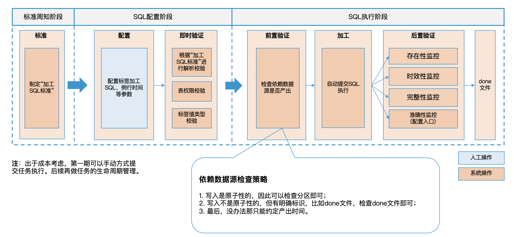
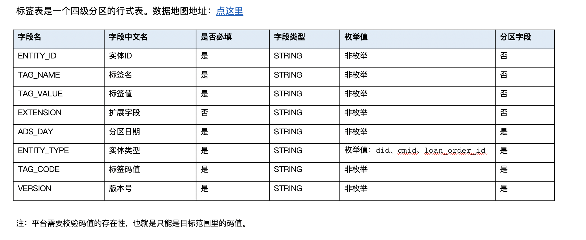
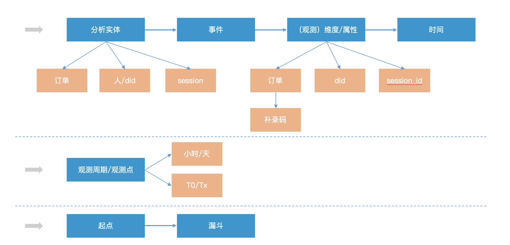
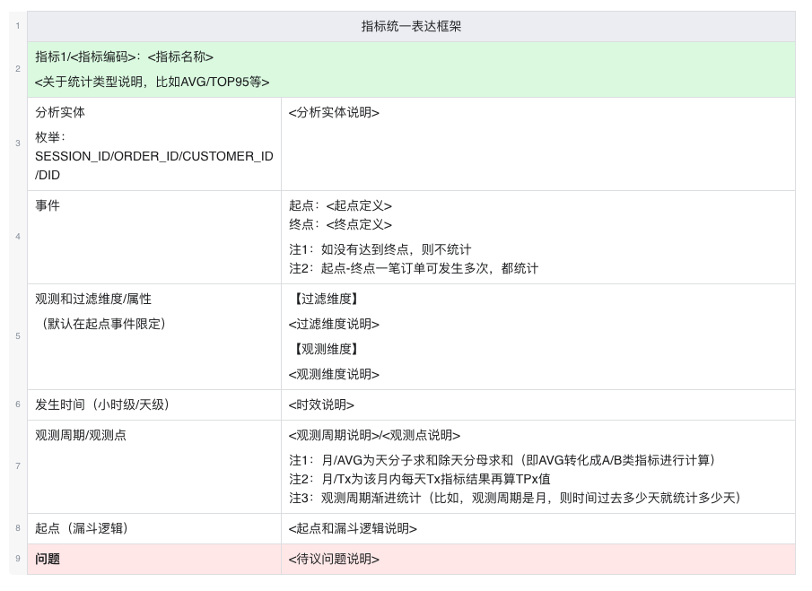
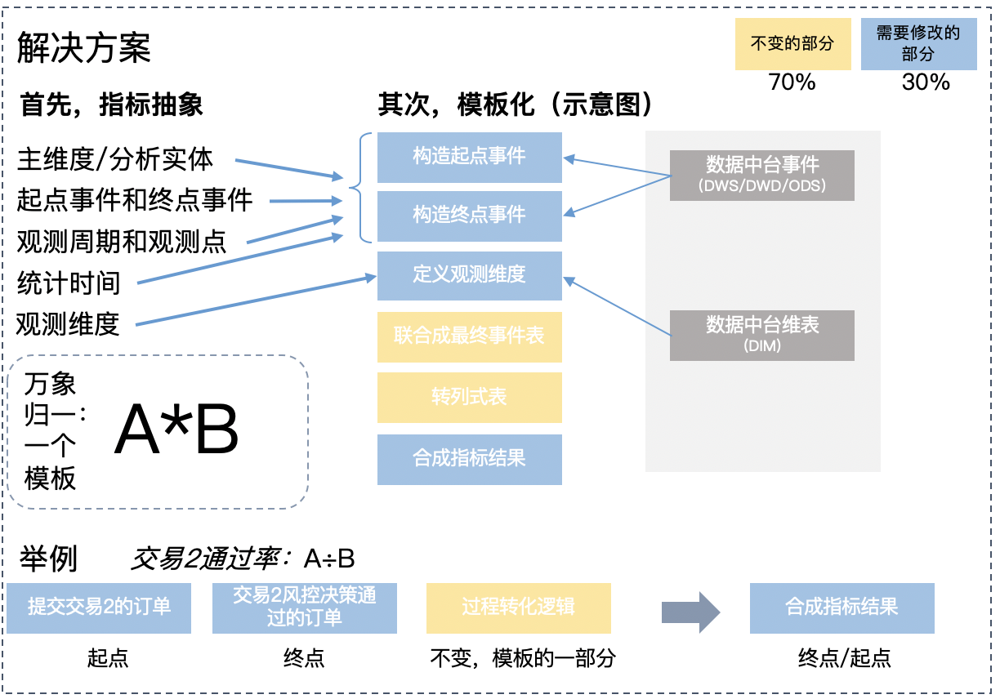
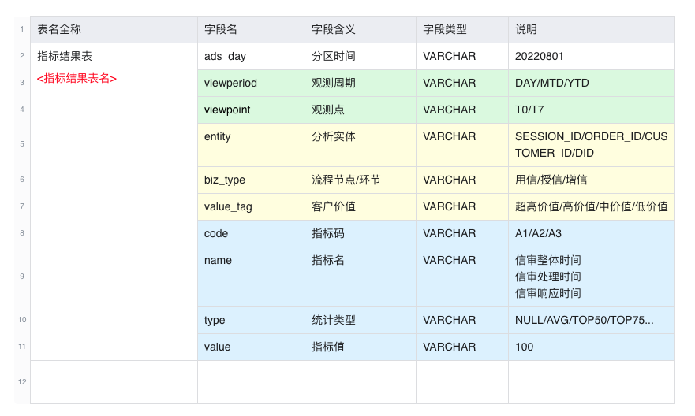
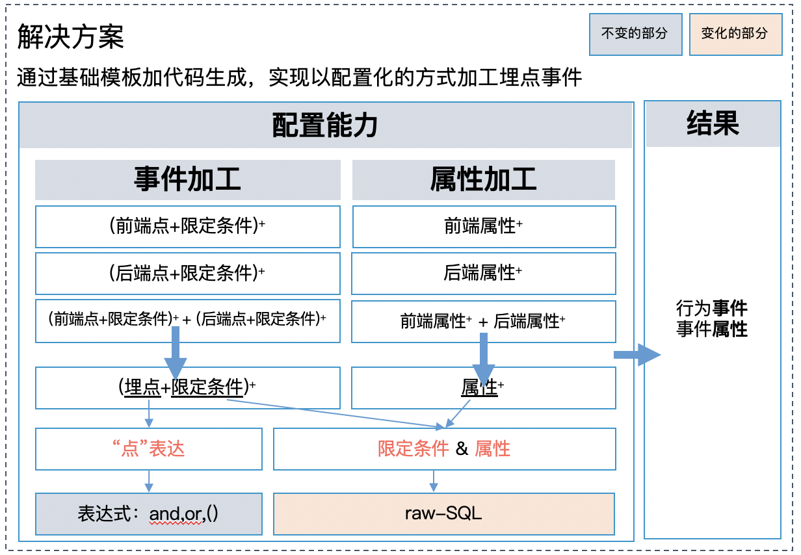
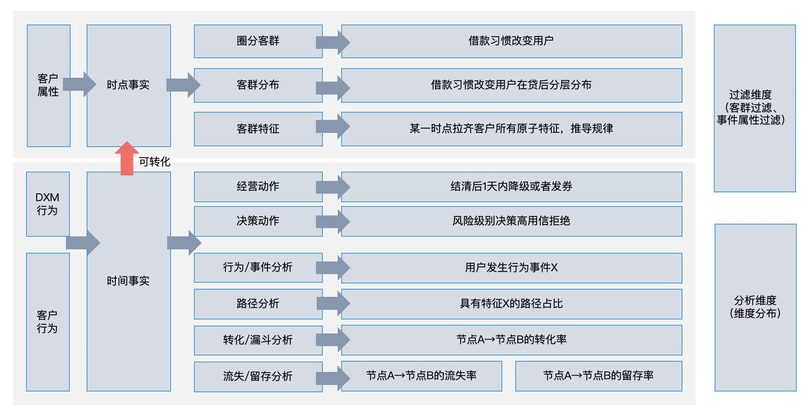
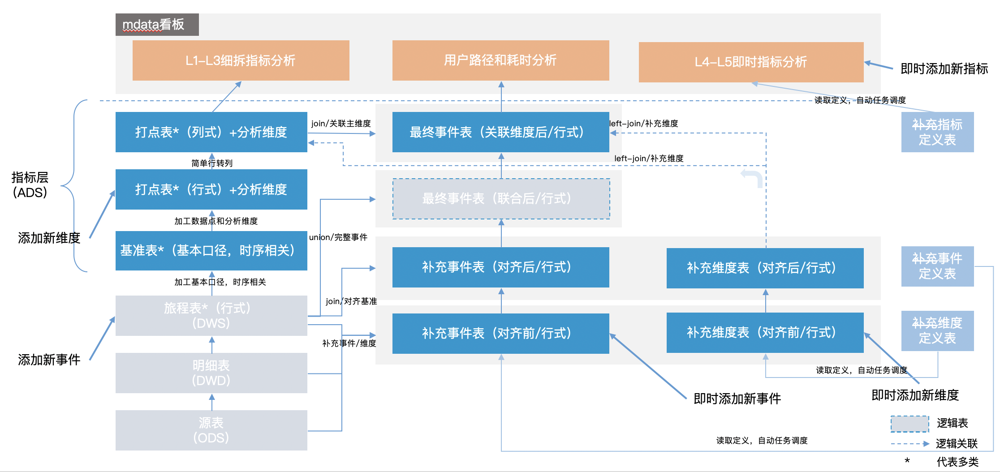

# 数据平台

## 标签配置化加工工具

本文讨论限定于离线标签。

**技术架构**

标签的结构非常固定，因此非常适合通过配置化的方式加工。



另外需要注意的是，通过配置化的方式加工数据，必然涉及对用户配置的 SQL 的合法性校验。一般目标执行引擎都会提供对应的 SQL 解析工具，比如 [presto-parser (Facebook Opensource, part of Presto)](https://mvnrepository.com/artifact/com.facebook.presto/presto-parser
)。

**存储方式**

一个公司的标签往往快速膨胀，如何设计一种非耦合的存储方式是关键，从而保证独立的执行，相互不影响。



## 指标配置化加工工具

本文讨论限定于离线指标。

**表达框架——指标技术体系**





**技术架构**

基于表达框架，指标可以做结构化抽象。如下图，可以抽象为起点、终点、观测维度，以及最后行转列，进而产出指标。



**指标举例**

```sql
ZGVsZXRlIGZyb20gbG9hbl9kYXRhX3dhcmVob3VzZS5hZHNfbG9hbl9zZXJ2X2luZGV4X3JvX2RkIHdoZXJlIGFkc19kYXk9J3tEQVRFLTF9JyBhbmQgdmlld3BlcmlvZD0nREFZJyBhbmQgdmlld3BvaW50PSdUMCcgIGFuZCBlbnRpdHk9J09SREVSX0lEJyAgYW5kIGNvZGU9J1MyMycgOwppbnNlcnQgaW50byBsb2FuX2RhdGFfd2FyZWhvdXNlLmFkc19sb2FuX3NlcnZfaW5kZXhfcm9fZGQKIAogIAotLSMjIyMjIyMjIyMjIOaooeadvzog57uf5LiA5qih5p2/ICMjIyMjIyMjIyMjCi0tLS0tLS0tLS0tLS0tLS0tLSBFVkVOVFMgU1RBUlQgLS0tLS0tLS0tLS0tLS0tLS0KIAotLSDkupHluIbogJfml7YgZG9uZQotLSDotbfngrnpgLvovpHvvJrlj5bmjojkv6HooaXlvZUr55So5L+h6KGl5b2V5LqL5Lu2IOaJgOacieeahOaVsOaNruW+gOWJjeaJvjPlpKnvvIznnIvmmK/lkKbmnInpnZ7lvZPml6XnmoTorrDlvZXvvIznrZvmjonvvJvlj5bmnIDml6nnmoTkuIDmnaHkvZzkuLrotbfngrnvvJsKd2l0aCBFVkVOVF9zdGFydCBhcyAoCiAgICBzZWxlY3QKICAgICAgICBkaXN0aW5jdAogICAgICAgIHN1YnN0cihkd2RfaG91ciwxLDgpIGFzIGR0LAogICAgICAgIGFsbF9vcmRlcnMub3JkZXJfaWQgYXMgcHJpbWFyeV9kaW0sCiAgICAgICAgY21pZCBhcyByZWZfZGltLAogICAgICAgICdFVkVOVF9zdGFydCcgYXMgZXZlbnQsCiAgICAgICAgb2NjdXJfdGltZSBhcyBvY2N1cl90aW1lCiAgICBmcm9tICgKICAgICAgICAtLSDlj5Y05aSp5pWw5o2uIOW8gOeqlyDlj5bnrKzkuIDmnaEg5Y+q5Y+W5pe26Ze05Zyo5b2T5aSp55qE6K6i5Y2VCiAgICAgICAgc2VsZWN0ICogZnJvbSAoCiAgICAgICAgICAgIHNlbGVjdAogICAgICAgICAgICAgICAgZHdkX2hvdXIsCiAgICAgICAgICAgICAgICBvcmRlcl9pZCwKICAgICAgICAgICAgICAgIGNtaWQsCiAgICAgICAgICAgICAgICBvY2N1cl90aW1lLAogICAgICAgICAgICAgICAgcm93X251bWJlcigpIG92ZXIgKHBhcnRpdGlvbiBieSBvcmRlcl9pZCBvcmRlciBieSBvY2N1cl90aW1lKSBhcyBybgogICAgICAgICAgICBmcm9tIGxvYW5fZGF0YV93YXJlaG91c2UuZHdkX2xvYW5fb21nX29mZmVyX2hkCiAgICAgICAgICAgIHdoZXJlIHN1YnN0cihkd2RfaG91ciwxLDgpID49ICd7REFURS00fScgYW5kIHN1YnN0cihkd2RfaG91ciwxLDgpIDw9ICd7REFURS0xfScKICAgICAgICAgICAgLS0g6LW354K55LqL5Lu277yM6L+Y5rKh5pyJ5LqR5biG55qE57uT5p6c77yM5omA5Lul5peg6ZyA562b6YCJ57G75Z6LCiAgICAgICAgICAgIGFuZCBldmVudCA9ICd0cmFuc2FjdGlvbl90d29fdWxvYW5fbG9hbl9zdWJtaXQnIC0tIG9tZ+aPkOS6pOaOiOS/oSBvbWfmj5DkuqTnlKjkv6EKICAgICAgICApIHdoZXJlIHJuID0gMSBhbmQgcmVnZXhwX3JlcGxhY2Uoc3Vic3RyKG9jY3VyX3RpbWUsMSwxMCksJy0nLCcnKSA9ICd7REFURS0xfScKICAgICkgYWxsX29yZGVycwogICAgbGVmdCBqb2luICgKICAgICAgICBzZWxlY3Qgb3JkZXJfaWQKICAgICAgICBmcm9tIGxvYW5fZGF0YV93YXJlaG91c2UuZHdkX2xvYW5fdWxvYW5fZGlzdF9oZCAtLSDkupHluIZkd2QKICAgICAgICB3aGVyZSBzdWJzdHIoc3RhdF9kdCwxLDgpID49ICd7REFURS0xfScgYW5kIHN1YnN0cihzdGF0X2R0LDEsOCkgPD0gJ3tEQVRFLTF9JwogICAgICAgIGFuZCBldmVudCA9ICd0cmFuc2FjdGlvbl90d29fcmVzdWx0JyAtLSDkuqTmmJMy57uT5p6cCiAgICAgICAgYW5kIGlzX3Bhc3MgaW4gKCcxJywgJzInKSAtLSDkupHluIZkd2TkuK3lrZjkuobkuK3pl7TmgIHlkoznu5PmnpzmgIEg6ZyA6KaB5Y+W57uT5p6c5oCB5oiQ5YqfL+Wksei0pSDlkKbliJnkuIDkuKrorqLljZXkvJrmnInlpJrmnaHorrDlvZUKICAgICAgICBhbmQgaXNGcm9udFRyYW5zUXVlcnlJbnN0ID0gJzEnIC0tIOino+iApjPmnJ/moIfor4bkuLoxCiAgICApIHVsb2FuX29yZGVycwogICAgb24gYWxsX29yZGVycy5vcmRlcl9pZCA9IHVsb2FuX29yZGVycy5vcmRlcl9pZAogICAgd2hlcmUgdWxvYW5fb3JkZXJzLm9yZGVyX2lkIGlzIG5vdCBudWxsIC0tIOWPquimgeWFs+iBlOS4iuino+iApjPmnJ/nmoTmlbDmja4KICAgIGFuZCBhbGxfb3JkZXJzLm9yZGVyX2lkIG5vdCBpbiAoCiAgICAgICAgLS0g6ZyA6KaB5o6S6Zmk5b2T5aSp55qEIOi/m+S6uuWuoeeahOiuouWNlSDlkKbliJnogJfml7bkvJrlj5jlvojplb8KICAgICAgICBzZWxlY3Qgb3JkZXJfaWQKICAgICAgICBmcm9tIGxvYW5fZGF0YV93YXJlaG91c2UuZHdkX2xvYW5fb21nX29mZmVyX2hkCiAgICAgICAgd2hlcmUgc3Vic3RyKGR3ZF9ob3VyLDEsOCkgPj0gJ3tEQVRFLTF9JyBhbmQgc3Vic3RyKGR3ZF9ob3VyLDEsOCkgPD0gJ3tEQVRFLTF9JwogICAgICAgIGFuZCBldmVudCA9ICd0cmFuc2FjdGlvbl90d29fYXBwcm92YWxfcmVzdWx0JwogICAgICAgIGFuZCBhcHByb3ZhbF9yZXN1bHQgPSAnNicKICAgICkKKSwKLS0g57uI54K56YC76L6R77ya5Y+W5Zue6LCD5LqR5biG5LqL5Lu2CkVWRU5UX2VuZCBhcyAoCiAgICBzZWxlY3QKICAgICAgICBkaXN0aW5jdAogICAgICAgIHN1YnN0cihkd2RfaG91ciwxLDgpIGFzIGR0LAogICAgICAgIG9yZGVyX2lkIGFzIHByaW1hcnlfZGltLAogICAgICAgIGNtaWQgYXMgcmVmX2RpbSwKICAgICAgICAnRVZFTlRfZW5kJyBhcyBldmVudCwKICAgICAgICBvY2N1cl90aW1lIGFzIG9jY3VyX3RpbWUKICAgIGZyb20gKAogICAgICAgIHNlbGVjdAogICAgICAgICAgICBkd2RfaG91ciwKICAgICAgICAgICAgb3JkZXJfaWQsCiAgICAgICAgICAgIGNtaWQsCiAgICAgICAgICAgIG9jY3VyX3RpbWUsCiAgICAgICAgICAgIHJvd19udW1iZXIoKSBvdmVyIChwYXJ0aXRpb24gYnkgb3JkZXJfaWQgb3JkZXIgYnkgb2NjdXJfdGltZSkgYXMgcm4KICAgICAgICBmcm9tIGxvYW5fZGF0YV93YXJlaG91c2UuZHdkX2xvYW5fb21nX29mZmVyX2hkCiAgICAgICAgd2hlcmUgc3Vic3RyKGR3ZF9ob3VyLDEsOCkgPj0gJ3tEQVRFLTF9JyBhbmQgIHN1YnN0cihkd2RfaG91ciwxLDgpIDw9ICd7REFURS0xfScKICAgICAgICBhbmQgb3JkZXJfaWQgaW4gKHNlbGVjdCBwcmltYXJ5X2RpbSBmcm9tIEVWRU5UX3N0YXJ0KQogICAgICAgIGFuZCBldmVudCA9ICd0cmFuc2FjdGlvbl90d29fdWxvYW5fcmVzdWx0JyAtLSBvbWflm57osIPkupHluIbkuovku7YKICAgICkgd2hlcmUgcm4gPSAxCiksCiAKRVZFTlRTIGFzICggLS3otbfngrnjgIHnu4jngrnkuovku7blkIjlubYKICAgIHNlbGVjdAogICAgICAgICAgICBkdCwKICAgICAgICAgICAgcHJpbWFyeV9kaW0sCiAgICAgICAgICAgIHJlZl9kaW0sCiAgICAgICAgICAgIGV2ZW50LAogICAgICAgICAgICBvY2N1cl90aW1lCiAgICAgICAgZnJvbSBFVkVOVF9zdGFydAogICAgICAgIHdoZXJlIGR0ID0gcmVnZXhwX3JlcGxhY2Uoc3Vic3RyKG9jY3VyX3RpbWUsMSwxMCksJy0nLCcnKQogCiAgICAgICAgdW5pb24gYWxsCiAKICAgICAgICBzZWxlY3QKICAgICAgICAgICAgZHQsCiAgICAgICAgICAgIHByaW1hcnlfZGltLAogICAgICAgICAgICByZWZfZGltLAogICAgICAgICAgICBldmVudCwKICAgICAgICAgICAgb2NjdXJfdGltZQogICAgICAgIGZyb20gRVZFTlRfZW5kCiAgICAgICAgd2hlcmUgZHQgPSByZWdleHBfcmVwbGFjZShzdWJzdHIob2NjdXJfdGltZSwxLDEwKSwnLScsJycpCiksCi0tLS0tLS0tLS0tLS0tLS0tLSBFVkVOVFMgRU5EIC0tLS0tLS0tLS0tLS0tLS0tCiAKIAogCi0tLS0tLS0tLS0tLS0tLS0tLSBESU0gU1RBUlQgLS0tLS0tLS0tLS0tLS0tLS0KLS3mlLnliqjngrkKRElNIGFzKCAtLeW8leWFpee7tOW6pgogICAgc2VsZWN0CiAgICAgICAgZHMgICAgICAgIGFzIGR0LAogICAgICAgIGNtX2lkICAgICBhcyBtaW5fZGltLAogICAgICAgIHZhbHVlX3RhZyBhcyBkaW00LAogICAgICAgICcnICAgICAgICBhcyBkaW01LAogICAgICAgICcnICAgICAgICBhcyBkaW02LAogICAgICAgICcnICAgICAgICBhcyBkaW03LAogICAgICAgICcnICAgICAgICBhcyBkaW04LAogICAgICAgICcnICAgICAgICBhcyBkaW05LAogICAgICAgICcnICAgICAgICBhcyBkaW0xMAogICAgZnJvbSAgbWR3X2R3ZC5kd2RfY3VzdF9wcm9maXRfdmFsdWVfbGV2ZWxfbWlkX3RhZ19kZgogICAgd2hlcmUgZHM+PSd7REFURS0xfScgYW5kICBkczw9J3tEQVRFLTF9JwopLAotLS0tLS0tLS0tLS0tLS0tLS0gRElNIEVORCAtLS0tLS0tLS0tLS0tLS0tLQogCi0tLS0tLS0tLS0tLS0tLS0tLSBDTyBTVEFSVCAtLS0tLS0tLS0tLS0tLS0tLQpDTyBhcyAoIC0t5ZCM5LiA5Liq5Lq655qE6LW354K55ZKM57uI54K55Liy5oiQ5LiA5p2h5pWw5o2uCiAgICAgCiAgICBzZWxlY3QKICAgICAgICBkdCwKICAgICAgICBwcmltYXJ5X2RpbSwKICAgICAgICByZWZfZGltLAogICAgICAgIGV2ZW50ICAgICAgICAgICAgICAgICAgICAgICAgICAgICAgICAgICAgICAgICAgICAgICAgICAgICAgICAgICAgICAgICAgICAgICBhcyBwb2ludF9zdGFydCwKICAgICAgICBvY2N1cl90aW1lICAgICAgICAgICAgICAgICAgICAgICAgICAgICAgICAgICAgICAgICAgICAgICAgICAgICAgICAgICAgICAgICAgYXMgcG9pbnRfc3RhcnRfdGltZSwKICAgICAgICBsZWFkKGV2ZW50LDEsJ2VtcHR5Jykgb3ZlcihwYXJ0aXRpb24gYnkgcHJpbWFyeV9kaW0gb3JkZXIgYnkgb2NjdXJfdGltZSkgICAgICAgYXMgcG9pbnRfZW5kLAogICAgICAgIGxlYWQob2NjdXJfdGltZSwxLCdlbXB0eScpIG92ZXIocGFydGl0aW9uIGJ5IHByaW1hcnlfZGltIG9yZGVyIGJ5IG9jY3VyX3RpbWUpICBhcyBwb2ludF9lbmRfdGltZQogICAgZnJvbSBFVkVOVFMKIAopLAogCiAKQ09fd2l0aF9kaW0gYXMgKC0t5Lq65ZKM57u05bqm6L+b6KGM5YWz6IGUCiAgICBzZWxlY3QKICAgICAgICBDTy5kdCwKICAgICAgICBDTy5wcmltYXJ5X2RpbSwKICAgICAgICBjYXNlIHdoZW4gIENPLnBvaW50X3N0YXJ0PSdFVkVOVF9zdGFydCcgdGhlbiAxIGVsc2UgMCBlbmQgYXMgcG9pbnRfc3RhcnQsCiAgICAgICAgQ08ucG9pbnRfc3RhcnRfdGltZSwKICAgICAgICBjYXNlIHdoZW4gIENPLnBvaW50X2VuZD0nRVZFTlRfZW5kJyB0aGVuIDEKICAgICAgICAgICAgIHdoZW4gIENPLnBvaW50X2VuZD0nZW1wdHknICAgICB0aGVuIDAgZW5kIGFzIHBvaW50X2VuZCwKICAgICAgICBDTy5wb2ludF9lbmRfdGltZSwKIAogICAgICAgIERJTTEuZGltNCAgICAgICAgYXMgZGltNCwKICAgICAgICBESU0xLmRpbTUgICAgICAgIGFzIGRpbTUsCiAgICAgICAgRElNMS5kaW02ICAgICAgICBhcyBkaW02LAogICAgICAgIERJTTEuZGltNyAgICAgICAgYXMgZGltNywKICAgICAgICBESU0xLmRpbTggICAgICAgIGFzIGRpbTgsCiAgICAgICAgRElNMS5kaW05ICAgICAgICBhcyBkaW05LAogICAgICAgIERJTTEuZGltMTAgICAgICAgYXMgZGltMTAsCiAKICAgICAgICBESU0yLmRpbTQgICAgICAgIGFzIGRpbTExLAogICAgICAgIERJTTIuZGltNSAgICAgICAgYXMgZGltMTIsCiAgICAgICAgRElNMi5kaW02ICAgICAgICBhcyBkaW0xMywKICAgICAgICBESU0yLmRpbTcgICAgICAgIGFzIGRpbTE0LAogICAgICAgIERJTTIuZGltOCAgICAgICAgYXMgZGltMTUsCiAgICAgICAgRElNMi5kaW05ICAgICAgICBhcyBkaW0xNiwKICAgICAgICBESU0yLmRpbTEwICAgICAgIGFzIGRpbTE3CiAgICBmcm9tIENPCiAgICBsZWZ0IGpvaW4gRElNIGFzIERJTTEKICAgICAgICAtLeaUueWKqOeCuSoKICAgICAgICBvbiBjby5yZWZfZGltID0gRElNMS5taW5fZGltIGFuZCByZWdleHBfcmVwbGFjZShzdWJzdHIoQ08ucG9pbnRfc3RhcnRfdGltZSwxLDEwKSwnLScsJycpICA9IERJTTEuZHQKICAgIGxlZnQgam9pbiBESU0gYXMgRElNMgogICAgICAgIC0t5pS55Yqo54K5KgogICAgICAgIG9uIGNvLnJlZl9kaW0gPSBESU0yLm1pbl9kaW0gYW5kIHJlZ2V4cF9yZXBsYWNlKHN1YnN0cihDTy5wb2ludF9lbmRfdGltZSwxLDEwKSwnLScsJycpICA9IERJTTIuZHQKICAgIHdoZXJlIHBvaW50X3N0YXJ0ID0nRVZFTlRfc3RhcnQnICBhbmQgcG9pbnRfZW5kIGluKCdlbXB0eScsICdFVkVOVF9lbmQnKQopCi0tLS0tLS0tLS0tLS0tLS0tLSBDTyBFTkQgLS0tLS0tLS0tLS0tLS0tLS0KIAogCi0tLS0tLS0tLS0tLS0tLS0tLSDmjIfmoIcgU1RBUlQgLS0tLS0tLS0tLS0tLS0tLS0KCnNlbGVjdAogICAgJycgYXMgYml6X3R5cGUsCiAgICBjb2FsZXNjZShkaW00LCcnKSBhcyB2YWx1ZV90YWcsCiAgICAn5Lqk5piTMi3kupHluIbogJfml7Yt6Kej6ICmM+acnycgYXMgbmFtZSwKICAgICdBVkcnIGFzIHR5cGUsCiAgICBjYXN0KAogICAgICAgIHN1bSgKICAgICAgICAgICAgQ0FTVChjb25jYXQoY2FzdChjYXN0KHRvX3VuaXh0aW1lKGNhc3Qoc3Vic3RyKHBvaW50X2VuZF90aW1lLDEsMTkpIGFzIHRpbWVzdGFtcCApKSBhcyBiaWdpbnQpIGFzIHZhcmNoYXIpLHN1YnN0cihwb2ludF9lbmRfdGltZSwyMSwyMykpIEFTIGJpZ2ludCkgLQogICAgICAgICAgICBDQVNUKGNvbmNhdChjYXN0KGNhc3QodG9fdW5peHRpbWUoY2FzdChzdWJzdHIocG9pbnRfc3RhcnRfdGltZSwxLDE5KSBhcyB0aW1lc3RhbXAgKSkgYXMgYmlnaW50KSBhcyB2YXJjaGFyKSxzdWJzdHIocG9pbnRfc3RhcnRfdGltZSwyMSwyMykpIEFTIGJpZ2ludCkKICAgICAgICApCiAgICBhcyB2YXJjaGFyKSBhcyBwb2ludF9zdGFydCwKICAgIGNhc3Qoc3VtKHBvaW50X3N0YXJ0KSBhcyB2YXJjaGFyKSBhcyBwb2ludF9lbmQsCiAgICBjYXN0KAogICAgICAgIGNhc3QoCiAgICAgICAgICAgIGF2ZygKICAgICAgICAgICAgICAgIENBU1QoY29uY2F0KGNhc3QoY2FzdCh0b191bml4dGltZShjYXN0KHN1YnN0cihwb2ludF9lbmRfdGltZSwxLDE5KSBhcyB0aW1lc3RhbXAgKSkgYXMgYmlnaW50KSBhcyB2YXJjaGFyKSxzdWJzdHIocG9pbnRfZW5kX3RpbWUsMjEsMjMpKSBBUyBiaWdpbnQpIC0KICAgICAgICAgICAgICAgIENBU1QoY29uY2F0KGNhc3QoY2FzdCh0b191bml4dGltZShjYXN0KHN1YnN0cihwb2ludF9zdGFydF90aW1lLDEsMTkpIGFzIHRpbWVzdGFtcCApKSBhcyBiaWdpbnQpIGFzIHZhcmNoYXIpLHN1YnN0cihwb2ludF9zdGFydF90aW1lLDIxLDIzKSkgQVMgYmlnaW50KQogICAgICAgICAgICApCiAgICAgICAgYXMgZGVjaW1hbCgzOCw0KSkKICAgIGFzIHZhcmNoYXIpIGFzIHZhbHVlLAogICAgJ3tEQVRFLTF9JyBhcyBhZHNfZGF5LAogICAgJ0RBWScgYXMgdmlld3BlcmlvZCwKICAgICdUMCcgYXMgdmlld3BvaW50LAogICAgJ09SREVSX0lEJyBhcyBlbnRpdHksCiAgICAnUzIzJyBhcyBjb2RlCmZyb20gQ09fd2l0aF9kaW0Kd2hlcmUgcG9pbnRfc3RhcnQ9MSBhbmQgcG9pbnRfZW5kPTEtLeacieW8gOWni+aciee7k+adn+eahOeCuQpncm91cCBieSAyCgp1bmlvbiBhbGwgCgpzZWxlY3QgCiAgICAnJyAgICAgICAgICAgICAgICAgICAgICAgICAgICAgICAgICAgICBhcyBiaXpfdHlwZSwKICAgIGNvYWxlc2NlKGRpbTQsJycpICAgICAgICAgICAgICAgICAgICAgIGFzIHZhbHVlX3RhZywKICAgICfkuqTmmJMyLeS6keW4huiAl+aXti3op6PogKYz5pyfJyAgICAgICAgICAgICAgICAgIGFzIG5hbWUsCiAgICAnVFA5OScgICAgICAgICAgICAgICAgICAgICAgICAgICAgICAgICBhcyB0eXBlLAogICAgJycgICAgICAgICAgICAgICAgICAgICAgICAgICAgICAgICAgICAgYXMgcG9pbnRfc3RhcnQsCiAgICAnJyAgICAgICAgICAgICAgICAgICAgICAgICAgICAgICAgICAgICBhcyBwb2ludF9lbmQsCiAgICBjYXN0KAogICAgICAgICAgICBhcHByb3hfcGVyY2VudGlsZSgKICAgICAgICAgICAgICAgIENBU1QoY29uY2F0KGNhc3QoY2FzdCh0b191bml4dGltZShjYXN0KHN1YnN0cihwb2ludF9lbmRfdGltZSwxLDE5KSBhcyB0aW1lc3RhbXAgKSkgYXMgYmlnaW50KSBhcyB2YXJjaGFyKSxzdWJzdHIocG9pbnRfZW5kX3RpbWUsMjEsMjMpKSBBUyBiaWdpbnQpIC0KICAgICAgICAgICAgICAgIENBU1QoY29uY2F0KGNhc3QoY2FzdCh0b191bml4dGltZShjYXN0KHN1YnN0cihwb2ludF9zdGFydF90aW1lLDEsMTkpIGFzIHRpbWVzdGFtcCApKSBhcyBiaWdpbnQpIGFzIHZhcmNoYXIpLHN1YnN0cihwb2ludF9zdGFydF90aW1lLDIxLDIzKSkgQVMgYmlnaW50KQogICAgICAgICAgICAsMC45OSkgICAKICAgIGFzIHZhcmNoYXIpICAgICAgICAgICAgICAgICAgICAgICAgICAgICAgICBhcyB2YWx1ZSwKCgogICAgJ3tEQVRFLTF9JyAgICAgICAgICAgICAgICAgICAgICAgICAgYXMgYWRzX2RheSwKICAgICAnREFZJyAgICAgICAgICAgICAgICAgICAgICAgICAgICAgIGFzIHZpZXdwZXJpb2QsCiAgICAgJ1QwJyAgICAgICAgICAgICAgICAgICAgICAgICAgICAgICBhcyB2aWV3cG9pbnQsCiAgICAgJ09SREVSX0lEJyAgICAgICAgICAgICAgICAgICAgICAgICBhcyBlbnRpdHksCiAgICAgJ1MyMycgICAgICAgICAgICAgICAgICAgICAgICAgICAgICBhcyBjb2RlCmZyb20gQ09fd2l0aF9kaW0Kd2hlcmUgcG9pbnRfc3RhcnQ9MSBhbmQgcG9pbnRfZW5kPTEtLeacieW8gOWni+aciee7k+adn+eahOeCuQoKZ3JvdXAgYnkgMiAKCgp1bmlvbiBhbGwKCgpzZWxlY3QgCiAgICAnJyAgICAgICAgICAgICAgICAgICAgICAgICAgICAgICAgICAgICBhcyBiaXpfdHlwZSwKICAgIGNvYWxlc2NlKGRpbTQsJycpICAgICAgICAgICAgICAgICAgICAgIGFzIHZhbHVlX3RhZywKICAgICfkuqTmmJMyLeS6keW4huiAl+aXti3op6PogKYz5pyfJyAgICAgICAgICAgICAgICAgIGFzIG5hbWUsCiAgICAnVFA5OCcgICAgICAgICAgICAgICAgICAgICAgICAgICAgICAgICBhcyB0eXBlLAogICAgJycgICAgICAgICAgICAgICAgICAgICAgICAgICAgICAgICAgICAgYXMgcG9pbnRfc3RhcnQsCiAgICAnJyAgICAgICAgICAgICAgICAgICAgICAgICAgICAgICAgICAgICBhcyBwb2ludF9lbmQsCiAgICBjYXN0KAogICAgICAgICAgICBhcHByb3hfcGVyY2VudGlsZSgKICAgICAgICAgICAgICAgIENBU1QoY29uY2F0KGNhc3QoY2FzdCh0b191bml4dGltZShjYXN0KHN1YnN0cihwb2ludF9lbmRfdGltZSwxLDE5KSBhcyB0aW1lc3RhbXAgKSkgYXMgYmlnaW50KSBhcyB2YXJjaGFyKSxzdWJzdHIocG9pbnRfZW5kX3RpbWUsMjEsMjMpKSBBUyBiaWdpbnQpIC0KICAgICAgICAgICAgICAgIENBU1QoY29uY2F0KGNhc3QoY2FzdCh0b191bml4dGltZShjYXN0KHN1YnN0cihwb2ludF9zdGFydF90aW1lLDEsMTkpIGFzIHRpbWVzdGFtcCApKSBhcyBiaWdpbnQpIGFzIHZhcmNoYXIpLHN1YnN0cihwb2ludF9zdGFydF90aW1lLDIxLDIzKSkgQVMgYmlnaW50KQogICAgICAgICAgICAsMC45OCkgICAKICAgIGFzIHZhcmNoYXIpICAgICAgICAgICAgICAgICAgICAgICAgICAgICAgICBhcyB2YWx1ZSwKCgogICAgJ3tEQVRFLTF9JyAgICAgICAgICAgICAgICAgICAgICAgICAgYXMgYWRzX2RheSwKICAgICAnREFZJyAgICAgICAgICAgICAgICAgICAgICAgICAgICAgIGFzIHZpZXdwZXJpb2QsCiAgICAgJ1QwJyAgICAgICAgICAgICAgICAgICAgICAgICAgICAgICBhcyB2aWV3cG9pbnQsCiAgICAgJ09SREVSX0lEJyAgICAgICAgICAgICAgICAgICAgICAgICBhcyBlbnRpdHksCiAgICAgJ1MyMycgICAgICAgICAgICAgICAgICAgICAgICAgICAgICBhcyBjb2RlCmZyb20gQ09fd2l0aF9kaW0Kd2hlcmUgcG9pbnRfc3RhcnQ9MSBhbmQgcG9pbnRfZW5kPTEtLeacieW8gOWni+aciee7k+adn+eahOeCuQoKZ3JvdXAgYnkgMiAKCgoKdW5pb24gYWxsIAoKCnNlbGVjdCAKICAgICcnICAgICAgICAgICAgICAgICAgICAgICAgICAgICAgICAgICAgIGFzIGJpel90eXBlLAogICAgY29hbGVzY2UoZGltNCwnJykgICAgICAgICAgICAgICAgICAgICAgYXMgdmFsdWVfdGFnLAogICAgJ+S6pOaYkzIt5LqR5biG6ICX5pe2Leino+iApjPmnJ8nICAgICAgICAgICAgICAgICAgYXMgbmFtZSwKICAgICdUUDk1JyAgICAgICAgICAgICAgICAgICAgICAgICAgICAgICAgIGFzIHR5cGUsCiAgICAnJyAgICAgICAgICAgICAgICAgICAgICAgICAgICAgICAgICAgICBhcyBwb2ludF9zdGFydCwKICAgICcnICAgICAgICAgICAgICAgICAgICAgICAgICAgICAgICAgICAgIGFzIHBvaW50X2VuZCwKICAgIGNhc3QoCiAgICAgICAgICAgIGFwcHJveF9wZXJjZW50aWxlKAogICAgICAgICAgICAgICAgQ0FTVChjb25jYXQoY2FzdChjYXN0KHRvX3VuaXh0aW1lKGNhc3Qoc3Vic3RyKHBvaW50X2VuZF90aW1lLDEsMTkpIGFzIHRpbWVzdGFtcCApKSBhcyBiaWdpbnQpIGFzIHZhcmNoYXIpLHN1YnN0cihwb2ludF9lbmRfdGltZSwyMSwyMykpIEFTIGJpZ2ludCkgLQogICAgICAgICAgICAgICAgQ0FTVChjb25jYXQoY2FzdChjYXN0KHRvX3VuaXh0aW1lKGNhc3Qoc3Vic3RyKHBvaW50X3N0YXJ0X3RpbWUsMSwxOSkgYXMgdGltZXN0YW1wICkpIGFzIGJpZ2ludCkgYXMgdmFyY2hhciksc3Vic3RyKHBvaW50X3N0YXJ0X3RpbWUsMjEsMjMpKSBBUyBiaWdpbnQpCiAgICAgICAgICAgICwwLjk1KSAgIAogICAgYXMgdmFyY2hhcikgICAgICAgICAgICAgICAgICAgICAgICAgICAgICAgIGFzIHZhbHVlLAoKCiAgICAne0RBVEUtMX0nICAgICAgICAgICAgICAgICAgICAgICAgICBhcyBhZHNfZGF5LAogICAgICdEQVknICAgICAgICAgICAgICAgICAgICAgICAgICAgICAgYXMgdmlld3BlcmlvZCwKICAgICAnVDAnICAgICAgICAgICAgICAgICAgICAgICAgICAgICAgIGFzIHZpZXdwb2ludCwKICAgICAnT1JERVJfSUQnICAgICAgICAgICAgICAgICAgICAgICAgIGFzIGVudGl0eSwKICAgICAnUzIzJyAgICAgICAgICAgICAgICAgICAgICAgICAgICAgIGFzIGNvZGUKZnJvbSBDT193aXRoX2RpbQp3aGVyZSBwb2ludF9zdGFydD0xIGFuZCBwb2ludF9lbmQ9MS0t5pyJ5byA5aeL5pyJ57uT5p2f55qE54K5Cgpncm91cCBieSAyIAoKCnVuaW9uIGFsbCAKCgpzZWxlY3QgCiAgICAnJyAgICAgICAgICAgICAgICAgICAgICAgICAgICAgICAgICAgICBhcyBiaXpfdHlwZSwKICAgIGNvYWxlc2NlKGRpbTQsJycpICAgICAgICAgICAgICAgICAgICAgIGFzIHZhbHVlX3RhZywKICAgICfkuqTmmJMyLeS6keW4huiAl+aXti3op6PogKYz5pyfJyAgICAgICAgICAgICAgICAgIGFzIG5hbWUsCiAgICAnVFA5MCcgICAgICAgICAgICAgICAgICAgICAgICAgICAgICAgICBhcyB0eXBlLAogICAgJycgICAgICAgICAgICAgICAgICAgICAgICAgICAgICAgICAgICAgYXMgcG9pbnRfc3RhcnQsCiAgICAnJyAgICAgICAgICAgICAgICAgICAgICAgICAgICAgICAgICAgICBhcyBwb2ludF9lbmQsCiAgICBjYXN0KAogICAgICAgICAgICBhcHByb3hfcGVyY2VudGlsZSgKICAgICAgICAgICAgICAgIENBU1QoY29uY2F0KGNhc3QoY2FzdCh0b191bml4dGltZShjYXN0KHN1YnN0cihwb2ludF9lbmRfdGltZSwxLDE5KSBhcyB0aW1lc3RhbXAgKSkgYXMgYmlnaW50KSBhcyB2YXJjaGFyKSxzdWJzdHIocG9pbnRfZW5kX3RpbWUsMjEsMjMpKSBBUyBiaWdpbnQpIC0KICAgICAgICAgICAgICAgIENBU1QoY29uY2F0KGNhc3QoY2FzdCh0b191bml4dGltZShjYXN0KHN1YnN0cihwb2ludF9zdGFydF90aW1lLDEsMTkpIGFzIHRpbWVzdGFtcCApKSBhcyBiaWdpbnQpIGFzIHZhcmNoYXIpLHN1YnN0cihwb2ludF9zdGFydF90aW1lLDIxLDIzKSkgQVMgYmlnaW50KQogICAgICAgICAgICAsMC45MCkgICAKICAgIGFzIHZhcmNoYXIpICAgICAgICAgICAgICAgICAgICAgICAgICAgICAgICBhcyB2YWx1ZSwKCgogICAgJ3tEQVRFLTF9JyAgICAgICAgICAgICAgICAgICAgICAgICAgYXMgYWRzX2RheSwKICAgICAnREFZJyAgICAgICAgICAgICAgICAgICAgICAgICAgICAgIGFzIHZpZXdwZXJpb2QsCiAgICAgJ1QwJyAgICAgICAgICAgICAgICAgICAgICAgICAgICAgICBhcyB2aWV3cG9pbnQsCiAgICAgJ09SREVSX0lEJyAgICAgICAgICAgICAgICAgICAgICAgICBhcyBlbnRpdHksCiAgICAgJ1MyMycgICAgICAgICAgICAgICAgICAgICAgICAgICAgICBhcyBjb2RlCmZyb20gQ09fd2l0aF9kaW0Kd2hlcmUgcG9pbnRfc3RhcnQ9MSBhbmQgcG9pbnRfZW5kPTEtLeacieW8gOWni+aciee7k+adn+eahOeCuQoKZ3JvdXAgYnkgMgoKCnVuaW9uIGFsbCAKCgpzZWxlY3QgCiAgICAnJyAgICAgICAgICAgICAgICAgICAgICAgICAgICAgICAgICAgICBhcyBiaXpfdHlwZSwKICAgIGNvYWxlc2NlKGRpbTQsJycpICAgICAgICAgICAgICAgICAgICAgIGFzIHZhbHVlX3RhZywKICAgICfkuqTmmJMyLeS6keW4huiAl+aXti3op6PogKYz5pyfJyAgICAgICAgICAgICAgICAgIGFzIG5hbWUsCiAgICAnVFA1MCcgICAgICAgICAgICAgICAgICAgICAgICAgICAgICAgICBhcyB0eXBlLAogICAgJycgICAgICAgICAgICAgICAgICAgICAgICAgICAgICAgICAgICAgYXMgcG9pbnRfc3RhcnQsCiAgICAnJyAgICAgICAgICAgICAgICAgICAgICAgICAgICAgICAgICAgICBhcyBwb2ludF9lbmQsCiAgICBjYXN0KAogICAgICAgICAgICBhcHByb3hfcGVyY2VudGlsZSgKICAgICAgICAgICAgICAgIENBU1QoY29uY2F0KGNhc3QoY2FzdCh0b191bml4dGltZShjYXN0KHN1YnN0cihwb2ludF9lbmRfdGltZSwxLDE5KSBhcyB0aW1lc3RhbXAgKSkgYXMgYmlnaW50KSBhcyB2YXJjaGFyKSxzdWJzdHIocG9pbnRfZW5kX3RpbWUsMjEsMjMpKSBBUyBiaWdpbnQpIC0KICAgICAgICAgICAgICAgIENBU1QoY29uY2F0KGNhc3QoY2FzdCh0b191bml4dGltZShjYXN0KHN1YnN0cihwb2ludF9zdGFydF90aW1lLDEsMTkpIGFzIHRpbWVzdGFtcCApKSBhcyBiaWdpbnQpIGFzIHZhcmNoYXIpLHN1YnN0cihwb2ludF9zdGFydF90aW1lLDIxLDIzKSkgQVMgYmlnaW50KQogICAgICAgICAgICAsMC41MCkgICAKICAgICAgICAKICAgIGFzIHZhcmNoYXIpICAgICAgICAgICAgICAgICAgICAgICAgICAgICAgICBhcyB2YWx1ZSwKCgogICAgJ3tEQVRFLTF9JyAgICAgICAgICAgICAgICAgICAgICAgICAgYXMgYWRzX2RheSwKICAgICAnREFZJyAgICAgICAgICAgICAgICAgICAgICAgICAgICAgIGFzIHZpZXdwZXJpb2QsCiAgICAgJ1QwJyAgICAgICAgICAgICAgICAgICAgICAgICAgICAgICBhcyB2aWV3cG9pbnQsCiAgICAgJ09SREVSX0lEJyAgICAgICAgICAgICAgICAgICAgICAgICBhcyBlbnRpdHksCiAgICAgJ1MyMycgICAgICAgICAgICAgICAgICAgICAgICAgICAgICBhcyBjb2RlCmZyb20gQ09fd2l0aF9kaW0Kd2hlcmUgcG9pbnRfc3RhcnQ9MSBhbmQgcG9pbnRfZW5kPTEtLeacieW8gOWni+aciee7k+adn+eahOeCuQoKZ3JvdXAgYnkgMiAKLS0tLS0tLS0tLS0tLS0tLS0tIOaMh+aghyBFTkQgLS0tLS0tLS0tLS0tLS0tLS0KOw==
```

**存储方式**

指标和标签类似，也需要一种非耦合的设计，所以采用横向存储。



注：分区字段 `ads_day=20240312/viewperiod=MTD/viewpoint=T0/entity=ORDER_ID/code=S5.n`。

## 埋点配置化加工工具

本文讨论限定于离线埋点加工。

**技术架构**

埋点也即用户行为事件，结构相对来说也非常固定，因此也适合通过配置化的方式加工。

埋点配置化加工的核心点在于通过基础模板加代码生成，实现以配置化的方式加工埋点事件。基础模板是不变的部分，额外加的代码是变化的部分。



**存储方式**

采用横向存储。

## 自助数据分析工具

本文讨论限定于离线数据分析。

自助数据分析工具并不完善，不详述。




