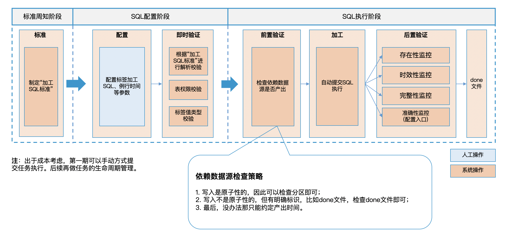
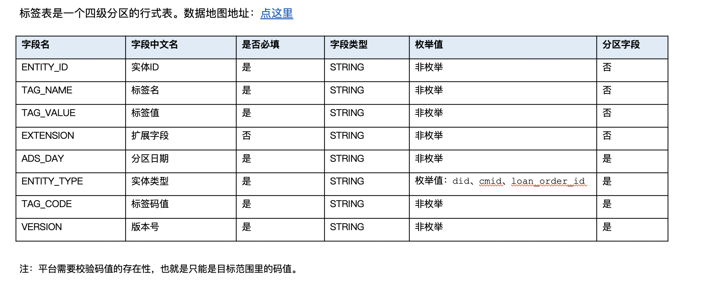
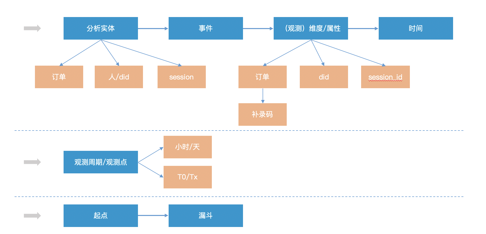
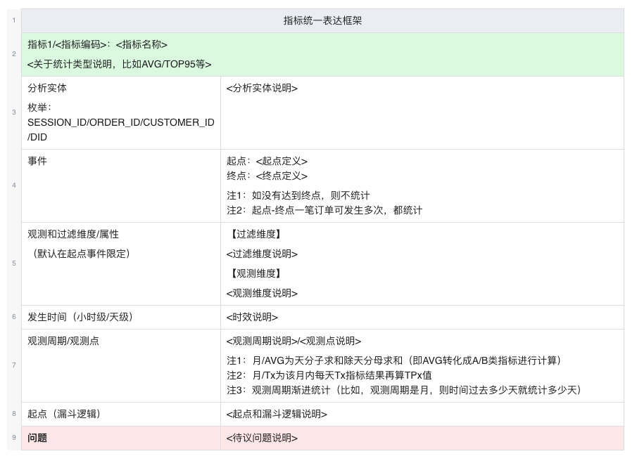
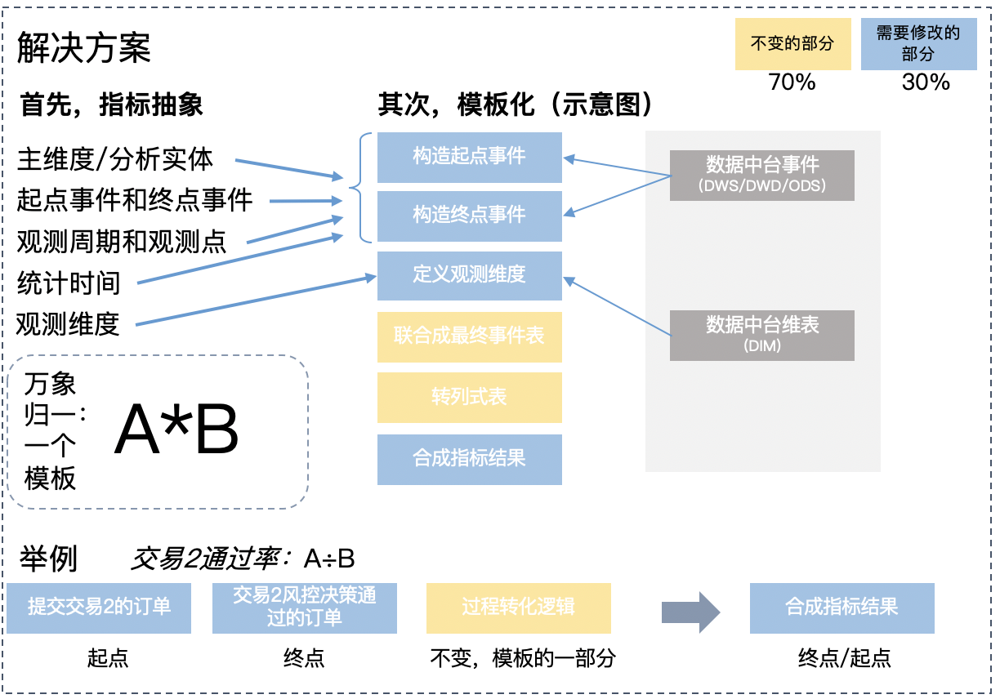
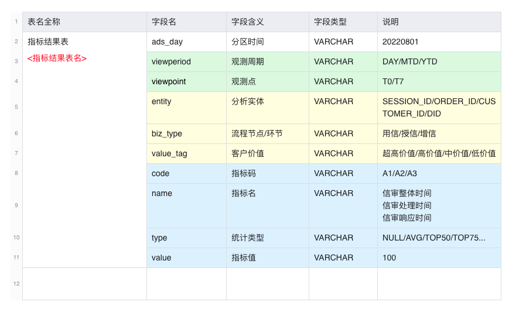
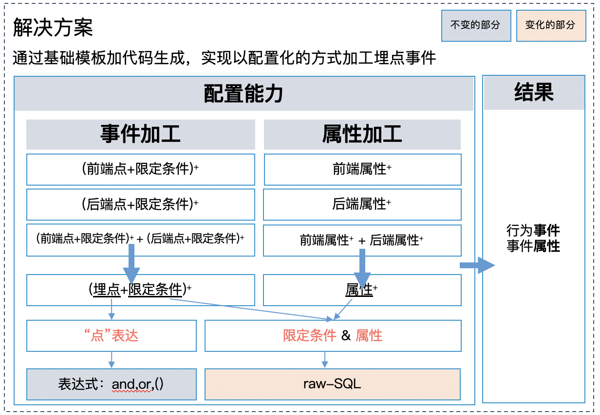

# 数据效率工具

## 标签（和变量）配置化加工工具

本文讨论限定于离线标签。

**技术架构**

标签的结构非常固定，因此非常适合通过配置化的方式加工。



另外需要注意的是，通过配置化的方式加工数据，必然涉及对用户配置的 SQL 的合法性校验。一般目标执行引擎都会提供对应的 SQL 解析工具，比如 [presto-parser (Facebook Opensource, part of Presto)](https://mvnrepository.com/artifact/com.facebook.presto/presto-parser
)。例如：

```xml
<!-- https://mvnrepository.com/artifact/com.facebook.presto/presto-parser -->
<dependency>
    <groupId>com.facebook.presto</groupId>
    <artifactId>presto-parser</artifactId>
    <version>0.283</version>
</dependency>
```

```java
String content = FileUtils.readFileToString(new File("/Users/dxm/DXM/projects/dxm/loan-data/loan-data-warehouse-python/dw/ads/tag/user5PercentLeaveBlankId/user5PercentLeaveBlankId.sql"));
SqlParser parser = new SqlParser();
Query query = (Query) parser.createStatement(content, ParsingOptions.builder().build());

//QuerySpecification body = (QuerySpecification)insert.getQuery().getChildren().get(0);

QuerySpecification body = (QuerySpecification) query.getQueryBody();
Select select = body.getSelect();

select.getSelectItems().forEach(e -> System.out.print(e.toString().split(" ")[1]+" "));
```

**存储方式**

一个公司的标签往往快速膨胀，如何设计一种非耦合的存储方式是关键，从而保证独立的执行，相互不影响。



### 一个子集：变量的结构化开发

在仅考虑加工层面的时候，变量和标签没有本质区别，变量表也可采用竖表结构。

**竖表结构**

```sql
Q1JFQVRFIFRBQkxFIElGIE5PVCBFWElTVFMgZG0uZG1fdmFyX2NvbXBfcmVzdWx0c19mZCgKICBlbnRpdHlfaWQgc3RyaW5nIENPTU1FTlQgJ+WunuS9k0lEJywgCiAgZW50aXR5X3R5cGUgc3RyaW5nIENPTU1FTlQgJ+WunuS9k+exu+WeiycsIAogIHZhcl9uYW1lIHN0cmluZyBDT01NRU5UICflj5jph4/lkI3np7AnLCAKICB2YXJfdmFsdWUgc3RyaW5nIENPTU1FTlQgJ+WPmOmHj+WAvCcsIAogIGV4dGVuc2lvbiBzdHJpbmcgQ09NTUVOVCAn5omp5bGV5a2X5q61JwopCkNPTU1FTlQgJ+WPmOmHj+iuoeeul+e7k+aenOihqCcKUEFSVElUSU9ORUQgQlkgKCAKICBkdCBzdHJpbmcgQ09NTUVOVCAn5YiG5Yy677yM5q+U5aaC77yaMjAyNS0wOS0yOScsCiAgdmFyX2NvZGUgc3RyaW5nIENPTU1FTlQgJ+WPmOmHj+e8lueggScpClJPVyBGT1JNQVQgU0VSREUgCiAgJ29yZy5hcGFjaGUuaGFkb29wLmhpdmUucWwuaW8ucGFycXVldC5zZXJkZS5QYXJxdWV0SGl2ZVNlckRlJwpXSVRIIFNFUkRFUFJPUEVSVElFUyAoCiAgJ2ZpZWxkLmRlbGltJz0nXDAwMScsCiAgJ3NlcmlhbGl6YXRpb24uZm9ybWF0Jz0nXDAwMScsCiAgJ3NlcmlhbGl6YXRpb24ubnVsbC5mb3JtYXQnPSdOVUxMJykKU1RPUkVEIEFTIElOUFVURk9STUFUCiAgJ29yZy5hcGFjaGUuaGFkb29wLmhpdmUucWwuaW8ucGFycXVldC5NYXByZWRQYXJxdWV0SW5wdXRGb3JtYXQnCk9VVFBVVEZPUk1BVAogICdvcmcuYXBhY2hlLmhhZG9vcC5oaXZlLnFsLmlvLnBhcnF1ZXQuTWFwcmVkUGFycXVldE91dHB1dEZvcm1hdCcKTE9DQVRJT04KICAnaGRmczovL2hkZnMtY2x1c3Rlci91c2VyL2hpdmUvd2FyZWhvdXNlL2RtLmRiL2RtX3Zhcl9jb21wX3Jlc3VsdHNfZmQnClRCTFBST1BFUlRJRVMgKAogICdwYXJxdWV0LmNvbXByZXNzaW9uJz0nU05BUFBZJyk7
```

```sql
Q1JFQVRFIFRBQkxFIElGIE5PVCBFWElTVFMgZG1fZl9mYWN1aS5kbV9mX2ZhY3VpX3Zhcl9jb21wX3Jlc3VsdHNfZmgoCiAgZW50aXR5X2lkIHN0cmluZyBDT01NRU5UICflrp7kvZNJRCcsIAogIGVudGl0eV90eXBlIHN0cmluZyBDT01NRU5UICflrp7kvZPnsbvlnosnLCAKICB2YXJfbmFtZSBzdHJpbmcgQ09NTUVOVCAn5Y+Y6YeP5ZCN56ewJywgCiAgdmFyX3ZhbHVlIHN0cmluZyBDT01NRU5UICflj5jph4/lgLwnLCAKICBleHRlbnNpb24gc3RyaW5nIENPTU1FTlQgJ+aJqeWxleWtl+autScKKQpDT01NRU5UICflj5jph4/orqHnrpfnu5PmnpzooajvvIjlsI/ml7bnuqfooajvvIknClBBUlRJVElPTkVEIEJZICggCiAgZHQgc3RyaW5nIENPTU1FTlQgJ+WIhuWMuu+8jOavlOWmgu+8mjIwMjYtMDQtMDEnLAogIGhyIHN0cmluZyBDT01NRU5UICflsI/ml7bliIbljLrvvIzmr5TlpoLvvJowMSwwMizigKbigKYsMjMnLAogIHZhcl9jb2RlIHN0cmluZyBDT01NRU5UICflj5jph4/nvJbnoIEnKQpST1cgRk9STUFUIFNFUkRFIAogICdvcmcuYXBhY2hlLmhhZG9vcC5oaXZlLnFsLmlvLnBhcnF1ZXQuc2VyZGUuUGFycXVldEhpdmVTZXJEZScKV0lUSCBTRVJERVBST1BFUlRJRVMgKAogICdmaWVsZC5kZWxpbSc9J1wwMDEnLAogICdzZXJpYWxpemF0aW9uLmZvcm1hdCc9J1wwMDEnLAogICdzZXJpYWxpemF0aW9uLm51bGwuZm9ybWF0Jz0nTlVMTCcpClNUT1JFRCBBUyBJTlBVVEZPUk1BVAogICdvcmcuYXBhY2hlLmhhZG9vcC5oaXZlLnFsLmlvLnBhcnF1ZXQuTWFwcmVkUGFycXVldElucHV0Rm9ybWF0JwpPVVRQVVRGT1JNQVQKICAnb3JnLmFwYWNoZS5oYWRvb3AuaGl2ZS5xbC5pby5wYXJxdWV0Lk1hcHJlZFBhcnF1ZXRPdXRwdXRGb3JtYXQnClRCTFBST1BFUlRJRVMgKAogICdwYXJxdWV0LmNvbXByZXNzaW9uJz0nU05BUFBZJyk7
```

**变量加工**

```sql

```

**最终合表（如需）**

```sql
LS1FTVIgU3BhcmsgU1FMCi0tKioqKioqKioqKioqKioqKioqKioqKioqKioqKioqKioqKioqKioqKioqKioqKioqKioqKioqKioqKioqKioqKioqKiotLQotLWF1dGhvcjpsaXVqaWFud2VpCi0tY3JlYXRlIHRpbWU6MjAyNi0wNi0wNCAwOTozMToyNwotLUVNUiBTcGFyayBTUUwg5Lu75Yqh5Y+q6IO96L+Q6KGM5Zyo54us5Lqr6LWE5rqQ57uE5LiKCi0tKioqKioqKioqKioqKioqKioqKioqKioqKioqKioqKioqKioqKioqKioqKioqKioqKioqKioqKioqKioqKioqKioqKiotLQoKCgotLSBDUkVBVEUgVEFCTEUgSUYgTk9UIEVYSVNUUyBkbV9mX2ZhY3VpLmRtX2ZfZmFjdWlfbGF3X3BsYXRmb3JtX2V4dGVybmFsX3ZhcnNfY2FzZV9mZCgKLS0gICBjYXNlX251bWJlciBzdHJpbmcgQ09NTUVOVCAn5qGI5Lu25Y+3JywgCi0tICAgY2FzZV9sYXN0X29uY2Vfb3JnIHN0cmluZyBDT01NRU5UICfmoYjku7bmnIDov5HkuIDmrKHlpITnva7mnLrmnoTvvIjlpJbpg6jotYTkuqfvvIknLCAKLS0gICBjYXNlX2xhc3RfdHdpY2Vfb3JnIHN0cmluZyBDT01NRU5UICfmoYjku7bmnIDov5HkuKTmrKHlpITnva7mnLrmnoTvvIjlpJbpg6jotYTkuqfvvIknLCAKLS0gICBjYXNlX2xhc3RfdGhyZWVfb3JnIHN0cmluZyBDT01NRU5UICfmoYjku7bmnIDov5HkuInmrKHlpITnva7mnLrmnoTvvIjlpJbpg6jotYTkuqfvvIknLCAKLS0gICBjYXNlX2xhc3Rfb25jZV9jb21wYW55IHN0cmluZyBDT01NRU5UICfmoYjku7bmnIDov5HkuIDmrKHlpITnva7lhazlj7jvvIjlpJbpg6jotYTkuqfvvIknLCAKLS0gICBjYXNlX2xhc3RfdHdpY2VfY29tcGFueSBzdHJpbmcgQ09NTUVOVCAn5qGI5Lu25pyA6L+R5Lik5qyh5aSE572u5YWs5Y+477yI5aSW6YOo6LWE5Lqn77yJJywgCi0tICAgY2FzZV9sYXN0X3RocmVlX2NvbXBhbnkgc3RyaW5nIENPTU1FTlQgJ+ahiOS7tuacgOi/keS4ieasoeWkhOe9ruWFrOWPuO+8iOWklumDqOi1hOS6p++8iScsCi0tICAgY2FzZV9vdmVyZHVlX2RheSBiaWdpbnQgQ09NTUVOVCAn5qGI5Lu26YC+5pyf5aSp5pWw77yI5aSW6YOo6LWE5Lqn77yJJywKLS0gICBjYXNlX292ZXJkdWVfbGV2ZWwgc3RyaW5nIENPTU1FTlQgJ+ahiOS7tumAvuacn+etiee6p++8iOWklumDqOi1hOS6p++8iScsCi0tICAgY2FzZV9vdmVyZHVlX2Ftb3VudCBkZWNpbWFsKDIwLDYpIENPTU1FTlQgJ+ahiOS7tumAvuacn+aAu+mine+8jOacrOmHkSvliKnmga/vvIjlpJbpg6jotYTkuqfvvIknLAotLSAgIGNhc2VfdW5wYXlfcHJpbmNpcGFsIGRlY2ltYWwoMjAsNikgQ09NTUVOVCAn5qGI5Lu25pyq6L+Y5pys6YeR77yM5YyF5ous6YC+5pyf5ZKM5pyq5Yiw5pyf5omA5pyJ5pyq6L+Y5pys6YeR77yI5aSW6YOo6LWE5Lqn77yJJwotLSApCi0tIENPTU1FTlQgJ+azleWCrC3lpJbpg6jotYTkuqct5qGI5Lu25Y+Y6YeP6KGoJwotLSBQQVJUSVRJT05FRCBCWSAoCi0tICAgZHQgc3RyaW5nIENPTU1FTlQgJ+WIhuWMuu+8jOavlOWmgu+8mjIwMjYtMDYtMDQnKQotLSBST1cgRk9STUFUIFNFUkRFCi0tICAgJ29yZy5hcGFjaGUuaGFkb29wLmhpdmUucWwuaW8ucGFycXVldC5zZXJkZS5QYXJxdWV0SGl2ZVNlckRlJwotLSBXSVRIIFNFUkRFUFJPUEVSVElFUyAoCi0tICAgJ2ZpZWxkLmRlbGltJz0nXDAwMScsCi0tICAgJ3NlcmlhbGl6YXRpb24uZm9ybWF0Jz0nXDAwMScsCi0tICAgJ3NlcmlhbGl6YXRpb24ubnVsbC5mb3JtYXQnPSdOVUxMJykKLS0gU1RPUkVEIEFTIElOUFVURk9STUFUCi0tICAgJ29yZy5hcGFjaGUuaGFkb29wLmhpdmUucWwuaW8ucGFycXVldC5NYXByZWRQYXJxdWV0SW5wdXRGb3JtYXQnCi0tIE9VVFBVVEZPUk1BVAotLSAgICdvcmcuYXBhY2hlLmhhZG9vcC5oaXZlLnFsLmlvLnBhcnF1ZXQuTWFwcmVkUGFycXVldE91dHB1dEZvcm1hdCcKLS0gVEJMUFJPUEVSVElFUyAoCi0tICAgJ3BhcnF1ZXQuY29tcHJlc3Npb24nPSdTTkFQUFknKTsKCgoKLS3inIXnu7TluqY6ZW50aXR5X2lkCndpdGggZG1fdmFyX2NvbXBfcmVzdWx0c192aWV3IGFzICgKICAgIHNlbGVjdCAKICAgIGVudGl0eV9pZAogICAgLHZhcl92YWx1ZQogICAgLHZhcl9jb2RlCiAgICBmcm9tIGRtLmRtX3Zhcl9jb21wX3Jlc3VsdHNfZmQKICAgIHdoZXJlIGR0PScke3llc3RlcmRheX0nCiAgICAgIGFuZCB2YXJfY29kZSBpbiAoCiAgICAgICAgICAtLSDkuIrmuLjku7vliqExOmRtLmRtX3Zhcl9jb21wX3Jlc3VsdHNfZmQuZGFpbHlfZGlzdF9jYXNlX2luaXRfdmFyc19leHRlcm5hbCAtLQogICAgICAgICAgJ2Nhc2VfbGFzdF9vbmNlX29yZ19leHRlcm5hbCcKICAgICAgICAgICwnY2FzZV9sYXN0X3R3aWNlX29yZ19leHRlcm5hbCcKICAgICAgICAgICwnY2FzZV9sYXN0X3RocmVlX29yZ19leHRlcm5hbCcKICAgICAgICAgICwnY2FzZV9sYXN0X29uY2VfY29tcGFueV9leHRlcm5hbCcKICAgICAgICAgICwnY2FzZV9sYXN0X3R3aWNlX2NvbXBhbnlfZXh0ZXJuYWwnCiAgICAgICAgICAsJ2Nhc2VfbGFzdF90aHJlZV9jb21wYW55X2V4dGVybmFsJwogICAgICAgICAgLS0gMjAyNjA2MjPmlrDlop4gLS0KICAgICAgICAgICwnY2FzZV9vdmVyZHVlX2RheV9leHRlcm5hbCcKICAgICAgICAgICwnY2FzZV9vdmVyZHVlX2xldmVsX2V4dGVybmFsJwogICAgICAgICAgLCdjYXNlX292ZXJkdWVfYW1vdW50X2V4dGVybmFsJwogICAgICAgICAgLCdjYXNlX3VucGF5X3ByaW5jaXBhbF9leHRlcm5hbCcpCikKCixmaW5hbHMgYXMgKAogICAgc2VsZWN0IAogICAgZW50aXR5X2lkIGFzIGNhc2VfbnVtYmVyCiAgICAKICAgICxtYXgoaWYodmFyX2NvZGU9J2Nhc2VfbGFzdF9vbmNlX29yZ19leHRlcm5hbCcsdmFyX3ZhbHVlLG51bGwpKSBhcyBjYXNlX2xhc3Rfb25jZV9vcmcKICAgICxtYXgoaWYodmFyX2NvZGU9J2Nhc2VfbGFzdF90d2ljZV9vcmdfZXh0ZXJuYWwnLHZhcl92YWx1ZSxudWxsKSkgYXMgY2FzZV9sYXN0X3R3aWNlX29yZwogICAgLG1heChpZih2YXJfY29kZT0nY2FzZV9sYXN0X3RocmVlX29yZ19leHRlcm5hbCcsdmFyX3ZhbHVlLG51bGwpKSBhcyBjYXNlX2xhc3RfdGhyZWVfb3JnCiAgICAsbWF4KGlmKHZhcl9jb2RlPSdjYXNlX2xhc3Rfb25jZV9jb21wYW55X2V4dGVybmFsJyx2YXJfdmFsdWUsbnVsbCkpIGFzIGNhc2VfbGFzdF9vbmNlX2NvbXBhbnkKICAgICxtYXgoaWYodmFyX2NvZGU9J2Nhc2VfbGFzdF90d2ljZV9jb21wYW55X2V4dGVybmFsJyx2YXJfdmFsdWUsbnVsbCkpIGFzIGNhc2VfbGFzdF90d2ljZV9jb21wYW55CiAgICAsbWF4KGlmKHZhcl9jb2RlPSdjYXNlX2xhc3RfdGhyZWVfY29tcGFueV9leHRlcm5hbCcsdmFyX3ZhbHVlLG51bGwpKSBhcyBjYXNlX2xhc3RfdGhyZWVfY29tcGFueQogICAgLS0gMjAyNjA2MjPmlrDlop4gLS0KICAgICxtYXgoaWYodmFyX2NvZGU9J2Nhc2Vfb3ZlcmR1ZV9kYXlfZXh0ZXJuYWwnLHZhcl92YWx1ZSxudWxsKSkgYXMgY2FzZV9vdmVyZHVlX2RheQogICAgLG1heChpZih2YXJfY29kZT0nY2FzZV9vdmVyZHVlX2xldmVsX2V4dGVybmFsJyx2YXJfdmFsdWUsbnVsbCkpIGFzIGNhc2Vfb3ZlcmR1ZV9sZXZlbAogICAgLG1heChpZih2YXJfY29kZT0nY2FzZV9vdmVyZHVlX2Ftb3VudF9leHRlcm5hbCcsdmFyX3ZhbHVlLDApKSBhcyBjYXNlX292ZXJkdWVfYW1vdW50CiAgICAsbWF4KGlmKHZhcl9jb2RlPSdjYXNlX3VucGF5X3ByaW5jaXBhbF9leHRlcm5hbCcsdmFyX3ZhbHVlLDApKSBhcyBjYXNlX3VucGF5X3ByaW5jaXBhbAogICAgCiAgICBmcm9tIGRtX3Zhcl9jb21wX3Jlc3VsdHNfdmlldwogICAgZ3JvdXAgYnkgZW50aXR5X2lkCikKCmluc2VydCBvdmVyd3JpdGUgdGFibGUgZG1fZl9mYWN1aS5kbV9mX2ZhY3VpX2xhd19wbGF0Zm9ybV9leHRlcm5hbF92YXJzX2Nhc2VfZmQKCnNlbGVjdCAqLCcke3llc3RlcmRheX0nIGZyb20gZmluYWxzOwo=
```

## 指标配置化加工工具

本文讨论限定于离线指标。

**表达框架——指标技术体系**





**技术架构**

基于表达框架，指标可以做结构化抽象。如下图，可以抽象为起点、终点、观测维度，以及最后行转列，进而产出指标。



**指标举例**

```sql
ZGVsZXRlIGZyb20gbG9hbl9kYXRhX3dhcmVob3VzZS5hZHNfbG9hbl9zZXJ2X2luZGV4X3JvX2RkIHdoZXJlIGFkc19kYXk9J3tEQVRFLTF9JyBhbmQgdmlld3BlcmlvZD0nREFZJyBhbmQgdmlld3BvaW50PSdUMCcgIGFuZCBlbnRpdHk9J09SREVSX0lEJyAgYW5kIGNvZGU9J1MyMycgOwppbnNlcnQgaW50byBsb2FuX2RhdGFfd2FyZWhvdXNlLmFkc19sb2FuX3NlcnZfaW5kZXhfcm9fZGQKIAogIAotLSMjIyMjIyMjIyMjIOaooeadvzog57uf5LiA5qih5p2/ICMjIyMjIyMjIyMjCi0tLS0tLS0tLS0tLS0tLS0tLSBFVkVOVFMgU1RBUlQgLS0tLS0tLS0tLS0tLS0tLS0KIAotLSDkupHluIbogJfml7YgZG9uZQotLSDotbfngrnpgLvovpHvvJrlj5bmjojkv6HooaXlvZUr55So5L+h6KGl5b2V5LqL5Lu2IOaJgOacieeahOaVsOaNruW+gOWJjeaJvjPlpKnvvIznnIvmmK/lkKbmnInpnZ7lvZPml6XnmoTorrDlvZXvvIznrZvmjonvvJvlj5bmnIDml6nnmoTkuIDmnaHkvZzkuLrotbfngrnvvJsKd2l0aCBFVkVOVF9zdGFydCBhcyAoCiAgICBzZWxlY3QKICAgICAgICBkaXN0aW5jdAogICAgICAgIHN1YnN0cihkd2RfaG91ciwxLDgpIGFzIGR0LAogICAgICAgIGFsbF9vcmRlcnMub3JkZXJfaWQgYXMgcHJpbWFyeV9kaW0sCiAgICAgICAgY21pZCBhcyByZWZfZGltLAogICAgICAgICdFVkVOVF9zdGFydCcgYXMgZXZlbnQsCiAgICAgICAgb2NjdXJfdGltZSBhcyBvY2N1cl90aW1lCiAgICBmcm9tICgKICAgICAgICAtLSDlj5Y05aSp5pWw5o2uIOW8gOeqlyDlj5bnrKzkuIDmnaEg5Y+q5Y+W5pe26Ze05Zyo5b2T5aSp55qE6K6i5Y2VCiAgICAgICAgc2VsZWN0ICogZnJvbSAoCiAgICAgICAgICAgIHNlbGVjdAogICAgICAgICAgICAgICAgZHdkX2hvdXIsCiAgICAgICAgICAgICAgICBvcmRlcl9pZCwKICAgICAgICAgICAgICAgIGNtaWQsCiAgICAgICAgICAgICAgICBvY2N1cl90aW1lLAogICAgICAgICAgICAgICAgcm93X251bWJlcigpIG92ZXIgKHBhcnRpdGlvbiBieSBvcmRlcl9pZCBvcmRlciBieSBvY2N1cl90aW1lKSBhcyBybgogICAgICAgICAgICBmcm9tIGxvYW5fZGF0YV93YXJlaG91c2UuZHdkX2xvYW5fb21nX29mZmVyX2hkCiAgICAgICAgICAgIHdoZXJlIHN1YnN0cihkd2RfaG91ciwxLDgpID49ICd7REFURS00fScgYW5kIHN1YnN0cihkd2RfaG91ciwxLDgpIDw9ICd7REFURS0xfScKICAgICAgICAgICAgLS0g6LW354K55LqL5Lu277yM6L+Y5rKh5pyJ5LqR5biG55qE57uT5p6c77yM5omA5Lul5peg6ZyA562b6YCJ57G75Z6LCiAgICAgICAgICAgIGFuZCBldmVudCA9ICd0cmFuc2FjdGlvbl90d29fdWxvYW5fbG9hbl9zdWJtaXQnIC0tIG9tZ+aPkOS6pOaOiOS/oSBvbWfmj5DkuqTnlKjkv6EKICAgICAgICApIHdoZXJlIHJuID0gMSBhbmQgcmVnZXhwX3JlcGxhY2Uoc3Vic3RyKG9jY3VyX3RpbWUsMSwxMCksJy0nLCcnKSA9ICd7REFURS0xfScKICAgICkgYWxsX29yZGVycwogICAgbGVmdCBqb2luICgKICAgICAgICBzZWxlY3Qgb3JkZXJfaWQKICAgICAgICBmcm9tIGxvYW5fZGF0YV93YXJlaG91c2UuZHdkX2xvYW5fdWxvYW5fZGlzdF9oZCAtLSDkupHluIZkd2QKICAgICAgICB3aGVyZSBzdWJzdHIoc3RhdF9kdCwxLDgpID49ICd7REFURS0xfScgYW5kIHN1YnN0cihzdGF0X2R0LDEsOCkgPD0gJ3tEQVRFLTF9JwogICAgICAgIGFuZCBldmVudCA9ICd0cmFuc2FjdGlvbl90d29fcmVzdWx0JyAtLSDkuqTmmJMy57uT5p6cCiAgICAgICAgYW5kIGlzX3Bhc3MgaW4gKCcxJywgJzInKSAtLSDkupHluIZkd2TkuK3lrZjkuobkuK3pl7TmgIHlkoznu5PmnpzmgIEg6ZyA6KaB5Y+W57uT5p6c5oCB5oiQ5YqfL+Wksei0pSDlkKbliJnkuIDkuKrorqLljZXkvJrmnInlpJrmnaHorrDlvZUKICAgICAgICBhbmQgaXNGcm9udFRyYW5zUXVlcnlJbnN0ID0gJzEnIC0tIOino+iApjPmnJ/moIfor4bkuLoxCiAgICApIHVsb2FuX29yZGVycwogICAgb24gYWxsX29yZGVycy5vcmRlcl9pZCA9IHVsb2FuX29yZGVycy5vcmRlcl9pZAogICAgd2hlcmUgdWxvYW5fb3JkZXJzLm9yZGVyX2lkIGlzIG5vdCBudWxsIC0tIOWPquimgeWFs+iBlOS4iuino+iApjPmnJ/nmoTmlbDmja4KICAgIGFuZCBhbGxfb3JkZXJzLm9yZGVyX2lkIG5vdCBpbiAoCiAgICAgICAgLS0g6ZyA6KaB5o6S6Zmk5b2T5aSp55qEIOi/m+S6uuWuoeeahOiuouWNlSDlkKbliJnogJfml7bkvJrlj5jlvojplb8KICAgICAgICBzZWxlY3Qgb3JkZXJfaWQKICAgICAgICBmcm9tIGxvYW5fZGF0YV93YXJlaG91c2UuZHdkX2xvYW5fb21nX29mZmVyX2hkCiAgICAgICAgd2hlcmUgc3Vic3RyKGR3ZF9ob3VyLDEsOCkgPj0gJ3tEQVRFLTF9JyBhbmQgc3Vic3RyKGR3ZF9ob3VyLDEsOCkgPD0gJ3tEQVRFLTF9JwogICAgICAgIGFuZCBldmVudCA9ICd0cmFuc2FjdGlvbl90d29fYXBwcm92YWxfcmVzdWx0JwogICAgICAgIGFuZCBhcHByb3ZhbF9yZXN1bHQgPSAnNicKICAgICkKKSwKLS0g57uI54K56YC76L6R77ya5Y+W5Zue6LCD5LqR5biG5LqL5Lu2CkVWRU5UX2VuZCBhcyAoCiAgICBzZWxlY3QKICAgICAgICBkaXN0aW5jdAogICAgICAgIHN1YnN0cihkd2RfaG91ciwxLDgpIGFzIGR0LAogICAgICAgIG9yZGVyX2lkIGFzIHByaW1hcnlfZGltLAogICAgICAgIGNtaWQgYXMgcmVmX2RpbSwKICAgICAgICAnRVZFTlRfZW5kJyBhcyBldmVudCwKICAgICAgICBvY2N1cl90aW1lIGFzIG9jY3VyX3RpbWUKICAgIGZyb20gKAogICAgICAgIHNlbGVjdAogICAgICAgICAgICBkd2RfaG91ciwKICAgICAgICAgICAgb3JkZXJfaWQsCiAgICAgICAgICAgIGNtaWQsCiAgICAgICAgICAgIG9jY3VyX3RpbWUsCiAgICAgICAgICAgIHJvd19udW1iZXIoKSBvdmVyIChwYXJ0aXRpb24gYnkgb3JkZXJfaWQgb3JkZXIgYnkgb2NjdXJfdGltZSkgYXMgcm4KICAgICAgICBmcm9tIGxvYW5fZGF0YV93YXJlaG91c2UuZHdkX2xvYW5fb21nX29mZmVyX2hkCiAgICAgICAgd2hlcmUgc3Vic3RyKGR3ZF9ob3VyLDEsOCkgPj0gJ3tEQVRFLTF9JyBhbmQgIHN1YnN0cihkd2RfaG91ciwxLDgpIDw9ICd7REFURS0xfScKICAgICAgICBhbmQgb3JkZXJfaWQgaW4gKHNlbGVjdCBwcmltYXJ5X2RpbSBmcm9tIEVWRU5UX3N0YXJ0KQogICAgICAgIGFuZCBldmVudCA9ICd0cmFuc2FjdGlvbl90d29fdWxvYW5fcmVzdWx0JyAtLSBvbWflm57osIPkupHluIbkuovku7YKICAgICkgd2hlcmUgcm4gPSAxCiksCiAKRVZFTlRTIGFzICggLS3otbfngrnjgIHnu4jngrnkuovku7blkIjlubYKICAgIHNlbGVjdAogICAgICAgICAgICBkdCwKICAgICAgICAgICAgcHJpbWFyeV9kaW0sCiAgICAgICAgICAgIHJlZl9kaW0sCiAgICAgICAgICAgIGV2ZW50LAogICAgICAgICAgICBvY2N1cl90aW1lCiAgICAgICAgZnJvbSBFVkVOVF9zdGFydAogICAgICAgIHdoZXJlIGR0ID0gcmVnZXhwX3JlcGxhY2Uoc3Vic3RyKG9jY3VyX3RpbWUsMSwxMCksJy0nLCcnKQogCiAgICAgICAgdW5pb24gYWxsCiAKICAgICAgICBzZWxlY3QKICAgICAgICAgICAgZHQsCiAgICAgICAgICAgIHByaW1hcnlfZGltLAogICAgICAgICAgICByZWZfZGltLAogICAgICAgICAgICBldmVudCwKICAgICAgICAgICAgb2NjdXJfdGltZQogICAgICAgIGZyb20gRVZFTlRfZW5kCiAgICAgICAgd2hlcmUgZHQgPSByZWdleHBfcmVwbGFjZShzdWJzdHIob2NjdXJfdGltZSwxLDEwKSwnLScsJycpCiksCi0tLS0tLS0tLS0tLS0tLS0tLSBFVkVOVFMgRU5EIC0tLS0tLS0tLS0tLS0tLS0tCiAKIAogCi0tLS0tLS0tLS0tLS0tLS0tLSBESU0gU1RBUlQgLS0tLS0tLS0tLS0tLS0tLS0KLS3mlLnliqjngrkKRElNIGFzKCAtLeW8leWFpee7tOW6pgogICAgc2VsZWN0CiAgICAgICAgZHMgICAgICAgIGFzIGR0LAogICAgICAgIGNtX2lkICAgICBhcyBtaW5fZGltLAogICAgICAgIHZhbHVlX3RhZyBhcyBkaW00LAogICAgICAgICcnICAgICAgICBhcyBkaW01LAogICAgICAgICcnICAgICAgICBhcyBkaW02LAogICAgICAgICcnICAgICAgICBhcyBkaW03LAogICAgICAgICcnICAgICAgICBhcyBkaW04LAogICAgICAgICcnICAgICAgICBhcyBkaW05LAogICAgICAgICcnICAgICAgICBhcyBkaW0xMAogICAgZnJvbSAgbWR3X2R3ZC5kd2RfY3VzdF9wcm9maXRfdmFsdWVfbGV2ZWxfbWlkX3RhZ19kZgogICAgd2hlcmUgZHM+PSd7REFURS0xfScgYW5kICBkczw9J3tEQVRFLTF9JwopLAotLS0tLS0tLS0tLS0tLS0tLS0gRElNIEVORCAtLS0tLS0tLS0tLS0tLS0tLQogCi0tLS0tLS0tLS0tLS0tLS0tLSBDTyBTVEFSVCAtLS0tLS0tLS0tLS0tLS0tLQpDTyBhcyAoIC0t5ZCM5LiA5Liq5Lq655qE6LW354K55ZKM57uI54K55Liy5oiQ5LiA5p2h5pWw5o2uCiAgICAgCiAgICBzZWxlY3QKICAgICAgICBkdCwKICAgICAgICBwcmltYXJ5X2RpbSwKICAgICAgICByZWZfZGltLAogICAgICAgIGV2ZW50ICAgICAgICAgICAgICAgICAgICAgICAgICAgICAgICAgICAgICAgICAgICAgICAgICAgICAgICAgICAgICAgICAgICAgICBhcyBwb2ludF9zdGFydCwKICAgICAgICBvY2N1cl90aW1lICAgICAgICAgICAgICAgICAgICAgICAgICAgICAgICAgICAgICAgICAgICAgICAgICAgICAgICAgICAgICAgICAgYXMgcG9pbnRfc3RhcnRfdGltZSwKICAgICAgICBsZWFkKGV2ZW50LDEsJ2VtcHR5Jykgb3ZlcihwYXJ0aXRpb24gYnkgcHJpbWFyeV9kaW0gb3JkZXIgYnkgb2NjdXJfdGltZSkgICAgICAgYXMgcG9pbnRfZW5kLAogICAgICAgIGxlYWQob2NjdXJfdGltZSwxLCdlbXB0eScpIG92ZXIocGFydGl0aW9uIGJ5IHByaW1hcnlfZGltIG9yZGVyIGJ5IG9jY3VyX3RpbWUpICBhcyBwb2ludF9lbmRfdGltZQogICAgZnJvbSBFVkVOVFMKIAopLAogCiAKQ09fd2l0aF9kaW0gYXMgKC0t5Lq65ZKM57u05bqm6L+b6KGM5YWz6IGUCiAgICBzZWxlY3QKICAgICAgICBDTy5kdCwKICAgICAgICBDTy5wcmltYXJ5X2RpbSwKICAgICAgICBjYXNlIHdoZW4gIENPLnBvaW50X3N0YXJ0PSdFVkVOVF9zdGFydCcgdGhlbiAxIGVsc2UgMCBlbmQgYXMgcG9pbnRfc3RhcnQsCiAgICAgICAgQ08ucG9pbnRfc3RhcnRfdGltZSwKICAgICAgICBjYXNlIHdoZW4gIENPLnBvaW50X2VuZD0nRVZFTlRfZW5kJyB0aGVuIDEKICAgICAgICAgICAgIHdoZW4gIENPLnBvaW50X2VuZD0nZW1wdHknICAgICB0aGVuIDAgZW5kIGFzIHBvaW50X2VuZCwKICAgICAgICBDTy5wb2ludF9lbmRfdGltZSwKIAogICAgICAgIERJTTEuZGltNCAgICAgICAgYXMgZGltNCwKICAgICAgICBESU0xLmRpbTUgICAgICAgIGFzIGRpbTUsCiAgICAgICAgRElNMS5kaW02ICAgICAgICBhcyBkaW02LAogICAgICAgIERJTTEuZGltNyAgICAgICAgYXMgZGltNywKICAgICAgICBESU0xLmRpbTggICAgICAgIGFzIGRpbTgsCiAgICAgICAgRElNMS5kaW05ICAgICAgICBhcyBkaW05LAogICAgICAgIERJTTEuZGltMTAgICAgICAgYXMgZGltMTAsCiAKICAgICAgICBESU0yLmRpbTQgICAgICAgIGFzIGRpbTExLAogICAgICAgIERJTTIuZGltNSAgICAgICAgYXMgZGltMTIsCiAgICAgICAgRElNMi5kaW02ICAgICAgICBhcyBkaW0xMywKICAgICAgICBESU0yLmRpbTcgICAgICAgIGFzIGRpbTE0LAogICAgICAgIERJTTIuZGltOCAgICAgICAgYXMgZGltMTUsCiAgICAgICAgRElNMi5kaW05ICAgICAgICBhcyBkaW0xNiwKICAgICAgICBESU0yLmRpbTEwICAgICAgIGFzIGRpbTE3CiAgICBmcm9tIENPCiAgICBsZWZ0IGpvaW4gRElNIGFzIERJTTEKICAgICAgICAtLeaUueWKqOeCuSoKICAgICAgICBvbiBjby5yZWZfZGltID0gRElNMS5taW5fZGltIGFuZCByZWdleHBfcmVwbGFjZShzdWJzdHIoQ08ucG9pbnRfc3RhcnRfdGltZSwxLDEwKSwnLScsJycpICA9IERJTTEuZHQKICAgIGxlZnQgam9pbiBESU0gYXMgRElNMgogICAgICAgIC0t5pS55Yqo54K5KgogICAgICAgIG9uIGNvLnJlZl9kaW0gPSBESU0yLm1pbl9kaW0gYW5kIHJlZ2V4cF9yZXBsYWNlKHN1YnN0cihDTy5wb2ludF9lbmRfdGltZSwxLDEwKSwnLScsJycpICA9IERJTTIuZHQKICAgIHdoZXJlIHBvaW50X3N0YXJ0ID0nRVZFTlRfc3RhcnQnICBhbmQgcG9pbnRfZW5kIGluKCdlbXB0eScsICdFVkVOVF9lbmQnKQopCi0tLS0tLS0tLS0tLS0tLS0tLSBDTyBFTkQgLS0tLS0tLS0tLS0tLS0tLS0KIAogCi0tLS0tLS0tLS0tLS0tLS0tLSDmjIfmoIcgU1RBUlQgLS0tLS0tLS0tLS0tLS0tLS0KCnNlbGVjdAogICAgJycgYXMgYml6X3R5cGUsCiAgICBjb2FsZXNjZShkaW00LCcnKSBhcyB2YWx1ZV90YWcsCiAgICAn5Lqk5piTMi3kupHluIbogJfml7Yt6Kej6ICmM+acnycgYXMgbmFtZSwKICAgICdBVkcnIGFzIHR5cGUsCiAgICBjYXN0KAogICAgICAgIHN1bSgKICAgICAgICAgICAgQ0FTVChjb25jYXQoY2FzdChjYXN0KHRvX3VuaXh0aW1lKGNhc3Qoc3Vic3RyKHBvaW50X2VuZF90aW1lLDEsMTkpIGFzIHRpbWVzdGFtcCApKSBhcyBiaWdpbnQpIGFzIHZhcmNoYXIpLHN1YnN0cihwb2ludF9lbmRfdGltZSwyMSwyMykpIEFTIGJpZ2ludCkgLQogICAgICAgICAgICBDQVNUKGNvbmNhdChjYXN0KGNhc3QodG9fdW5peHRpbWUoY2FzdChzdWJzdHIocG9pbnRfc3RhcnRfdGltZSwxLDE5KSBhcyB0aW1lc3RhbXAgKSkgYXMgYmlnaW50KSBhcyB2YXJjaGFyKSxzdWJzdHIocG9pbnRfc3RhcnRfdGltZSwyMSwyMykpIEFTIGJpZ2ludCkKICAgICAgICApCiAgICBhcyB2YXJjaGFyKSBhcyBwb2ludF9zdGFydCwKICAgIGNhc3Qoc3VtKHBvaW50X3N0YXJ0KSBhcyB2YXJjaGFyKSBhcyBwb2ludF9lbmQsCiAgICBjYXN0KAogICAgICAgIGNhc3QoCiAgICAgICAgICAgIGF2ZygKICAgICAgICAgICAgICAgIENBU1QoY29uY2F0KGNhc3QoY2FzdCh0b191bml4dGltZShjYXN0KHN1YnN0cihwb2ludF9lbmRfdGltZSwxLDE5KSBhcyB0aW1lc3RhbXAgKSkgYXMgYmlnaW50KSBhcyB2YXJjaGFyKSxzdWJzdHIocG9pbnRfZW5kX3RpbWUsMjEsMjMpKSBBUyBiaWdpbnQpIC0KICAgICAgICAgICAgICAgIENBU1QoY29uY2F0KGNhc3QoY2FzdCh0b191bml4dGltZShjYXN0KHN1YnN0cihwb2ludF9zdGFydF90aW1lLDEsMTkpIGFzIHRpbWVzdGFtcCApKSBhcyBiaWdpbnQpIGFzIHZhcmNoYXIpLHN1YnN0cihwb2ludF9zdGFydF90aW1lLDIxLDIzKSkgQVMgYmlnaW50KQogICAgICAgICAgICApCiAgICAgICAgYXMgZGVjaW1hbCgzOCw0KSkKICAgIGFzIHZhcmNoYXIpIGFzIHZhbHVlLAogICAgJ3tEQVRFLTF9JyBhcyBhZHNfZGF5LAogICAgJ0RBWScgYXMgdmlld3BlcmlvZCwKICAgICdUMCcgYXMgdmlld3BvaW50LAogICAgJ09SREVSX0lEJyBhcyBlbnRpdHksCiAgICAnUzIzJyBhcyBjb2RlCmZyb20gQ09fd2l0aF9kaW0Kd2hlcmUgcG9pbnRfc3RhcnQ9MSBhbmQgcG9pbnRfZW5kPTEtLeacieW8gOWni+aciee7k+adn+eahOeCuQpncm91cCBieSAyCgp1bmlvbiBhbGwgCgpzZWxlY3QgCiAgICAnJyAgICAgICAgICAgICAgICAgICAgICAgICAgICAgICAgICAgICBhcyBiaXpfdHlwZSwKICAgIGNvYWxlc2NlKGRpbTQsJycpICAgICAgICAgICAgICAgICAgICAgIGFzIHZhbHVlX3RhZywKICAgICfkuqTmmJMyLeS6keW4huiAl+aXti3op6PogKYz5pyfJyAgICAgICAgICAgICAgICAgIGFzIG5hbWUsCiAgICAnVFA5OScgICAgICAgICAgICAgICAgICAgICAgICAgICAgICAgICBhcyB0eXBlLAogICAgJycgICAgICAgICAgICAgICAgICAgICAgICAgICAgICAgICAgICAgYXMgcG9pbnRfc3RhcnQsCiAgICAnJyAgICAgICAgICAgICAgICAgICAgICAgICAgICAgICAgICAgICBhcyBwb2ludF9lbmQsCiAgICBjYXN0KAogICAgICAgICAgICBhcHByb3hfcGVyY2VudGlsZSgKICAgICAgICAgICAgICAgIENBU1QoY29uY2F0KGNhc3QoY2FzdCh0b191bml4dGltZShjYXN0KHN1YnN0cihwb2ludF9lbmRfdGltZSwxLDE5KSBhcyB0aW1lc3RhbXAgKSkgYXMgYmlnaW50KSBhcyB2YXJjaGFyKSxzdWJzdHIocG9pbnRfZW5kX3RpbWUsMjEsMjMpKSBBUyBiaWdpbnQpIC0KICAgICAgICAgICAgICAgIENBU1QoY29uY2F0KGNhc3QoY2FzdCh0b191bml4dGltZShjYXN0KHN1YnN0cihwb2ludF9zdGFydF90aW1lLDEsMTkpIGFzIHRpbWVzdGFtcCApKSBhcyBiaWdpbnQpIGFzIHZhcmNoYXIpLHN1YnN0cihwb2ludF9zdGFydF90aW1lLDIxLDIzKSkgQVMgYmlnaW50KQogICAgICAgICAgICAsMC45OSkgICAKICAgIGFzIHZhcmNoYXIpICAgICAgICAgICAgICAgICAgICAgICAgICAgICAgICBhcyB2YWx1ZSwKCgogICAgJ3tEQVRFLTF9JyAgICAgICAgICAgICAgICAgICAgICAgICAgYXMgYWRzX2RheSwKICAgICAnREFZJyAgICAgICAgICAgICAgICAgICAgICAgICAgICAgIGFzIHZpZXdwZXJpb2QsCiAgICAgJ1QwJyAgICAgICAgICAgICAgICAgICAgICAgICAgICAgICBhcyB2aWV3cG9pbnQsCiAgICAgJ09SREVSX0lEJyAgICAgICAgICAgICAgICAgICAgICAgICBhcyBlbnRpdHksCiAgICAgJ1MyMycgICAgICAgICAgICAgICAgICAgICAgICAgICAgICBhcyBjb2RlCmZyb20gQ09fd2l0aF9kaW0Kd2hlcmUgcG9pbnRfc3RhcnQ9MSBhbmQgcG9pbnRfZW5kPTEtLeacieW8gOWni+aciee7k+adn+eahOeCuQoKZ3JvdXAgYnkgMiAKCgp1bmlvbiBhbGwKCgpzZWxlY3QgCiAgICAnJyAgICAgICAgICAgICAgICAgICAgICAgICAgICAgICAgICAgICBhcyBiaXpfdHlwZSwKICAgIGNvYWxlc2NlKGRpbTQsJycpICAgICAgICAgICAgICAgICAgICAgIGFzIHZhbHVlX3RhZywKICAgICfkuqTmmJMyLeS6keW4huiAl+aXti3op6PogKYz5pyfJyAgICAgICAgICAgICAgICAgIGFzIG5hbWUsCiAgICAnVFA5OCcgICAgICAgICAgICAgICAgICAgICAgICAgICAgICAgICBhcyB0eXBlLAogICAgJycgICAgICAgICAgICAgICAgICAgICAgICAgICAgICAgICAgICAgYXMgcG9pbnRfc3RhcnQsCiAgICAnJyAgICAgICAgICAgICAgICAgICAgICAgICAgICAgICAgICAgICBhcyBwb2ludF9lbmQsCiAgICBjYXN0KAogICAgICAgICAgICBhcHByb3hfcGVyY2VudGlsZSgKICAgICAgICAgICAgICAgIENBU1QoY29uY2F0KGNhc3QoY2FzdCh0b191bml4dGltZShjYXN0KHN1YnN0cihwb2ludF9lbmRfdGltZSwxLDE5KSBhcyB0aW1lc3RhbXAgKSkgYXMgYmlnaW50KSBhcyB2YXJjaGFyKSxzdWJzdHIocG9pbnRfZW5kX3RpbWUsMjEsMjMpKSBBUyBiaWdpbnQpIC0KICAgICAgICAgICAgICAgIENBU1QoY29uY2F0KGNhc3QoY2FzdCh0b191bml4dGltZShjYXN0KHN1YnN0cihwb2ludF9zdGFydF90aW1lLDEsMTkpIGFzIHRpbWVzdGFtcCApKSBhcyBiaWdpbnQpIGFzIHZhcmNoYXIpLHN1YnN0cihwb2ludF9zdGFydF90aW1lLDIxLDIzKSkgQVMgYmlnaW50KQogICAgICAgICAgICAsMC45OCkgICAKICAgIGFzIHZhcmNoYXIpICAgICAgICAgICAgICAgICAgICAgICAgICAgICAgICBhcyB2YWx1ZSwKCgogICAgJ3tEQVRFLTF9JyAgICAgICAgICAgICAgICAgICAgICAgICAgYXMgYWRzX2RheSwKICAgICAnREFZJyAgICAgICAgICAgICAgICAgICAgICAgICAgICAgIGFzIHZpZXdwZXJpb2QsCiAgICAgJ1QwJyAgICAgICAgICAgICAgICAgICAgICAgICAgICAgICBhcyB2aWV3cG9pbnQsCiAgICAgJ09SREVSX0lEJyAgICAgICAgICAgICAgICAgICAgICAgICBhcyBlbnRpdHksCiAgICAgJ1MyMycgICAgICAgICAgICAgICAgICAgICAgICAgICAgICBhcyBjb2RlCmZyb20gQ09fd2l0aF9kaW0Kd2hlcmUgcG9pbnRfc3RhcnQ9MSBhbmQgcG9pbnRfZW5kPTEtLeacieW8gOWni+aciee7k+adn+eahOeCuQoKZ3JvdXAgYnkgMiAKCgoKdW5pb24gYWxsIAoKCnNlbGVjdCAKICAgICcnICAgICAgICAgICAgICAgICAgICAgICAgICAgICAgICAgICAgIGFzIGJpel90eXBlLAogICAgY29hbGVzY2UoZGltNCwnJykgICAgICAgICAgICAgICAgICAgICAgYXMgdmFsdWVfdGFnLAogICAgJ+S6pOaYkzIt5LqR5biG6ICX5pe2Leino+iApjPmnJ8nICAgICAgICAgICAgICAgICAgYXMgbmFtZSwKICAgICdUUDk1JyAgICAgICAgICAgICAgICAgICAgICAgICAgICAgICAgIGFzIHR5cGUsCiAgICAnJyAgICAgICAgICAgICAgICAgICAgICAgICAgICAgICAgICAgICBhcyBwb2ludF9zdGFydCwKICAgICcnICAgICAgICAgICAgICAgICAgICAgICAgICAgICAgICAgICAgIGFzIHBvaW50X2VuZCwKICAgIGNhc3QoCiAgICAgICAgICAgIGFwcHJveF9wZXJjZW50aWxlKAogICAgICAgICAgICAgICAgQ0FTVChjb25jYXQoY2FzdChjYXN0KHRvX3VuaXh0aW1lKGNhc3Qoc3Vic3RyKHBvaW50X2VuZF90aW1lLDEsMTkpIGFzIHRpbWVzdGFtcCApKSBhcyBiaWdpbnQpIGFzIHZhcmNoYXIpLHN1YnN0cihwb2ludF9lbmRfdGltZSwyMSwyMykpIEFTIGJpZ2ludCkgLQogICAgICAgICAgICAgICAgQ0FTVChjb25jYXQoY2FzdChjYXN0KHRvX3VuaXh0aW1lKGNhc3Qoc3Vic3RyKHBvaW50X3N0YXJ0X3RpbWUsMSwxOSkgYXMgdGltZXN0YW1wICkpIGFzIGJpZ2ludCkgYXMgdmFyY2hhciksc3Vic3RyKHBvaW50X3N0YXJ0X3RpbWUsMjEsMjMpKSBBUyBiaWdpbnQpCiAgICAgICAgICAgICwwLjk1KSAgIAogICAgYXMgdmFyY2hhcikgICAgICAgICAgICAgICAgICAgICAgICAgICAgICAgIGFzIHZhbHVlLAoKCiAgICAne0RBVEUtMX0nICAgICAgICAgICAgICAgICAgICAgICAgICBhcyBhZHNfZGF5LAogICAgICdEQVknICAgICAgICAgICAgICAgICAgICAgICAgICAgICAgYXMgdmlld3BlcmlvZCwKICAgICAnVDAnICAgICAgICAgICAgICAgICAgICAgICAgICAgICAgIGFzIHZpZXdwb2ludCwKICAgICAnT1JERVJfSUQnICAgICAgICAgICAgICAgICAgICAgICAgIGFzIGVudGl0eSwKICAgICAnUzIzJyAgICAgICAgICAgICAgICAgICAgICAgICAgICAgIGFzIGNvZGUKZnJvbSBDT193aXRoX2RpbQp3aGVyZSBwb2ludF9zdGFydD0xIGFuZCBwb2ludF9lbmQ9MS0t5pyJ5byA5aeL5pyJ57uT5p2f55qE54K5Cgpncm91cCBieSAyIAoKCnVuaW9uIGFsbCAKCgpzZWxlY3QgCiAgICAnJyAgICAgICAgICAgICAgICAgICAgICAgICAgICAgICAgICAgICBhcyBiaXpfdHlwZSwKICAgIGNvYWxlc2NlKGRpbTQsJycpICAgICAgICAgICAgICAgICAgICAgIGFzIHZhbHVlX3RhZywKICAgICfkuqTmmJMyLeS6keW4huiAl+aXti3op6PogKYz5pyfJyAgICAgICAgICAgICAgICAgIGFzIG5hbWUsCiAgICAnVFA5MCcgICAgICAgICAgICAgICAgICAgICAgICAgICAgICAgICBhcyB0eXBlLAogICAgJycgICAgICAgICAgICAgICAgICAgICAgICAgICAgICAgICAgICAgYXMgcG9pbnRfc3RhcnQsCiAgICAnJyAgICAgICAgICAgICAgICAgICAgICAgICAgICAgICAgICAgICBhcyBwb2ludF9lbmQsCiAgICBjYXN0KAogICAgICAgICAgICBhcHByb3hfcGVyY2VudGlsZSgKICAgICAgICAgICAgICAgIENBU1QoY29uY2F0KGNhc3QoY2FzdCh0b191bml4dGltZShjYXN0KHN1YnN0cihwb2ludF9lbmRfdGltZSwxLDE5KSBhcyB0aW1lc3RhbXAgKSkgYXMgYmlnaW50KSBhcyB2YXJjaGFyKSxzdWJzdHIocG9pbnRfZW5kX3RpbWUsMjEsMjMpKSBBUyBiaWdpbnQpIC0KICAgICAgICAgICAgICAgIENBU1QoY29uY2F0KGNhc3QoY2FzdCh0b191bml4dGltZShjYXN0KHN1YnN0cihwb2ludF9zdGFydF90aW1lLDEsMTkpIGFzIHRpbWVzdGFtcCApKSBhcyBiaWdpbnQpIGFzIHZhcmNoYXIpLHN1YnN0cihwb2ludF9zdGFydF90aW1lLDIxLDIzKSkgQVMgYmlnaW50KQogICAgICAgICAgICAsMC45MCkgICAKICAgIGFzIHZhcmNoYXIpICAgICAgICAgICAgICAgICAgICAgICAgICAgICAgICBhcyB2YWx1ZSwKCgogICAgJ3tEQVRFLTF9JyAgICAgICAgICAgICAgICAgICAgICAgICAgYXMgYWRzX2RheSwKICAgICAnREFZJyAgICAgICAgICAgICAgICAgICAgICAgICAgICAgIGFzIHZpZXdwZXJpb2QsCiAgICAgJ1QwJyAgICAgICAgICAgICAgICAgICAgICAgICAgICAgICBhcyB2aWV3cG9pbnQsCiAgICAgJ09SREVSX0lEJyAgICAgICAgICAgICAgICAgICAgICAgICBhcyBlbnRpdHksCiAgICAgJ1MyMycgICAgICAgICAgICAgICAgICAgICAgICAgICAgICBhcyBjb2RlCmZyb20gQ09fd2l0aF9kaW0Kd2hlcmUgcG9pbnRfc3RhcnQ9MSBhbmQgcG9pbnRfZW5kPTEtLeacieW8gOWni+aciee7k+adn+eahOeCuQoKZ3JvdXAgYnkgMgoKCnVuaW9uIGFsbCAKCgpzZWxlY3QgCiAgICAnJyAgICAgICAgICAgICAgICAgICAgICAgICAgICAgICAgICAgICBhcyBiaXpfdHlwZSwKICAgIGNvYWxlc2NlKGRpbTQsJycpICAgICAgICAgICAgICAgICAgICAgIGFzIHZhbHVlX3RhZywKICAgICfkuqTmmJMyLeS6keW4huiAl+aXti3op6PogKYz5pyfJyAgICAgICAgICAgICAgICAgIGFzIG5hbWUsCiAgICAnVFA1MCcgICAgICAgICAgICAgICAgICAgICAgICAgICAgICAgICBhcyB0eXBlLAogICAgJycgICAgICAgICAgICAgICAgICAgICAgICAgICAgICAgICAgICAgYXMgcG9pbnRfc3RhcnQsCiAgICAnJyAgICAgICAgICAgICAgICAgICAgICAgICAgICAgICAgICAgICBhcyBwb2ludF9lbmQsCiAgICBjYXN0KAogICAgICAgICAgICBhcHByb3hfcGVyY2VudGlsZSgKICAgICAgICAgICAgICAgIENBU1QoY29uY2F0KGNhc3QoY2FzdCh0b191bml4dGltZShjYXN0KHN1YnN0cihwb2ludF9lbmRfdGltZSwxLDE5KSBhcyB0aW1lc3RhbXAgKSkgYXMgYmlnaW50KSBhcyB2YXJjaGFyKSxzdWJzdHIocG9pbnRfZW5kX3RpbWUsMjEsMjMpKSBBUyBiaWdpbnQpIC0KICAgICAgICAgICAgICAgIENBU1QoY29uY2F0KGNhc3QoY2FzdCh0b191bml4dGltZShjYXN0KHN1YnN0cihwb2ludF9zdGFydF90aW1lLDEsMTkpIGFzIHRpbWVzdGFtcCApKSBhcyBiaWdpbnQpIGFzIHZhcmNoYXIpLHN1YnN0cihwb2ludF9zdGFydF90aW1lLDIxLDIzKSkgQVMgYmlnaW50KQogICAgICAgICAgICAsMC41MCkgICAKICAgICAgICAKICAgIGFzIHZhcmNoYXIpICAgICAgICAgICAgICAgICAgICAgICAgICAgICAgICBhcyB2YWx1ZSwKCgogICAgJ3tEQVRFLTF9JyAgICAgICAgICAgICAgICAgICAgICAgICAgYXMgYWRzX2RheSwKICAgICAnREFZJyAgICAgICAgICAgICAgICAgICAgICAgICAgICAgIGFzIHZpZXdwZXJpb2QsCiAgICAgJ1QwJyAgICAgICAgICAgICAgICAgICAgICAgICAgICAgICBhcyB2aWV3cG9pbnQsCiAgICAgJ09SREVSX0lEJyAgICAgICAgICAgICAgICAgICAgICAgICBhcyBlbnRpdHksCiAgICAgJ1MyMycgICAgICAgICAgICAgICAgICAgICAgICAgICAgICBhcyBjb2RlCmZyb20gQ09fd2l0aF9kaW0Kd2hlcmUgcG9pbnRfc3RhcnQ9MSBhbmQgcG9pbnRfZW5kPTEtLeacieW8gOWni+aciee7k+adn+eahOeCuQoKZ3JvdXAgYnkgMiAKLS0tLS0tLS0tLS0tLS0tLS0tIOaMh+aghyBFTkQgLS0tLS0tLS0tLS0tLS0tLS0KOw==
```

**存储方式**

指标和标签类似，也需要一种非耦合的设计，所以采用横向存储。



注：分区字段 `ads_day=20240312/viewperiod=MTD/viewpoint=T0/entity=ORDER_ID/code=S5.n`。

## 埋点配置化加工工具

本文讨论限定于离线埋点加工。

**技术架构**

埋点也即用户行为事件，结构相对来说也非常固定，因此也适合通过配置化的方式加工。

埋点配置化加工的核心点在于通过基础模板加代码生成，实现以配置化的方式加工埋点事件。基础模板是不变的部分，额外加的代码是变化的部分。



**存储方式**

采用横向存储。

## 变量配置化校验工具

本文讨论限定于离线变量校验。通过配置化的方式自动和目标值进行比对，从而提升大量变量正确性校验的效率。计算引擎采用 OLAP 引擎，比如 StarRocks 引擎。

**技术方案**

```python
IyEvdXNyL2Jpbi9lbnYgcHl0aG9uCiMgLSotIGNvZGluZzogdXRmLTggLSotCgoiIiIKQSBnZW5lcmFsIHB1cnBvc2UgRGlzdGNwIHdyYXBwZXIgaW1wbGVtZW50YXRpb24uCiIiIgppbXBvcnQgYmFzZTY0CmltcG9ydCBsb2dnaW5nCmltcG9ydCBzdWJwcm9jZXNzCmltcG9ydCBzeXMKZnJvbSBkYXRldGltZSBpbXBvcnQgZGF0ZXRpbWUKCmltcG9ydCBwcm9wcwoKbG9nZ2luZy5iYXNpY0NvbmZpZyhmaWxlbmFtZT0nLi9jb21wYXJlLmxvZycsIGZpbGVtb2RlPSd3JywgbGV2ZWw9bG9nZ2luZy5JTkZPLCBmb3JtYXQ9JyUoYXNjdGltZSlzIC0gJShuYW1lKXMgLSAlKGxldmVsbmFtZSlzIC0gJShtZXNzYWdlKXMnKQoKdmFyc19maWxlID0gImNvbXBhcmVfdmFycy5jc3YiCm1ldGhvZF9maWxlID0gImNvbXBhcmVfbWV0aG9kLnNxbCIKbWV0aG9kX29mX2NvbGxlY3RfZmlsZSA9ICJjb21wYXJlX2NvbGxlY3RfbWV0aG9kLnNxbCIKcmVzdWx0c19maWxlID0gImNvbXBhcmVfcmVzdWx0cy50eHQiCgpwcm9weiA9IHByb3BzLmxvYWQoImNvbXBhcmUucHJvcGVydGllcyIpCgpTVEFNUCA9IGRhdGV0aW1lLm5vdygpLnN0cmZ0aW1lKCclWSVtJWQlSCVNJykKCgpkZWYgc3RhcnQoKToKICAgIHdpdGggb3Blbih2YXJzX2ZpbGUsICJyIiwgZW5jb2Rpbmc9InV0Zi04IikgYXMgZmlsZToKICAgICAgICBsb2dnaW5nLmluZm8oZiJTVEFSVElORyB0byBjb21wYXJlIHZhcmlhYmxlcyBpbjoge3ZhcnNfZmlsZX0iKQogICAgICAgIGZvciBsaW5lIGluIGZpbGU6CiAgICAgICAgICAgIGNvbXBhcmUobGluZS5zdHJpcCgpKQogICAgICAgICAgICBjb2xsZWN0KGxpbmUuc3RyaXAoKSkKICAgICAgICBsb2dnaW5nLmluZm8oZiJFTkQgb2YgY29tcGFyaXNvbiBvZiB2YXJpYWJsZXMgaW46IHt2YXJzX2ZpbGV9IikKCgpkZWYgY29tcGFyZSh2YXIpOgogICAgbGluZSA9IGYibXlzcWwgLWggZmUtYy1iODY2MzU2NjdmYmRkYmYwLWludGVybmFsLnN0YXJyb2Nrcy5hbGl5dW5jcy5jb20gLVAgOTAzMCAtdSBnYW94aWFuZ2xpbiAtcHtiYXNlNjQuYjY0ZGVjb2RlKHByb3B6WydaSElNQUtBSU1FTiddKS5kZWNvZGUoJ3V0Zi04Jyl9IC1lIFwie21ldGhvZCh2YXIpfVwiIgogICAgbG9nZ2luZy5pbmZvKGYiY29tcGFyaW5nIFt7dmFyfV0gd2l0aCBsaW5lOiB7bGluZX0iKQogICAgcmVzdWx0ID0gc3VicHJvY2Vzcy5ydW4obGluZSwgc2hlbGw9VHJ1ZSwgY2hlY2s9VHJ1ZSwgc3Rkb3V0PXN1YnByb2Nlc3MuUElQRSwgc3RkZXJyPXN1YnByb2Nlc3MuUElQRSkKICAgIGxvZ2dpbmcuaW5mbyhmImNvbXBhcmlzb24gb2YgW3t2YXJ9XSBET05FOiB7cmVzdWx0LnJldHVybmNvZGV9IikKCgpkZWYgbWV0aG9kKHZhcik6CiAgICB3aXRoIG9wZW4obWV0aG9kX2ZpbGUsICdyJywgZW5jb2Rpbmc9J3V0Zi04JykgYXMgZmlsZToKICAgICAgICBjb250ZW50ID0gZmlsZS5yZWFkKCkKICAgICAgICBjb250ZW50ID0gY29udGVudC5yZXBsYWNlKCJWQVJfVE9fUkVQTEFDRSIsIHZhcikKICAgICAgICBjb250ZW50ID0gY29udGVudC5yZXBsYWNlKCJTVEFNUCIsIFNUQU1QKQogICAgICAgIGNvbnRlbnQgPSBjb250ZW50LnJlcGxhY2UoIlNPVVJDRV9UQUJMRV9OQU1FIiwgcHJvcHpbInNvdXJjZV90YWJsZV9uYW1lIl0pCiAgICAgICAgY29udGVudCA9IGNvbnRlbnQucmVwbGFjZSgiU09VUkNFX1RBQkxFX0RUIiwgcHJvcHpbInNvdXJjZV90YWJsZV9kdCJdKQogICAgICAgIGNvbnRlbnQgPSBjb250ZW50LnJlcGxhY2UoIlRBUkdFVF9UQUJMRV9OQU1FIiwgcHJvcHpbInRhcmdldF90YWJsZV9uYW1lIl0pCiAgICAgICAgY29udGVudCA9IGNvbnRlbnQucmVwbGFjZSgiVEFSR0VUX1RBQkxFX0RUIiwgcHJvcHpbInRhcmdldF90YWJsZV9kdCJdKQogICAgICAgIHJldHVybiBjb250ZW50CgoKZGVmIGNvbGxlY3QodmFyKToKICAgIHJlc3VsdHNfdGFibGUgPSBmImhpdmVfY2F0YWxvZy50ZXN0Lnt2YXJ9X3tTVEFNUH0iCiAgICBsaW5lID0gZiJteXNxbCAtaCBmZS1jLWI4NjYzNTY2N2ZiZGRiZjAtaW50ZXJuYWwuc3RhcnJvY2tzLmFsaXl1bmNzLmNvbSAtUCA5MDMwIC11IGdhb3hpYW5nbGluIC1we2Jhc2U2NC5iNjRkZWNvZGUocHJvcHpbJ1pISU1BS0FJTUVOJ10pLmRlY29kZSgndXRmLTgnKX0gLWUgXCJ7bWV0aG9kX29mX2NvbGxlY3QocmVzdWx0c190YWJsZSl9XCIiCiAgICBsb2dnaW5nLmluZm8oZiJjb2xsZWN0aW5nIFt7dmFyfV0gcmVzdWx0cyB3aXRoIGxpbmU6IHtsaW5lfSIpCiAgICByZXN1bHQgPSBzdWJwcm9jZXNzLnJ1bihsaW5lLCBzaGVsbD1UcnVlLCBjaGVjaz1UcnVlLCBzdGRvdXQ9c3VicHJvY2Vzcy5QSVBFLCBzdGRlcnI9c3VicHJvY2Vzcy5QSVBFKQogICAgbG9nZ2luZy5pbmZvKGYiY29sbGVjdGlvbiBvZiBbe3Zhcn1dIERPTkU6IHtyZXN1bHQucmV0dXJuY29kZX0iKQogICAgd3JpdGVfcmVzdWx0c190b19maWxlKGYie3Jlc3VsdHNfdGFibGV9XG57cmVzdWx0LnN0ZG91dC5kZWNvZGUoJ3V0Zi04Jyl9IikKCgpkZWYgbWV0aG9kX29mX2NvbGxlY3QocmVzdWx0c190YWJsZSk6CiAgICB3aXRoIG9wZW4obWV0aG9kX29mX2NvbGxlY3RfZmlsZSwgJ3InLCBlbmNvZGluZz0ndXRmLTgnKSBhcyBmaWxlOgogICAgICAgIGNvbnRlbnQgPSBmaWxlLnJlYWQoKQogICAgICAgIGNvbnRlbnQgPSBjb250ZW50LnJlcGxhY2UoIlJFU1VMVFNfVEFCTEVfTkFNRSIsIHJlc3VsdHNfdGFibGUpCiAgICAgICAgcmV0dXJuIGNvbnRlbnQKCgpkZWYgd3JpdGVfcmVzdWx0c190b19maWxlKHJlc3VsdHMpOgogICAgd2l0aCBvcGVuKHJlc3VsdHNfZmlsZSwgJ2EnLCBlbmNvZGluZz0idXRmLTgiKSBhcyBmaWxlOgogICAgICAgIGZpbGUud3JpdGUocmVzdWx0cyArICJcblxuXG4iKQoKCmRlZiBtYWluKCk6CiAgICB0cnk6CiAgICAgICAgc3RhcnQoKQogICAgICAgIGxvZ2dpbmcuaW5mbyhmIkFMTCBET05FLiIpCiAgICBleGNlcHQgRXhjZXB0aW9uIGFzIGU6CiAgICAgICAgbG9nZ2luZy5pbmZvKGYiRVJST1I6IHtlfSIpCiAgICAgICAgcmFpc2UgZQoKCmlmIF9fbmFtZV9fID09ICdfX21haW5fXyc6ICAjIOWmguaenOebtOaOpeS9nOS4uueLrOeri+aWh+S7tuaJp+ihjO+8jOWImSBfX25hbWVfX+eahCDlgLzlsLHmmK8gX19tYWluX1/vvIzlj6/ku6XorqTkuLrlsLHmmK8gUHl0aG9uIOeahCLnqIvluo/lhaXlj6MiCiAgICBzeXMuZXhpdChtYWluKCkp
```

```sql
Y3JlYXRlIHRhYmxlIGhpdmVfY2F0YWxvZy50ZXN0LlZBUl9UT19SRVBMQUNFX1NUQU1QIGFzCgp3aXRoIHMgYXMgKApzZWxlY3QgKiBmcm9tIFNPVVJDRV9UQUJMRV9OQU1FCndoZXJlIGR0PSdTT1VSQ0VfVEFCTEVfRFQnCiksCgp0IGFzICgKc2VsZWN0ICogZnJvbSBUQVJHRVRfVEFCTEVfTkFNRQopCgpzZWxlY3QKdC5pZF9ub19kZXMsCgp0LlZBUl9UT19SRVBMQUNFIGFzIHRfVkFSX1RPX1JFUExBQ0UsCnMuVkFSX1RPX1JFUExBQ0UgYXMgc19WQVJfVE9fUkVQTEFDRQoKZnJvbSB0CmxlZnQgam9pbiBzCm9uIHQuaWRfbm9fZGVzID0gcy5pZF9ub19kZXMKCndoZXJlIDE9MQogIGFuZCBhYnMoY29hbGVzY2Uocy5WQVJfVE9fUkVQTEFDRSwwKSAtIGNvYWxlc2NlKHQuVkFSX1RPX1JFUExBQ0UsMCkpID4gMC4wMDAwMSAtLeWvueS6juaVsOWAvOexu+Wei++8jOaegeWwj+amgueOh+WPr+iDvemcgOimgeWNleeLrOWkhOeQhm51bGwKICAgLS1vciBjb2FsZXNjZShzLlZBUl9UT19SRVBMQUNFLCcnKSA8PiBjb2FsZXNjZSh0LlZBUl9UT19SRVBMQUNFLCcnKQo7
```

另外，自动化工具针对大量变量的校验工作，对于少量变量，可以手动校验，模版如下：

```sql
LS3mlbDmja7pqozor4HvvIzmlbDmja7mr5Tlr7nvvIzmlbDmja7moKHpqozvvIzpqozor4HmlbDmja7vvIzmr5Tlr7nmlbDmja7vvIzmoKHpqozmlbDmja4tLQp3aXRoIHQgYXMgKAogICAgc2VsZWN0IAogICAgb3JkZXJfaWQgYXMgZW50aXR5X2lkLAogICAgaXRlbV9jb2RlIGFzIHZhcl92YWx1ZQogICAgLS3pnIDopoHkv67mlLkKICAgIGZyb20gZG1fZl9mYWN1aS5kbV9mX2ZhY3VpX3hxX2xhd3N1aXRfb3JkZXJfaW5mb196amRkX2ZkCiAgICB3aGVyZSBkdD0nMjAyNi0wNi0yOScKKQoKLHMgYXMgKAogICAgc2VsZWN0IAogICAgb3JkZXJfaWQgYXMgZW50aXR5X2lkLAogICAgaXRlbV9jb2RlIGFzIHZhcl92YWx1ZQogICAgLS3pnIDopoHkv67mlLkKICAgIC0tZnJvbSBkbS5kbV92YXJfY29tcF9yZXN1bHRzX2ZkX2RldgogICAgZnJvbSBkbV9mX2ZhY3VpLmRtX2ZfZmFjdWlfeHFfbGF3c3VpdF9vcmRlcl9pbmZvX3pqZGRfZmRfZGV2CiAgICB3aGVyZSBkdD0nMjAyNi0wNi0yOScKKQoKLS0gLGNoZWNrX2RldGFpbHMgYXMgKAotLSAgICAgc2VsZWN0IAotLSAgICAgdC5lbnRpdHlfaWQgYXMgdF9lbnRpdHlfaWQKLS0gICAgICxzLmVudGl0eV9pZCBhcyBzX2VudGl0eV9pZAotLSAgICAgLHQudmFyX3ZhbHVlIGFzIHRfdmFsdWUKLS0gICAgICxzLnZhcl92YWx1ZSBhcyBzX3ZhbHVlCi0tICAgICBmcm9tIHQKLS0gICAgIGZ1bGwgam9pbiBzIAotLSAgICAgb24gcy5lbnRpdHlfaWQgPSB0LmVudGl0eV9pZAotLSAgICAgd2hlcmUgY29hbGVzY2UodC52YXJfdmFsdWUsJycpPD5jb2FsZXNjZShzLnZhcl92YWx1ZSwnJykKLS0gKQoKLS0gc2VsZWN0ICogZnJvbSBjaGVja19kZXRhaWxzCi0tIDsKCgpzZWxlY3QgCifmlbDmja7mr5Tlr7knCi0t6ZyA6KaB5L+u5pS5Cixjb3VudChpZihjb2FsZXNjZSh0LnZhcl92YWx1ZSwnJyk8PmNvYWxlc2NlKHMudmFyX3ZhbHVlLCcnKSwxLG51bGwpKSBhcyB2YWx1ZV9kaWZmCmZyb20gdApmdWxsIGpvaW4gcyAKLS3pnIDopoHkv67mlLkKb24gcy5lbnRpdHlfaWQgPSB0LmVudGl0eV9pZAo7
```

注：如果目标表没有唯一主键，可以考虑使用`全字段拼接`作为关联键。
