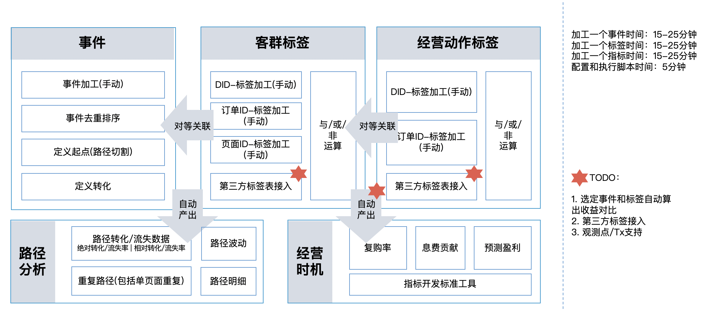

# 数据应用和服务

## 用户画像

通过全方位的标签，刻画一个用户的特征，即给用户画像，然后针对性的经营。

### 存储方式

画像的应用分两种场景，一种是直接面向业务人员平台展示，一种是通过某种形式的 API 和功能系统对接，比如经营场景。我们这里讨论狭义的画像，即平台展示这种，系统对接后面讨论。

平台展示是通过用户ID查询该用户所有标签，即“人查值”，本质上是一个 OLAP 场景，可以采用 KV 存储，比如 [HBase](TechItself-batch.md#HBase)，或者一般的 OLAP 引擎，比如 [Greenplum](TechItself-batch.md#OLAP)（所有标签按用户ID维度聚合成一行，本质上还是 KV 结构）。

## 用户旅程

通过[事务表](DataWarehouse-batch-overview.md#事务表/事务事实表)的反应**完整业务变化事实**的特性，构建用户全生命周期旅程。

### 存储方式

用户旅程的场景是通过用户ID查询该用户所有旅程事件，本质上是一个 OLAP 场景，可以采用 KV 存储，比如 [HBase](TechItself-batch.md#HBase)，或者一般的 OLAP 引擎，比如 [Greenplum](TechItself-batch.md#OLAP)。

## 指标体系

本文讨论限定于离线指标。

指标作为衡量系统或业务健康度的晴雨表，在决策和紧急处置场景下发挥着重要作用。指标应用遵循[表达框架——指标技术体系](DataTools.md#指标配置化加工工具)，构建完善的指标体系。

## 标签体系

本文讨论限定于离线标签。

用户画像之外，还可以建立丰富的标签体系（业务人员负责）。从不同角度刻画用户以及用户的行为，进而针对性地经营。

### 存储方式

标签应用分几种场景。一种是直接面向业务人员平台展示，也就是[用户画像](DataUsePlatforms.md#用户画像)，请查阅上文，这里不赘述。

一种是通过某种形式的 API 和在线功能系统对接，比如经营场景。经营场景同时存在“值查人”和“人查值”。经营场景又分为“离线（例行化）经营”和“实时经营”。

#### 离线（例行化）经营

离线经营主要是“值查人”，对性能不是那么“敏感”，可以直接基于 Hive 存储介质，用一些快速SQL查询引擎获取数据（一群用户），比如 [Presto](TechItself-batch.md#Presto)，然后再把这部分数据推送给下游做决策，进而触达。

#### 实时经营

实时经营主要是“人查值”，对性能比较敏感，通过实时处理技术加工实时标签，然后把标签存储于某种定点查询（不同于多维分析查询）介质上，比如DDBS，然后通过对外提供数据服务 API 来支持下游查询。

上述方式，提供的是实时标签，但并不能保证实时经营，或者说需要功能系统考虑经营触发的时效性。除此之外，或许可以考虑触发时机也由数据平台控制，这样就需要一种通知下游的机制，比如下游提供通知 API 或者下游监听数据的 Kafka 消息。

## 数据服务——API

上述所讲的都是指数据的应用。数据可以通过广义上的 API 的方式（比如：HDFS 文件地址、Kafka 所代表的的消息队列、SQL 和 NoSQL 数据库等）对外提供服务。

## 数据服务——自助数据分析工具

除了 API 的方式，业务自助取数进行分析也是一种数据服务策略。本文讨论限定于离线数据分析。

自助分析工具（或多维分析工具）并不完善，不详述。

