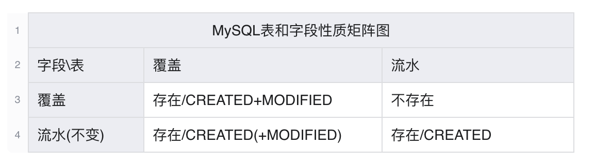
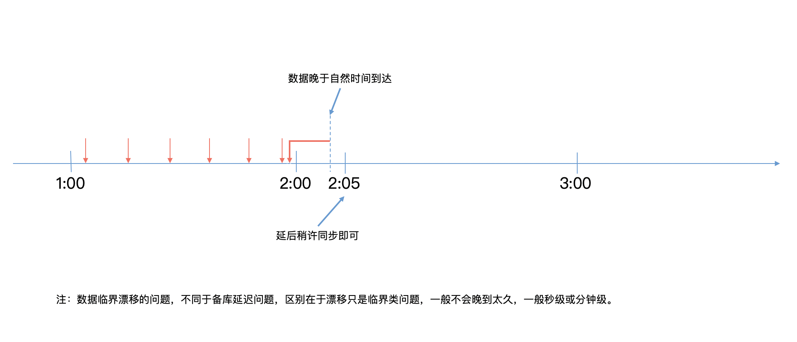
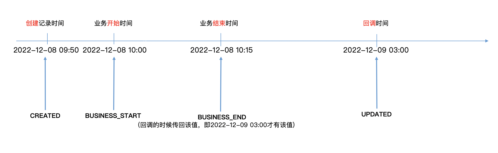
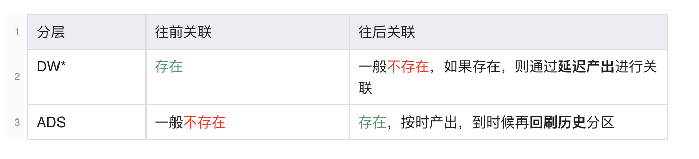
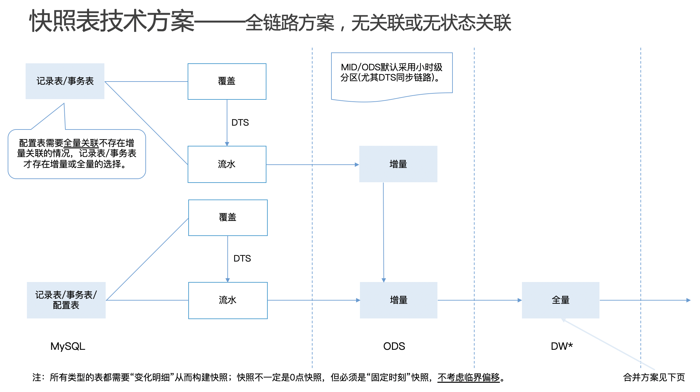
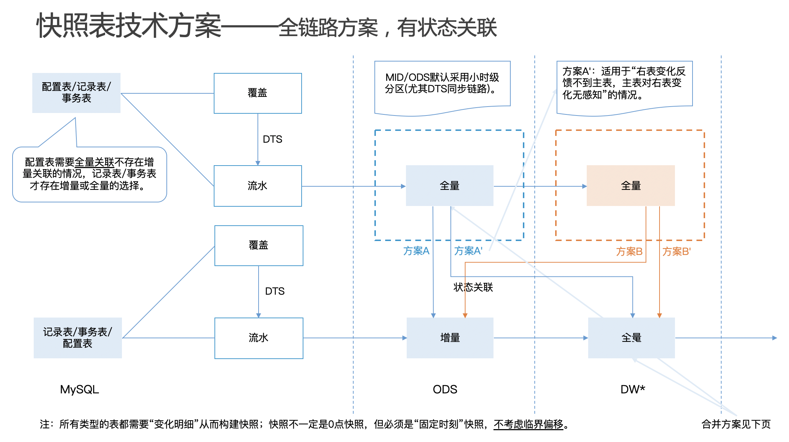
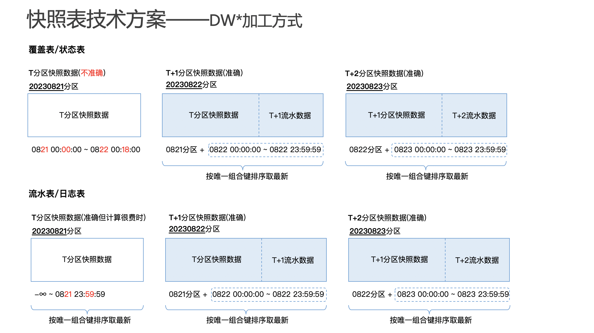

# 数据仓库开发——离线

本文限定讨论范围为离线数据仓库开发的最佳实践。

## 基本规范

理想情况，应该每一层只依赖上一层；例外也允许跨层依赖、同层依赖；严格禁止反向依赖。

ODS+DW* 所有字段均为 `string` 类型。不允许有 `null`（应用 `coalesce()` 函数） 值，都转化成空串 `''`。

ADS 字段类型按需，一般不涉及小数字段的采用 `bigint`，涉及小数的字段采用 `decimal(38,4)` ~~或者 `double`~~。由于应用层涉及多种字段类型，无法统一把 `null` 转成空串 `''`；另外，应用层空串 `''` 可能具有业务含义，故在应用层保留 `null`。

统一时间格式，比如 `yyyy-MM-dd HH:mm:ss.SSS`。

ODS 表命名规范：`[ods]_[源表名]_[dd/df/hd/hf/md/mf]`。

DW* 模型表命名规范：`[分层]_[一级主题域]_[二级主题域]_[自定义段]_[dd/df/hd/hf/md/mf]`。

## DW*事务表最佳实践

### 第一个一般性原则：MySQL【同步方式】判定策略

同步方式包括下面的同步时效、同步范围、同步字段以及同步时间点等。

注意：覆盖式数据源，不能重新拉取，因为当时的数据现场已被覆盖修改。

#### 同步时效 & 同步范围

**配置表（跑批表等同于配置表）**

- 覆盖：全量同步，优先 **hf**，或者权衡成本性能以及必要性降级成 df，如果降级成 df，需评估影响，另外，如果要求更高的准确性，就需要流水式的配置表或者事件产生时，原生就带有属性。
- 流水：增量同步，优先 hd，或者降级成 dd（极小概率分支，遇到具体情况可再说）。

**记录表**

- 覆盖：增量同步，优先 **hd**，或者降级成 dd。
- 流水：增量同步，优先 **hd**，或者降级成 dd。

#### 同步字段

一、如果 MySQL 表是覆盖的且用到的字段是覆盖的，则同步字段是 **CREATED+MODIFIED**，反例比如交易 detail 表同步问题。

二、如果 MySQL 表是覆盖的且用到的字段是不变的，则同步字段是 **CREATED+MODIFIED**，或者 **CREATED**（是否同步 MODIFIED 可以取决于需求，但一般建议都同步）。

注：另外，某些情况下结合 till-now 可以取巧成只同步 MODIFIED，但不建议这么做，徒增理解成本，反例比如核心的 tloan 同步。

三、如果 MySQL 表是流水，则同步字段是 **CREATED**。

注意，无论是 CREATED 还是 MODIFIED，都必须是**系统时间字段（或数据时间字段）**，而不能是带业务含义的**业务时间字段**；如果业务系统缺失系统时间字段，不得已用业务时间字段替代，需说明可行性和影响。

#### 同步时间点

因为临界漂移问题，所以需要**延后同步**，反例比如授信dwd临界漂移问题。所有同步任务都应该**延后几分钟**（比如5分钟）同步。

如果数据晚到时间过晚，则属于备库延迟问题，另看。

**实时同步**

实时同步采用 DTS 推送 Kafka，数据量超过5G就不建议使用该链路。

### 第二个一般性原则：DW*【加工方式】判定策略

#### 加工字段

一般来说，基于 CREATED 或者 MODIFIED 加工事件即可。

但涉及过程（比如异步回调）的事件，一般都会涉及四个字段：CREATED、BUSINESS_START、BUSINESS_END、MODIFIED。

加工策略如下：

**数据分区/dwd_hour**：目标自然时间

**读取数据时间字段**：CREATED/MODIFIED=目标分区

**事件时间/occur_time**：最**真实**的业务发生时间
- 如果事件定义为**结果**点：用 **BUSINESS_END** 作为 occur_time
- 如果事件定义为**起始**点：用 **BUSINESS_START** 作为 occur_time

注意，对于覆盖式 ODS，在没有状态机的情况下，如果 MODIFIED **不只被事件发生所驱动修改**，其它 DWD 不关心字段也会驱动 MODIFIED 修改，则**必须通过某些条件能明确判断出事件发生**。

### 第三个一般性原则：DW*加工【关联范围】判定策略

〇、先明确**主表**，主表的含义如下

- 〇.a. 作为关联（**left-join**）的左表。
- 〇.b. 主表记录不能丢失，如果关联不上右表，属性字段置空即可，左表记录**完整性**要保证，例外比如权益使用dws，因为主表缺少必要业务判断属性。

一、**关联全表**的情况

- 记录关联配置表（往往配置在前，业务事实发生在后），比如核心关联 product 表和 method 表、价格 dwd 关联 price_code 表。

二、**往前关联**或者**对等关联**的情况

- 记录表关联记录表（业务发生有先后），比如：权益使用dwd关联coupons、触达回调表关联任务下发表。具体往前关联的窗口大小，看折损率而定。

三、**往后关联**的情况（正常情况下不存在往后关联的情况）

- 接口流水问题，比如 OMG 接口流水；
- 关联记录表，主表业务发生在前，附属表业务发生在后，**但注意这时候需要考虑是否主表选择错误**，反例比如权益dwd变换主表case；（极小概率分支，遇到具体 case，需拿出来 review。）
- 其它特殊处理逻辑，比如核心 dwd 的 tx 表关联 tloan 和 op 表，一般不建议如此处理。

具体往后关联的窗口大小，看折损率而定。

### 第四个一般性原则：DW*事件【附带属性】判定策略

一、事件只带该事件**原生属性**，就是在**该事件上产生的属性**；

二、**基本ID**或公共属性（包括：did,customer_id,product_id），可以重复在**所有事件**上都带上，允许关联其它 dwd，如果是非 1:1 映射关联，仅限于细找粗。

三、事件属性枚举值全部加工（包括透传）到 DW*——因此枚举值存在性可以在 DW* 验证——因此，模型需要设计 else 逻辑。

例外：

一、ADS/DWS 关联补齐属性**成本很高**，且 DWD 关联补齐属性成本**相对很低**，且仅限于当前业务系统内关联，可以在DWD关联补齐属性，比如核心dwd放款补齐借据固有属性；

二、业务系统本身掺杂不属于本系统的临时逻辑或者默认逻辑，出于**收敛目的**，可以在 DWD 附带加工，且允许关联其它dwd，比如权益使用dwd关联交易取助贷码。

### 第五个一般性原则：DW*事件【加工构造】判定策略

一般来说，一个事件只能基于状态机的"**唯一状态**"加工。

#### 起点

一、起点事件一般基于**唯一状态**加工，反例比如资金 dwd 的起点事件；

二、对于覆盖式的 ODS，状态机的**所有非起点状态**且**CREATED=目标分区**，都要构造一条起点事件，比如交易dwd、权益dwd（反例）、资金dwd的起点事件。

例外：

**多初始态**，则需**保留所有**初始态的映射，暂无具体实例。

#### 终点

1. 终点事件一般也基于**唯一状态**加工；
2. 对于覆盖式的ODS，~~且如果MODIFIED不只被事件发生所驱动修改，~~则需要限定**事件发生时间=目标分区**来找到事件的真正发生。

例外：

一、**多终态**，则需**保留所有**终态的映射，比如资金dwd的退票事件；

二、另一个例外是，**终态会变**（出于业务系统某种不可控原因），则**保留所有**终态的映射，因为也没办法去重，比如触达dwd的多次回调。

总之，由于覆盖式的 ODS，在每一次**修改发生**的时候，这条记录都会天然**附带上之前的信息**，所以加工事件的时候要明确能**区分出来事件的真正发生时间**；流水式的 ODS 不存在类似问题。

注：针对覆盖式 ODS，我们需要构造起点事件，推荐的代码结构是**先构造完整流水**，**再加工 DWD 事件**，可拆分成两个独立任务。

### 第六个一般性原则：DW*【数据合并/留存】判定策略

合并/保留总原则依赖于**数据量**来判定，而数据量影响的是：

1. 查询性能
2. 回溯效率（回溯效率还可以通过合并任务即动态分区提效）
3. 存储资源

分别来看。

#### 查询性能

如果查询性能受到影响，则肯定得合并，无论是增量场景还是全量场景。把高时效（多分区）的数据合并成低时效（少分区）的数据。

至于高时效的数据是否删除，则取决于存储资源占用。

#### 回溯效率

一般回溯效率可以通过合并任务即动态分区提升。如果合并任务这条路走不通，则也可以考虑合并分区，把高时效（多分区）的数据合并成低时效（少分区）的数据。

如果是回溯效率考虑，则高时效分区数据必然会删除。

#### 存储资源

**增量场景\/\*d**

目前小时级增量数据量基本都在KB或者MB级别，因此可以**保留全生命周期**的数据，若小时级增量数据超过5GB，则另行评估数据保留时间。

而且增量数据合并并不能减少数据存储量。

**全量场景\/\*f**

一般来说，小时级全量数据多为配置表，数据量不大且变动极低，一般数据量为KB或者MB级别的存储，此类数据可以**保留全生命周期**的数据。

若小时级全量占用存储接近或者超过10GB，则需要对数据进行整理，数据整理方案如下：

1. 小时级全量例行任务的数据保留**最近一周**的数据，对历史数据定期清理；
2. 小时级全量历史数据退化为天级全量（因为是全量数据，低时效的合并会减少数据存储量）数据存储，**保留全生命周期**的数据。

**回溯影响**

高时效分区合并低时效分区后，如果高时效分区数据删除，则低时效任务和高时效任务下游使用方会面临回溯问题的影响。

问题就是回溯和例行的代码不能保持一套，需要通过更底层的数据进行回溯，这就**需要保证数据加工结果和例行的一致性**。

另外，如果高时效分区数据不删除，则回溯（如果需要）可以通过合并任务即动态分区提效。

## ADS事务表最佳实践

### 第一个一般性原则：应用层数据【加工方式】判定策略

#### 加工时效 & 加工范围

默认**小时级增量**加工，即 **hd**。

注：鉴于 Eggroll 这门技术的性能以及诸多限制问题，可【基于两种方案退化】：hf 或者合并，具体在详设时评估，然后拿出来 review。

### 第二个一般性原则：ADS 加工【关联范围】判定策略

ADS应用层数据加工，应该不涉及【关联范围】的决策，关联的问题应该在 DW* 层解决掉。

如果涉及关联范围，更多的也是【往后关联】，可以参照 DW* 层的规范。

### 第三个一般性原则：分层判定策略

一、是否有 dws 一层，通过【**需求驱动**】以及【**是否通用**】来判断，详设时明确。

二、ads/dws（如有）默认完全【**基于dwd**】加工，例外如 push 推送，需单独拿出来 review。

### 第四个一般性原则：ADS 层禁止的操作

出于数据中台解耦和可维护性的考虑，一个逻辑类型只能在一个地方加工，推导出来，ADS禁止做【**枚举映射**】，因为【映射】天然的弱逻辑性，很容易在后续修改中被忽略或遗忘，所有枚举映射都应该在 DWD 层完成。码值转中文不在此禁止范围。

### 其它技术实践规范

一般来说，无论 DW* 还是 ADS **不应该使用 `distinct`** 操作符去重，默认使用 `distinct` 去重，会**掩盖问题**，反例比如核心 dwd 加工逻辑默认都加 `distinct`、交易 dwd 还款事件逻辑加 `distinct`。

一般来说，无论 DW* 还是 ADS **不应该使用 `union`** 操作符达到去重的目的，应该使用 `union-all`，否则会**掩盖问题**，反例比如资金 dwd 通过union修补另一个代码问题导致的数据重复问题。

一般来说，无论 DW* 还是 ADS **不应该使用 `join`** 操作符达到去重的目的，应该使用 `left-join`，否则会**掩盖问题**，反例比如标签。

例外案例，拿出来 review。

禁止不加分区限制或者其它条件限制的**查询全表**的 SQL 行为。

## DW*快照表最佳实践

## ADS快照表最佳实践

没有什么特殊性。可参考[ADS事务表最佳实践](DataWarehouse-batch-build.md#ADS事务表最佳实践)。

## 数据共享最佳实践

如果所有任务是同在一个加工平台，也就是相同上下文环境，则任务之间最好设置任务级别的依赖。

如果数据跨上下文共享时，也就无法设置任务级别的依赖，但下游方还是需要知道上游方的任务什么时候执行完，也就是数据什么时候产出完成，下游好开始拉取。

一般这种跨上下文数据 **Ready** 判断，有如下策略：

1、写入是原子性的，因此可以检查分区即可；

2、写入不是原子性的，但有明确标识，比如done文件，检查done文件即可；

3、最后，没办法那只能约定产出时间。
