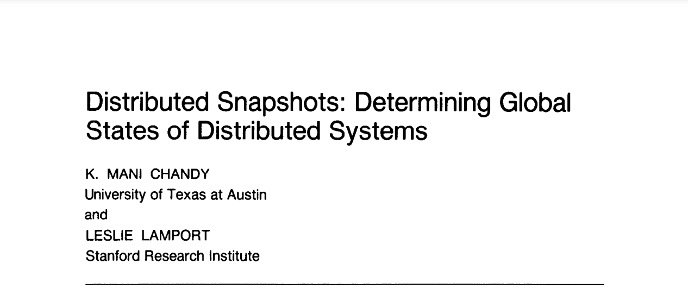
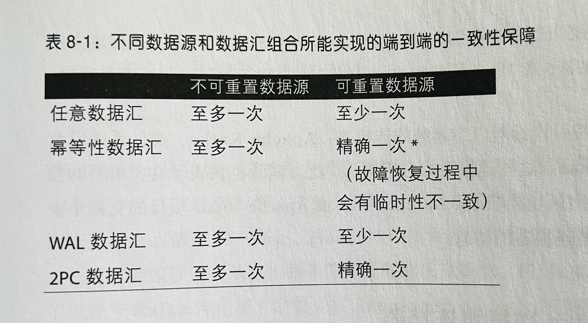

# 大数据技术——实时

[[Kafka](TechItself-realtime.md#kafka)]
[[Flink](TechItself-realtime.md#flink)]

## Kafka

Kafka 是基于"订阅"模式的消息队列。消息的生产者和消费者最大限度的实现解耦。

### Kafka 在流处理中的作用

Kafka 作为流处理系统（比如稍后讨论的 Flink）的数据来源介质，并不只是提供输入数据这么简单。事实上，正是由于 Kafka 这种消息组件的存在，才让 Flink 这种系统成为可能。

Kafka 提供的高性能和**持久性**是 Flink 按预期工作的前提。尤其持久性可以让消息**重播**（replay），这个功能使得 Flink 可以对事件流中的某一部分进行**重新计算**（时空穿梭），而这是准确计算的必要前提。

## Flink——流处理框架

批处理总是作用于确定范围内的数据，流可以看做无边界数据，批可以看做有限静态的流（有限数据集）。

Flink 是一个分布式的高吞吐的[有状态](TechItself-realtime.md#状态)的流处理引擎。Flink 也是 M/S 架构。

### 流处理系统 vs. 在线工程系统

先区分"业务流程"和"业务分析"，业务流程是完成用户操作的主干任务，业务分析是旁路任务，旁路的意思是两者在**结构**上差异很大（异构环境），虽然两者本身复杂度差不多。

一个假设：一个系统如果要**同时**干两件**结构差异**很大的事情，系统复杂度会陡增。

基于上述分析，需要另一个独立系统处理"业务分析"，并且根据分析结果触发式的触达用户。

由于"业务分析"这条线，直接"看到"的就是大量的数据，而不是接口调用或者功能模块，因此一个**实时**（或者低延迟，以及准实时、近实时等都是对同等时效的不同叫法）的**数据处理**系统更适合（相比"业务流程"，在线工程系统更适合）。

到此为止，我们陈述的只是"理论上"的原因。在公司中，往往需要更"直接"的原因，说服领导者构建实时数据处理系统。

正如《Introduction to Apache Flink: Stream Processing for Real Time and Beyond》一书中所说：

> 这样做也使数据库得以解脱，不用参与对当前业务状态的实时分析。

### 编程模型

本文所有编程相关讨论都是限定 Flink DataStream API 编程模型。Flink SQL（或者 Table API） 是否成熟尚不可知，其目的是为实现批流统一编程而设计。

**—— 构建 Source**

Source（数据源） 是流式处理的数据来源，一般是各种消息组件（比如 Kafka），或者相对静态表转化成的数据流。

*———— 清洗 Source*

对 Source 返回的数据做一些清洗过滤操作。

*———— 设置 Watermark*

对数据源事件设置**时间戳**，以便 Watermark 机制的正常工作。

**—— 操作 Transformation**

Transformation（数据转换） 是流式处理的核心计算部分，主要逻辑位于此。

**—— 构建 Sink**

Sink（数据汇）是流式处理的数据结果输出，一般是各种消息组件（比如 Kafka，作为其它数据处理管道的源），或者分布式数据库。

**——启动程序**

最后调用 `env.execute()` 方法，启动程序执行。

### 时间

在流处理场景中，主要有两个时间：

①处理时间，即事件被 Flink 处理程序处理时候的时间，处理时间广义上还包括"摄取时间"，即事件到达 Flink 系统的时间，以及其它一些系统时间；处理时间都属于人为设置的时间或者系统时间。

②事件时间（Event-time），即事件发生时候的自然时间，非系统时间或人为设置时间。

Flink 可以"理解"事件时间，从而允许应用程序设置更合理的计算窗口，获得最佳的计算结果。

### 窗口

窗口是一种机制，或者处理方式，即按一定的特征把符合这些特征的事件"圈"起来一起处理。即便是实时流处理，仅仅单个事件的处理，不涉及任何上下文或者状态的情况还是非常少的。

窗口包括：时间（事件时间、处理时间）窗口、计数窗口、会话窗口。时间窗口更符合实际应用情况。

从另一个角度看，窗口是一种"触发机制"，触发系统聚合窗口内容并计算结果。事实上，窗口背后的实现原理就是靠触发器，我们也可以实现自定义的触发器。

一般情况，我们更多的使用**事件时间窗口**。

#### Watermark

Watermark（可以勉强翻译为"水位线"）用于实现事件时钟（逻辑时钟），也就是用于决定事件时间窗口的触发时机。换句话说，Watermark 是事件时间窗口的**全局进度指标**。

#### 乱序

乱序的发生不可避免。

#### 迟到

迟到的发生不可避免。

### 状态

流处理往往意味着需要考虑**上下文**，也就是需要多个流事件来计算结果，必须将数据从一个事件保留到下一个事件。这些保存下来的数据叫作计算的**状态**，也就是有状态计算（仅仅处理单个独立事件称作无状态计算）。

#### 正确性级别（一致性）

引入状态则引入了一致性问题。一致性实际上是"正确性级别"的另一种说法。

准确**记录**（注意，对状态的更新是持续进行的）并**处理**状态对于计算结果的正确性或一致性至关重要。

Flink 支持 Exactly-once 的状态一致性语义。

#### 检查点——保证 Exactly-once

在故障或中断之后能够继续准确地更新状态（状态一致性）是容错的关键。Flink 使用叫作**检查点**（checkpoint）的技术来做到状态的重置。在每个检查点，Flink 系统都会记录中间计算状态，以便重置使用。

状态重置后，Flink 系统进而可以**重新计算**（不必从头重新开始，也即**阶段性重算**）保证结果的正确性。这里注意，除了检查点，Kafka 的[重播能力](TechItself-realtime.md#Kafka-在流处理中的作用)也是 Flink 可以**阶段性重算**的必要前提。

注：窗口和检查点无关。另外检查点通过检查点分界（checkpoint barrier）来触发一次状态保存——也就是在同一逻辑时间点（不是同一自然时间点）进行状态快照保存。检查点基于如下分布式快照算法实现：

#### 端到端一致性

端到端一致性的保证非常困难且需要下游系统（一般是存储系统）配合才能做到。

Sink 支持 **read committed** 语义（即数据先缓存起来，等检查点生成后再输出，检查点生成意味着 Flink 内部**已提交**），再加上下游系统需要支持"原子提交"（即**事务性**），以及 Sink 按照 ~~**WAL**（Write Ahead Log，其实就是缓存）或~~ **2PC**（两阶段提交，分布式事务典型实现方案）标准实现，则可以三者一起保证端到端一致性。

具体来看，Kafka、File 等支持事务的下游存储系统，再加上适当的 Sink 实现（Flink 提供基于 2PC 的内置实现），可以达到端到端一致性。

另外一种弱一些的一致性是**最终一致性**，也需要下游系统支持**幂等性**（可以做适当"修正"处理），以及 Sink 按照 **UPSERT** 标准实现，这样允许用最终正确的数据"覆盖"先前已经输出的过程中数据（此时，已经不正确了），达到最终的一致。但数据在覆盖修正前是不一致的。

注：顺便解释下端到端的含义，其实就是从开始到结束整个完整链路。

### 多流（关联）——等待另一个流的到达

多流关联必然涉及一个流等待另一个流的到达的问题，关键在于先到的流数据如何保存——①共享实例变量②保存在状态里。——这是属于最佳实践的问题，可惜尚未深度使用。

**流与静态表或动态表关联**

关键在于先到的流数据如何保存——①共享实例变量②保存在状态里。——这是属于最佳实践的问题，可惜尚未深度使用。
