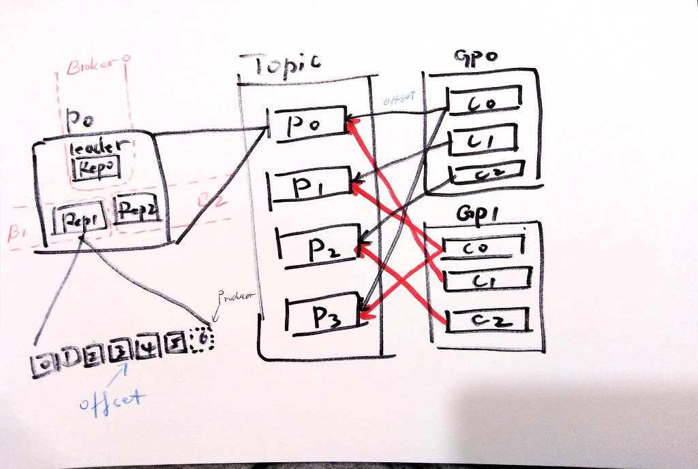
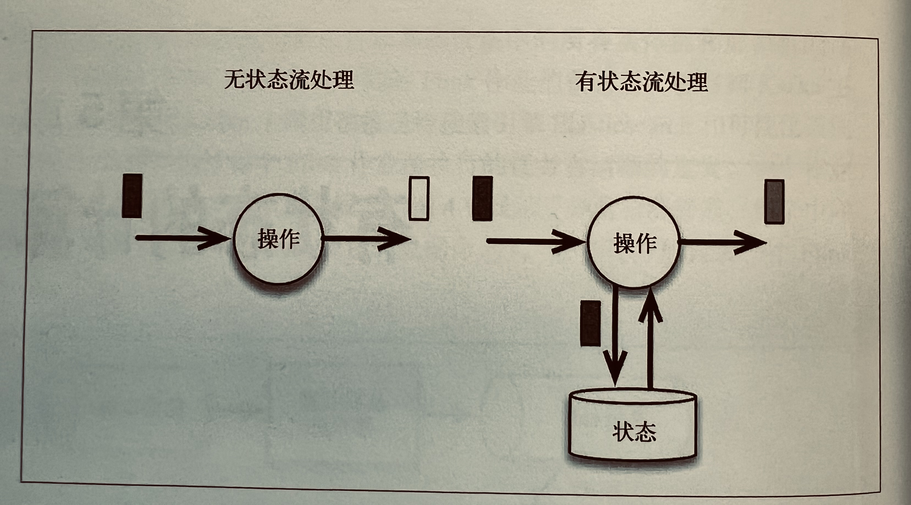

# 大数据技术——实时

[[Kafka](TechItself-realtime.md#kafka)]
[[Flink](TechItself-realtime.md#flink)]

## Kafka

Kafka 是基于"订阅"模式的消息队列。消息的生产者和消费者最大限度的实现解耦。

### Kafka 在流处理中的作用

Kafka 作为流处理系统（比如稍后讨论的 Flink）的数据来源介质，并不只是提供输入数据这么简单。事实上，正是由于 Kafka 这种消息组件的存在，才让 Flink 这种系统成为可能。

Kafka 提供的高性能和持久性是 Flink 按预期工作的前提。尤其持久性可以**让消息重播**（replay），这个功能使得 Flink 可以对事件流中的某一部分进行**重新计算**（时空穿梭），而这是准确计算的必要前提。

## Flink——流处理框架

批处理总是作用于确定范围内的数据，流可以看做无边界数据，批可以看做有限静态的流（有限数据集）。

Flink 是一个分布式的高吞吐的[有状态](TechItself-realtime.md#状态)的流处理引擎。

### 流处理系统 vs. 在线工程系统

先区分"业务流程"和"业务分析"，业务流程是完成用户操作的主干任务，业务分析是旁路任务，旁路的意思是两者在**结构**上差异很大（异构环境），虽然两者本身复杂度差不多。

一个假设：一个系统如果要**同时**干两件**结构差异**很大的事情，系统复杂度会陡增。

基于上述分析，需要另一个独立系统处理"业务分析"，并且根据分析结果触发式的触达用户。

由于"业务分析"这条线，直接"看到"的就是大量的数据，而不是接口调用或者功能模块，因此一个**实时**（或者低延迟，以及准实时、近实时等都是对同等时效的不同叫法）的**数据处理**系统更适合（相比"业务流程"，在线工程系统更适合）。

到此为止，我们陈述的只是"理论上"的原因。在公司中，往往需要更"直接"的原因，说服领导者构建实时数据处理系统。

正如《Introduction to Apache Flink: Stream Processing for Real Time and Beyond》一书中所说：

> 这样做也使数据库得以解脱，不用参与对当前业务状态的实时分析。

### 编程模型

**Source**

**Transformation**

**Sink**

### 时间

在流处理场景中，主要有两个时间：

①处理时间，即事件被 Flink 处理程序处理时候的时间，处理时间广义上还包括"摄取时间"，即事件到达 Flink 系统的时间，以及其它一些系统时间；处理时间都属于人为设置的时间或者系统时间。

②事件时间（Event-time），即事件发生时候的自然时间，非系统时间或人为设置时间。

Flink 可以"理解"事件时间，从而允许应用程序设置更合理的计算窗口，获得最佳的计算结果。

### 窗口

窗口是一种机制，或者处理方式，即按一定的特征把符合这些特征的事件"圈"起来一起处理。即便是实时流处理，仅仅单个事件的处理，不涉及任何上下文或者状态的情况还是非常少的。

窗口包括：时间（事件时间、处理时间）窗口、计数窗口、会话窗口。时间窗口更符合实际应用情况。

从另一个角度看，窗口是一种"触发机制"，触发系统聚合窗口内容并计算结果。事实上，窗口背后的实现原理就是靠触发器，我们也可以实现自定义的触发器。

#### Watermark

#### 乱序

乱序的发生不可避免。

#### 延迟

延迟的发生不可避免。

### 状态

流处理往往意味着需要考虑**上下文**，也就是需要多个流事件来计算结果，必须将数据从一个事件保留到下一个事件。这些保存下来的数据叫作计算的**状态**，也就是有状态计算（仅仅处理单个独立事件称作无状态计算）。

#### 正确性级别（一致性）

引入状态则引入了一致性问题。一致性实际上是"正确性级别"的另一种说法。

准确**记录**（注意，对状态的更新是持续进行的）并**处理**状态对于计算结果的正确性或一致性至关重要。

Flink 支持 Exactly-once 的状态一致性语义。

#### 检查点——保证 Exactly-once

在故障或中断之后能够继续准确地更新状态（状态一致性）是容错的关键。Flink 使用叫作**检查点**（checkpoint）的技术来做到状态的重置。在每个检查点，Flink 系统都会记录中间计算状态，以便重置使用。

检查点也是 Flink 系统可以**重新计算**的关键前提之一（另一个前提是 Kafka 的[重播能力](TechItself-realtime.md#Kafka-在流处理中的作用)）。

注：窗口和检查点无关。

### 多流（关联）——等待另一个流的到达

#### 流与静态表或动态表关联

### 端到端一致性
