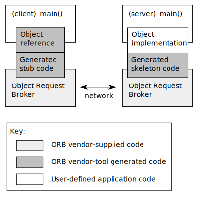

# Java IDL

Java IDL 是一项针对**分布式对象**的技术，所谓分布式对象就是在不同的平台上通过网络进行交互的对象，这个交互的过程称为**[远程过程调用（RPC）](RPC.md)**。Java IDL 类似于 [RMI (Remote Method Invocation)](RMI.md)，即 RPC 的纯 Java 实现，也是一种 RPC 的实现，但也有不同。具体来说，Java IDL 是针对 CORBA（Common Object Request Brokerage Architecture） 的 Java 实现，因为 CORBA 是语言无关的架构，因此 Java IDL 天生可以和其它符合 CORBA 架构的应用交互。

## What Is IDL

IDL（Interface Definition Language），是接口定义语言，用来描述一种通用约定，语言无关。CORBA 就是通过 IDL 来约定接口调用协议，从而做到语言无关，就像 Java 通过 Java IDL 来实现 Java 到 CORBA 的映射，任何语言都可以实现自己到 CORBA 的映射，只要符合 IDL 的规范即可。

IDL 并不是 CORBA 专有的技术，IDL 是一种通用技术，用来描述一种接口的通用约定。

我们来看一个 IDL(someIDL.idl) 实例：

```IDL
module SomeModule{
   interface SomeInterface{
      string someMethod();
   };
};
```

### Mapping IDL to Java

IDL 定义的接口，需要通过 IDL-to-Java compiler 转换成 Java 接口，才能在 Java 环境中运行。执行如下命令：

```
>idlj -fall someIDL.idl
```

就会生成该 IDL 的 Java 对应物，包括客户端和服务端的代码。更多关于该命令的详细信息，请查看命令自带帮助信息。

## What Is CORBA


