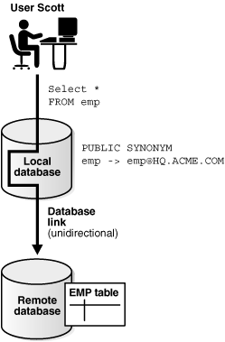
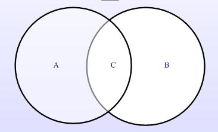
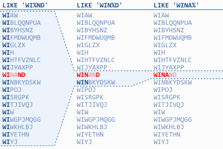
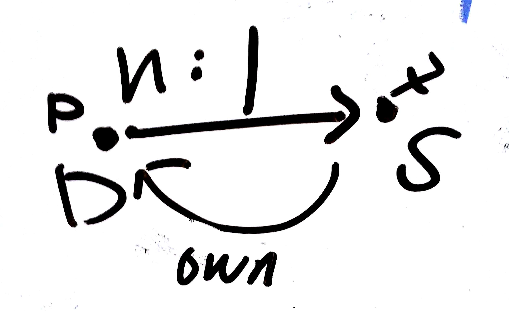

# SQL

### 数据库（Database）

> Organized collection of data treated as a unit. The purpose of a database is to store and retrieve related information. Every Oracle database instance accesses only one database in its lifetime.

### 数据库链接（Database Link）

> A named schema object that describes a path from one database to another. Database links are implicitly used when a reference is made to a global object name in a distributed database.

> The central concept in distributed database systems is a database link. A database link is a connection between two physical database servers that allows a client to access them as one logical database.

```SQL
CREATE DATABASE LINK "AN"
   CONNECT TO "TBOZFS" IDENTIFIED BY VALUES '057A0A59949CB465A5392D8CFBDCF72DD3'
   USING '(DESCRIPTION=(ADDRESS=(PROTOCOL=TCP)(Host=localhost)(Port=1521))(CONNECT_DATA=(SID=XE)))';
```

The following figure shows an example of user scott accessing the emp table on the remote database with the global name hq.acme.com:



### 表空间（Tablespace）

> A database storage unit that groups related logical structures together.The database data files are stored in tablespaces.

```SQL
-- create tablespace
CREATE TABLESPACE <tablespace_name> DATAFILE 'C:\ORACLEXE\APP\ORACLE\ORADATA\XE\ARIBA.DBF' size 1024M AUTOEXTEND ON extent management local autoallocate segment space management auto;
-- resize tablespace/datafile
ALTER DATABASE DATAFILE 'C:\ORACLEXE\APP\ORACLE\ORADATA\XE\SYSTEM.DBF' RESIZE 1G;
-- drop tablespace
DROP TABLESPACE <tablespace_name> INCLUDING CONTENTS AND DATAFILES CASCADE CONSTRAINTS;
```

### 表和视图（Table & View）

表：

> Basic unit of data storage in Oracle Database. Data in tables is stored in rows and columns.

视图：

> A custom-tailored presentation of the data in one or more tables. The views do not actually contain or store data, but derive it from the tables on which they are based.

### 同义词（Synonym）

> An alias for a schema object. You can use synonyms to provide dataindependence and location transparency.

```SQL
CREATE OR REPLACE SYNONYM "ORG_JL" FOR "ORG";
CREATE OR REPLACE PUBLIC SYNONYM "DBA_TABLES" FOR "SYS"."DBA_TABLES";
CREATE OR REPLACE SYNONYM "TBOZFS2"."ORG_AN" FOR "ORG"@"AN"; -- AN is a databse link to remote database
```

### 数据类型


```SQL
TYPE <name> IS RECORD (
    <name> <type>;
    ...
);
```

```SQL
CREATE OR REPLACE TYPE <name> AS OBJECT (
    <name> <type>;
    ...
);
```

```SQL
TYPE <name> IS TABLE OF <type>;
```

```SQL
TYPE <name> IS TABLE OF <type> INDEX BY BINARY_INTEGER;
```

```SQL
CREATE OR REPLACE TYPE <name> IS TABLE OF <type>;
```

```SQL
TYPE <type_name> IS VARRAY(<size_limit>) OF <data_type> [NOT NULL];
```

```SQL
CREATE TYPE <name> IS VARRAY(20) OF <type>;
```

### PL/SQL块

```SQL
DECLARE
/* 定义常量、变量和复杂数据类型，以及游标等。*/

BEGIN
/* 执行 PLSQL 和 SQL 语句。*/

EXCEPTION
/* 处理运行异常 */

END;
```

### Procedure

```SQL
CREATE PROCEDURE <name> (<name> <type>, ...)
IS
BEGIN
    /* 执行 PL/SQL 和 SQL 语句。*/
END;
/
```

### Function

```SQL
CREATE FUNCTION <name> (<name> <type>, ...)
RETURN <type> IS
    <name> <type>;
BEGIN
    /* 执行 PL/SQL 和 SQL 语句。*/
    RETURN <name>;
END;
/
```

### Package

```SQL
CREATE PACKAGE <name> IS
    PROCEDURE <name> (<name> <type>, ...);
    FUNCTION <name> (<name> <type>, ...) RETURN <type>;
END;
/
```

```SQL
CREATE PACKAGE BODY <name> IS

    PROCEDURE <name> (<name> <type>, ...)
    IS
    BEGIN
        /* 执行 PLSQL 和 SQL 语句。*/
    END;

    FUNCTION <name> (<name> <type>, ...) RETURN <type>
    IS
    <name> <type>;
    BEGIN
        /* 执行 PL/SQL 和 SQL 语句。*/
        RETURN <name>;
    END;

END;
/
```

### 结构控制语句

```SQL
IF <condition> THEN
    <statements;>
[ELSIF <condition> THEN
    <statements;>]
[ELSE
    <statements;>]
END IF;
```

```SQL
LOOP
    <statement;>
    EXIT [WHEN <condition>];
END LOOP;
```

```SQL
WHILE <condition> LOOP
    <statement;>
END LOOP;
```

```SQL
FOR <var_name> IN [REVERSE] <lower_number>..<upper_number> LOOP
         /* 执行 PLSQL 和 SQL 语句。*/
END LOOP;
```

```SQL
FOR <var_name> IN <dataset_name> LOOP
         /* 执行 PLSQL 和 SQL 语句。*/
END LOOP;
```

### DQL



涉及多表查询，必须在 WHERE 子句中，指定有效的连接条件。如果不指定连接条件，或者指定了无效的连接条件，那么会导致生成笛卡尔集（X * Y）。常用的连接有内连接（[INNER] JOIN）、左外连接（LEFT [OUTER] JOIN）、右外连接（RIGHT [OUTER] JOIN）和完全外连接（FULL [OUTER] JOIN）。左外连接得到的是上图中 A + C 部分，右外连接得到的是上图中 C + B 部分，完全外连接得到的是 A + C + B 部分，也就是所有数据，缺的数据用 NULL 补齐。其中默认的是内连接，即 C 部分，即取两张表（集合）的公共子集，内连接可以省去 INNER JOIN （连同 ON）关键字。另外还可以从比较条件出发，分为相等连接、不等连接（使用 <，>，BETWEEN 以及 AND 关键字）和自连接。

```SQL
SELECT * FROM <table_name> JOIN <table_name> ON <condition>;
SELECT * FROM <table_name>, <table_name> WHERE <condition>;
```

针对 Oracle 数据库，其实现了自己的简化写法，即标识 (+)。用 (+) 标识的列所在的表，当没有与其连接表相对应的记录的时候，用 NULL 与连接表记录连接（在查询列表的列的值显示为 NULL），即等同于对侧方向的外连接。(+) 不能用于实现完全外连接。如下代码所示，两者结果集相等：

```SQL
SELECT * FROM <table_name> LEFT JOIN <another_table_name> ON <table_name>.<column_name> = <another_table_name>.<column_name>;
SELECT * FROM <table_name>, <another_table_name> WHERE <table_name>.<column_name> = <another_table_name>.<column_name>(+);
```

不等连接，如下代码所示：

> 

自连接加不等连接，用来查询重复数据：

```SQL
SELECT *
FROM <table_name> t1,
     <table_name> t2
WHERE t1.<column_name> = t2.<column_name>[ AND ...]
AND t1.id              < t2.id;
```

DQL 可以搭配分组函数一起使用。常用分组函数有：COUNT，MAX，MIN，AVG，SUM 等。需要注意的是，分组函数只能出现在查询列表、ORDER BY 和 HAVING 子句中，而不能出现在 WHERE 和 GROUP BY 子句中。另外，当查询列表同时包含列、表达式和分组函数的时候，那么这些列和表达式必须出现在 GROUP BY 子句中。比如：

```SQL
SELECT country,
  COUNT(*)
FROM org
GROUP BY country
HAVING COUNT(*) > 20
ORDER BY country;
```

一个典型的应用，就是去重，比如下面代码：

```SQL
-- 方案 1
DELETE
FROM <table_name>
WHERE id NOT IN
  (SELECT MAX(ID)
  FROM <table_name>
  GROUP BY <column_name>[, ...]
  );
-- 结合游标，批量操作
DELETE
FROM <table_name>
WHERE id IN
  (SELECT id
  FROM <table_name>
  WHERE id NOT IN
    (SELECT MAX(ID)
    FROM <table_name>
    GROUP BY <column_name>[, ...]
    )
  );
```

```SQL
-- 方案 2
DELETE
FROM <table_name>
WHERE id IN
  (SELECT MIN(id) id
  FROM <table_name>
  GROUP BY <column_name>[, ...]
  HAVING COUNT(*) > 1
  );
```

第一个方案非常简洁易懂，结合游标（游标 + BULK-COLLECT-FORALL）也可以批量提交，应该优先采用。第二个方案只适用于两条重复记录的情况，如果是多条重复记录，则还需结合差集运算等找到所有需要删除的记录 ID。

此外， 使用 PARTITION BY 也可用来分组去重，这种方案的弊端在于不易理解，可读性差，其性能和以上两种并无差别：

```SQL
-- 方案 3
DELETE
FROM <table_name>
WHERE id IN
  (SELECT id
  FROM
    (SELECT id id,
      ROW_NUMBER() over (PARTITION BY <column_name>[, ...] ORDER BY id) rn
    FROM <table_name>
    )
  WHERE rn <> 1
  );
```

另外，一般情况任何需要一个或多个值的地方都可以用*子查询*替代，这里就子查询中比较复杂的**相关子查询**，做简单介绍。相关子查询是指需要引用主查询表列的子查询语句。如下代码所示，同样是用于去除重复数据，这个方案的弊端也是不能结合游标批量提交，除非通过差集等其他计算的辅助：

```SQL
-- 方案 4	  

DELETE
FROM <table_name> t1
WHERE t1.id NOT IN
  (SELECT MAX(t2.id)
  FROM <table_name> t2
  WHERE (t1.<column_name> = t2.<column_name>
  OR (t1.<column_name>   IS NULL
  AND t2.<column_name>   IS NULL))
  [AND ...]
  );

DELETE
FROM <table_name> t1
WHERE t1.id > ANY
  (SELECT t2.id
  FROM <table_name> t2
  WHERE (t1.<column_name> = t2.<column_name>
  OR (t1.<column_name>   IS NULL
  AND t2.<column_name>   IS NULL))
  [AND ...]
  );
```

这种去重方案，应该不被最先采用，因为其额外需要处理 NULL 值，所以增加了复杂度，降低了可读性，但性能并无二致。

另外，我们还可以使用UNION、UNION ALL、INTERSECT 和 MINUS 进行合并查询。

另外，可以使用 ROWNUM（用于 WHERE 子句中），限制返回条数。Oracle 还提供了一个伪列 ROWID， 对于每一行，该字段返回改行的物理地址。我们应该优先使用主键，来唯一标识一行，而不是 ROWID，因为在删除再重新插入同一行记录后，其物理地址会发生改变，这就破坏了可移植性。如果一张表没有提供主键，那么我们可以用 RWOID 来区分每一行。

另外，Oracle 提供了一张虚拟表 `DUAL`，我们可以通过查询语句的形式，得到一些系统属性或常量等结果，比如：

```SQL
SELECT TO_DATE('2016-06-21 16:49:00','yyyy-mm-dd hh24:mi:ss') FROM DUAL;
```

### DML

DML 包括 INSERT，UPDATE，DELETE 以及 MERGE 等语句。

**insert**

```SQL
INSERT INTO TABLE <table_name> [(<column_name>[, ...])] VALUES (<value>[, ...]);
```

其中 VALUES (<value>[, ...]) 部分可用结果集（SELECT ...）替代。

**update**

```SQL
UPDATE TABLE <table_name> set <column_name> = <value>[, <column_name> = <value>] [WHERE <condition>];
UPDATE TABLE <table_name> set (<column_name>[, <column_name>]) = (<value>[, <value>]) [WHERE <condition>];
```

其中 <value> 和 <value>[, <value>] 部分可用结果集（SELECT ...）替代。

**delete**

```SQL
DELETE FROM <table_name> [WHERE <condition>];
```

**merge**

```SQL
MERGE INTO <table|view> USING <table|view|subquery> ON (<condition>)
WHEN MATCHED THEN
    <UPDATE_clause>
WHEN NOT MATCHED THEN
    <INSERT_clause>
```

### DDL

DDL 包括 CREATE，ALTER 和 DROP 等语句。

```SQL
CREATE TABLE <table_name> (<column_name> <data_type>[, <column_name> <data_type>]) constraint <constraint_name> <constraint_condition>;

... constraint <constant_name> check(<column_name> IS NOT NULL);
... constraint <constant_name>  primary key(<column_name>);
... constraint <column_name> not null

CREATE VIEW <view_name> AS <SELECT_clause> [WITH READ ONLY CONSTRAINT]; -- 创建视图
```

```SQL
ALTER user <user_name> identified by <password>;
ALTER table <table_name> add <column_name> <data_type>;
ALTER table <table_name> alter column <column_name> <data_type>;
ALTER table <table_name> ADD CONSTRAINT <constraint_name> PRIMARY KEY (<column_name>);
ALTER TABLE <table_name> ADD CONSTRAINT <constraint_name> FOREIGN KEY (<column_name>) REFERENCES <table_name> (<column_name>);
ALTER TABLE B ADD <column_name> <data_type>;
```

```SQL
DROP table <table_name>;
```

TRUNCATE 也属于 DDL：

```SQL
TRUNCATE TABLE <table_name>;
```

TRUNCATE 会释放表段占用的表空间，因此不能回滚（rollback）。

### DCL

DCL 包括 GRANT，REVOKE 等语句。

```SQL
GRANT <permission> TO <user_name>;
```

```SQL
REVOKE <permission> FROM <user_name>;
```

### 索引

> Optional schema object associated with a nonclustered table, tablepartition, or table cluster. In some cases indexes speed data access.

索引分为单独索引和复合索引。单独索引是指在一个列上面构建的索引，复合索引是指在多列上并顺序相关的建立起来的索引。

复合索引的工作原理是先找到第一索引列，然后以此类推查找之后的索引列，如果第一索引列不在查询列表里，则完全用不到复合索引。所以，复合索引的索引列需按照区分性和使用性从高到低的顺序依次列出。如果，第一索引列不能降低集合范围，即区分度不是很大，则甚至都不会使用该复合索引。

一般最佳实践是，复合索引的全部列都在查询列表里，这时候，复合索引会被完全用到。

一个例外是 `like` 语句的 `%` 通配符。由于是通配，所以索引无法定位，因此可能就会导致全表扫描，如下图示，展示了不同通配符的位置，索引的访问情况，如果通配符位于起始位置，则索引不会被使用：



更多细节，请查看[Indexing LIKE Filters - USE THE INDEX, LUKE](http://use-the-index-luke.com/sql/where-clause/searching-for-ranges/like-performance-tuning)。

我们可以通过下面的语句来创建索引：

```SQL
CREATE [UNIQUE] INDEX <index_name> ON <table_name> (<column_name>[, <ccolumn_name>]);
```

可以通过 USER_INDEXES 和 USER_IND_COLUMNS 来查询一张表建立了哪些索引：

```SQL
SELECT * FROM USER_INDEXES WHERE TABLE_NAME = UPPER('<table_name>');
SELECT * FROM USER_IND_COLUMNS WHERE INDEX_NAME = '<index_name>';
```

索引会被系统自动调用来加速查询，也可以强制调用索引：

```SQL
SELECT /*+ INDEX(<table_alias> <index_name>)[ ...] */ <column_name>[, ...] FROM <table_name> <table_alias> WHERE <condition>;
```

Oracle 默认创建 B-tree 索引。

### Hint

Hints can be used with SQL statements to alter execution plans. Hints let you make decisions usually made by the optimizer. As an application designer, you might know information about your data that the optimizer does not know. Hints provide a mechanism to direct the optimizer to choose a certain **query execution plan** based on the specific criteria.

For example, you might know that a certain index is more selective for certain queries. Based on this information, you might be able to choose a more efficient execution plan than the optimizer. In such a case, use hints to force the optimizer to use the optimal execution plan.

```SQL
SELECT /*+ FIRST_ROWS(100) */ <column_name>[, ...] FROM <table_name> WHERE <condition>;
SELECT /*+ INDEX(<table_name> <index_name/column_name[, ...])[ ...] */ <column_name>[, ...] FROM <table_name> WHERE <condition>;
```

### 游标

执行 SELECT、INSERT、UPDATE以及DELETE语句时，隐式游标会被自动生成。可以使用诸如 SQL%FOUND、SQL%NOTFOUND和SQL%ROWCOUNT等隐式游标属性。

另外，我们还可以定义显式游标：

```SQL
DECLARE
    CURSOR <cursor_name> IS SELECT ...;
    <var_name> <cursor_name>%rowtype;
BEGIN
    FOR <var_name> IN <cursor_name> LOOP
         /* 执行 PLSQL 和 SQL 语句。*/
    END LOOP;
END;
```

如下代码示例：

```SQL
declare

cursor relation is select min(id) id from cxml_doc_relation group by dbcreated, dbupdated, source_document, derived_document, source_partition having count(*) > 1;

rec_relation  relation%ROWTYPE;

begin
    for rec_relation in relation
    loop
        delete from cxml_doc_relation where id = rec_relation.id;
        commit;
    end loop;

commit;
exception
	when others then
		dbms_output.put_line('error occurred, rolling back.');
		rollback;

end;
/
```

这种每次取一条的循环操作，性能很差，我们可以结合 BULK-COLLECT-FORALL 来提高性能。

```SQL
DECLARE
    CURSOR <cursor_name> IS SELECT ...;
    TYPE <type_name> IS TABLE OF <cursor_name>%ROWTYPE;
    <var_name> <type_name>;
BEGIN
    OPEN <cursor_name>;
    LOOP
        FETCH <cursor_name> BULK COLLECT INTO <var_name> LIMIT <batch_size>;
        EXIT WHEN <var_name>.count = 0;
        FORALL i IN <var_name>.FIRST..<var_name>.LAST
            /* 执行 PLSQL 和 SQL 语句。注意，这里只能有且只有一句静态或动态的 DML 语句。*/
        COMMIT;
    END LOOP;
    CLOSE <cursor_name>;
END;
```

如下代码示例：

```SQL
declare

cursor relations is select id from (select id id, row_number() over (partition by source_document, derived_document, source_partition order by id desc) rn from cxml_doc_relation) where rn > 1;
type rowtype is table of relations%rowtype;
rels rowtype;

batchSize number := 500;

begin

    open relations;
    loop
        fetch relations bulk collect into rels limit batchSize;
        exit when rels.count = 0;
        forall i in rels.first..rels.last
            delete from cxml_doc_relation where id = rels(i).id;
        commit;
        dbms_output.put_line('deleted ' || relations%rowcount || ' records in all.');
    end loop;
    close relations;

exception
    when others then
        dbms_output.put_line('error occurred, rolling back.');
        rollback;

end;
/
```

### 序列（Sequence）

> A schema object that generates a serial list of unique numbers for table columns.

```SQL
CREATE SEQUENCE <sequence_name>  
    INCREMENT BY 1  -- 每次加几个  
    START WITH 1    -- 从1开始计数  
    NOMAXVALUE      -- 不设置最大值  
    NOCYCLE;         -- 一直累加，不循环
```

```SQL
CREATE SEQUENCE PERSON_LINK_PROPOSAL_SEQ MINVALUE 1 MAXVALUE 999999999999999999999999999 INCREMENT BY 1 START WITH 100;
```

### 触发器（Trigger）

```SQL
CREATE [OR REPLACE] TRIGGER <trigger_name>
<BEFORE|AFTER> <INSERT|UPDATE|DELETE[|...]> [OR <INSERT|UPDATE|DELETE[|...]>]
ON <table_name>
[REFERENCING OLD AS old | NEW AS new]
[FOR EACH ROW]
[WHEN <condition>]
BEGIN
    <statement;>
END;
```

```SQL
CREATE OR REPLACE TRIGGER PERSON_LINK_PROPOSAL_BIR
  BEFORE INSERT ON PERSON_LINK_PROPOSAL FOR EACH ROW
  DECLARE
    v_id NUMBER;
  BEGIN
    IF :NEW.id IS NULL THEN
      SELECT PERSON_LINK_PROPOSAL_SEQ.NEXTVAL INTO v_id FROM DUAL;
      :NEW.id := v_id;
    END IF;
  END;
  /
```

### 事务

DML 语句被执行时，作用表和作用行会被加锁。在事务未提交之前，改动对其它 session 不可见。当事务被提交时（COMMIT），会删除保存点、释放锁。事务提交之后，不可回滚。所有这些特性可以用一句话概括，就是所谓的 **ACID** 原则，即原子性、一致性、隔离性和持久性。

ACID 的机制，首先允许我们为事务设置保存点：

```SQL
SAVEPOINT <savepoint_name>;

-- 通过程序来做
dbms_transaction.savepoint('<savepoint_name>');
```

设置保存点之后，就可以回滚改动到保存点的位置：

```SQL
ROLLBACK TO <savepoint_name>;
ROLLBACK; -- 取消全部修改

-- 通过程序来做
dbms_transaction.rollback_savepoint('savepoint_name');
dbms_transaction.rollback; -- 取消全部修改
```

当所有修改完毕，可以提交事务：

```SQL
COMMIT;

-- 通过程序来做
dbms_transaction.commit;
```

提交之后，修改就对所有 session 可见，并不可回滚。

我们来下，底层的一些实现机制，为什么可以保证修改的原子性，或者说为什么修改在提交之前可以回滚，就是因为 Rollback Segments 的存在。Rollback Segments 是在你数据库中的一些存储空间，它用来临时的保存当数据库数据发生改变时的先前值，Rollback Segment 主要有两个目的：

1. 如果因为某种原因或者其他用用户想要通过 ROLLBACK 声明来取消一个人的数据操作，数据就会复原到之前为改变时的值。这种情况只在transaction的过程中有效，如果用户执行了 COMMIT 命令，那么 ROLLBACK SEGMENT 里面的值就会标识为失效的，数据改变就将永久化。

2. 另一个目的是当有并发的 session 访问了一个数据值改变但事务还没有提交的表。如果一个 SELECT 语句开始读取一个表同时一个事务也在修改这个表的值，那么修改前的值就会保存到 rollback segment 里面，SELECT 语句也是从 ROLLBACK SEGMENT 里面读取表的值。

此外，还有些情况，我们不能控制事务。当发生如下情况时，事务会（强制）自动提交：

+ 执行 DDL 语句。
+ 执行 DCL 语句。
+ 回话退出。

可以看到，在四种类型的 SQL 语句当中，只有 DML 语句可以应用事务机制（DQL 是只读，不涉及修改）。支持事务的语句，我们称作 transactional 的，而不支持事务的语句，我们称作 non-transactional 的。

### 表分区（Table Partition）

表分区是存储层的概念，对应用层透明。一个有着大量数据的表可以通过分区，即拆分成几个子表来提高访问速度。这里说的拆分是指物理拆分，就是说子表是真实存在的，子表甚至可以位于不同的表空间。但子表对应用不可见，应用还是访问主表，也叫做分区表。数据库会根据分区的条件，自动读写数据从到相应分区。

表分区的方式有三种：

- 根据某列的哈希值分区
- 根据某列的具体值分区
- 根据某列的值的所属范围分区

一个没有分区的表，也可以后期改造成分区表。

```SQL
CREATE TABLE purchase_order
(
id number(28, 0),
amount number(30, 15),
created DATE
)
PARTITION BY RANGE(created)
(
PARTITION purchase_order_201612 VALUES LESS THAN(TO_DATE('2017-01-01','YYYY-MM-DD')),
PARTITION purchase_order_201701 VALUES LESS THAN(TO_DATE('2017-02-01','YYYY-MM-DD')),
PARTITION purchase_order_201702 VALUES LESS THAN(TO_DATE('2017-03-01','YYYY-MM-DD'))
);
```

### 表簇（Table Cluster）

表簇是存储层的概念，对应用层透明。对于那些有着相同列（比如共同引用其它表的主键）的表，而且经常一起查询或读写，可以把它们存储在一起，即相同的数据块上，从而提高访问速度。

> Optional structure for storing table data. Clusters are groups of one or more tables physically stored together because they share common columns and are often used together. Because related rows are physically stored together,disk access time improves.

### 数据字典（Data Dictionary）

查询表约束：

```SQL
SELECT * FROM DBA_CONSTRAINTS WHERE TABLE_NAME = '<table_name>';
select * from dba_tablespaces;
select * from dba_data_files;
```

查询表空间：

```SQL
select * from dba_tablespaces;
select * from dba_data_files;
```

### Dynamic SQL vs. Static SQL

**What is Static SQL ?**

- Data Manipulation Language (DML) Statements (except EXPLAIN PLAN) : INSERT, UPDATE, DELETE
- Transaction Control Language (TCL) Statements : COMMIT, ROLLBACK...
- SQL Functions

**What is Dynamic SQL?**

However, some applications must accept (or build) and process a variety of SQL statements at run time. In this case, the statement's makeup is unknown until run time. Such statements can, and probably will, change from execution to execution. They are aptly called dynamic SQL statements.

Unlike static SQL statements, dynamic SQL statements are not embedded in your source program. Instead, they are stored in character strings input to or built by the program at run time. They can be entered interactively or read from a file.

The EXECUTE IMMEDIATE statement prepares (parses) and immediately executes a dynamic SQL statement or an anonymous PL/SQL block：

```SQL
EXECUTE IMMEDIATE 'Dynamic SQL';
```

另外，`EXECUTE IMMEDIATE` 也可以用来执行静态语句，但是其 will not commit a DML transaction carried out and an explicit commit should be done. If the DML command is processed via EXECUTE IMMEDIATE, one needs to explicitly commit any changes that may have been done before or as part of the EXECUTE IMMEDIATE itself.

一般来说，静态语句也是事务型（Transactional）的，动态语句也是非事务型的：

| Type  | Transactional | Static  |
| ----- |:----:| -----:|
| DML | Y | Y |
| DDL | N | N |
| DCL | N | N |
| TCL | Y | Y |

### Entity Relationship Model

1. 外键引用总是在 n:1 的另一方，即 n 所代表的表；
2. n:n 需要第三张表来表示；
3. n:1 的 1 是 source，n 是 destination；
4. 一般而言，n:1 的 1 owns n。


