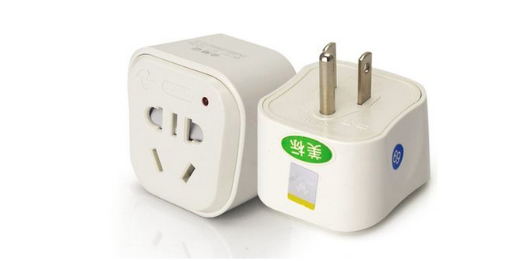

# 设计模式之适配器模式

## 什么是适配器模式

所谓适配器模式，就是在两种不同的接口之间进行适配，它非常像我们出国旅行时带的电源转换器。我们先来看下电源转换器：



美国的电源插孔和中国的插头是无法匹配的，所以要想在美国使用中国插头的电器，必须要在美式电源插孔和中式插头之间接一个如图的适配器，适配器的一端插入美式插孔，另一段接中式插头，连接输出到输入。这就是典型的适配器模式的一种应用。之所以要适配的一个大前提是，**既有接口不可更改的事实，而且无法与现有接口一起工作**。比如，美国的插孔就是既有事实，无法为中国制式作出更改，同样中式插头也一直这么用着，也不会作出更改，而这两种制式又无法在不改变的前提下一起正常工作，这时候才需要适配器。

对于软件来说，也是同样的意思。我们来看示例。下面的代码示例高度抽象，同时**每一个接口都蕴含着一个实现类，当我们说接口不可更改的时候，也意味着实现类不可更改**。我们有一个系统里面有这么一个类，它调用了一个接口方法：

```Java
public class Client {

    private A a;

    public Client(A a) {
        this.a = a;
    }

    public void setA(A a) {
        this.a = a;
    }

    public void doSomething() {
        a.doA();
    }
}
```

```Java
public interface A {
    public void doA();
}
```

现在，还有这么一个接口，想要放到系统中（也就是Client类中）去工作：

```Java
public interface B {
    public void doB();
}
```

怎么办？先看行不行，在不改变Client类和A接口以及B接口的前提下，显然没法让B接口协同Client类一起工作。这时候，就需要适配器：

```Java
public class Adapter implements A { // 实现A接口是必须的。

    private B b; // b也可以是一个单纯的对象，不是实现自某个接口，只要保证一点，在适配器中调用b的方法即达到了适配的效果。

    public Adapter(B b) {
        this.b = b;
    }

    public void setB(B b) {
        this.b = b;
    }

    @Override
    public void doA() {
        b.doB();
    }
}
```

**注意**：本例中B的实现b是作为成员变量放到适配器中的，但是这不是必须的。某些情况下，如果b不是不可更改的，你也可以让适配器直接实现B，或者有些情况根本没有接口B，而只有一个单纯的类b。所有这些只要只要保证一点，在适配器中，接口A的方法被调用的时候，b的方法也会被调用，即达到了适配的效果。

我们来分析一下这个适配器。首先，其适用于Client类，也就是和接口A兼容（其实，它本身就是接口A的一个实现），这样它就可以和Client类一起工作；其次，该适配器又连接（引用）到B接口，在A的方法被调用的时候，B的方法可以同时被调用。最终，这就实现了在A的环境中让B工作的可能，这也就是适配器的另一种角度的定义。

## 最后

适配器模式属于**补偿模式**，就是不适合在新系统设计阶段使用它，而是专用来在遗留系统中进行扩展或修改。
