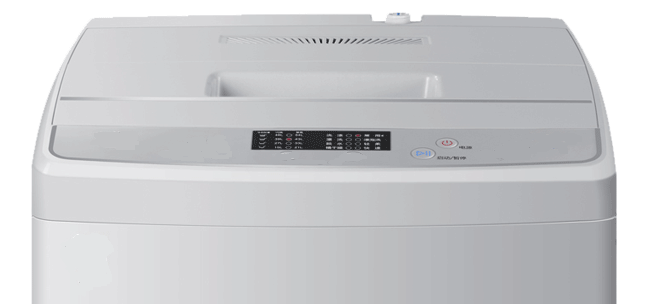

# 设计模式之外观模式

## 什么是外观模式？

所谓外观模式就是把一系列更底层更细节的操作步骤封装成一个或几个更高级的通常也是更简单的操作步骤。外观模式其实在生活中随处可见，比如洗衣机：



如果用过手动洗衣机，就会知道，我们得经历以下步骤：先把洗衣机通电，然后把衣服放进去，再放水和放洗衣液，再按一个启动按钮开始洗衣服，等洗完了还要先把水放了，再接干净的水进去，按漂洗按钮，漂洗完后，还要再把水放了，再开始甩干。所有这些步骤都要手动完成。而全自动洗衣机就是外观模式在手动洗衣机上应用的一个实例。全自动洗衣机封装了手动洗衣机的这些更底层的步骤，而对用户只暴露出两个更高级也更简化的接口，即`电源`和`启动/暂停`按钮。这样，要洗衣服的时候，我们只需先按`电源`按钮，再按`启动/暂停`按钮就可以自动完成上述所有步骤了。

对于软件来说，也是同样的意思。我们来看示意代码，描述的同样是洗衣服这个过程：

```Java
public class Facade {

    private WaterInlet waterInlet;
    private Detergent detergent;
    private Impeller impeller;
    ... // 省略了其它底层组件。

    private boolean power = false;

    public Facade(WaterInlet waterInlet, Detergent detergent, Impeller impeller) {
        this.waterInlet = waterInlet;
        this.detergent = detergent;
        this.impeller = impeller;
        ... // 省略了底层组件的赋值。
    }

    public void power() { // 电源控制
        power = !power;
    }

    public void on() { // 开始洗衣服
        if (!power) {
            return;
        }
        waterInlet.on();
        detergent.on();
        impeller.on();
        ... // 省略了其它换水、漂洗和甩干等细节操作。
    }

    ... // 省略了其它辅助逻辑。

}
```

代码粗略地说明了外观模式的逻辑，就是对一系列底层的方法进行封装成一个或几个更高级的对客户端更友好的易用的方法。客户端代码只需要先调用`power()`再调用`on()`就可以完成洗衣服的操作了。

我们来看另一个真实的例子。Apache 的 Commons IO 项目提供了一个`FileUtils`工具类，该类有一个方法如下：

```Java
public static void copyFileToDirectory(File srcFile, File destDir) {...}
```

顾名思义，该方法用来把一个文件复制到一个目录。客户端代码只需要调用这个方法就可以优雅地完成文件复制，但是有没有想过底层是怎么做的呢？查看源代码，我们可以发现，这个漂亮的方法隐含着一系列的复制一个文件所必须的操作，包括：

1. 文件和目录等的存在性以及合法性的检查。
2. 读写权限的检查。
3. 创建目标文件。
4. 创建和打开读写流。
5. 真正的复制文件字节。
6. 关闭读写流。
7. 设置目标文件的属性等。

这就是典型的外观模式，编程语言中外观模式的应用更是无处不在。

所以，另一个对外观模式的定义就是提供一种**不同层面的看待事物的方式**，忽略掉底层细节，从一个更高级别的角度看待事物，这也正是面向对象编程的精华所在。

## 最后

外观模式属于**补偿模式**，不是应用于系统之初的设计，而是后续为简化客户端工作而做的优化。
