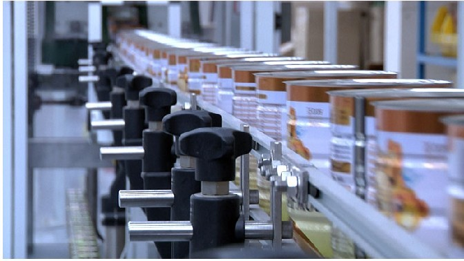

# 设计模式之工厂模式

## 什么是工厂模式

所谓工厂模式就是把对象的实现和客户端代码（也就是调用者）分离。其实现实世界中对工厂模式的应用更彻底，产品的消费者不直接生产产品而是通过工厂获得，这是毋庸置疑的，而且通过工厂生产的产品都是符合定规的，这样才能流水线作业：



对于软件，符合定规的意思就是程序有共同的接口，所以工厂模式也是通过接口**隔离变化**的一种体现，即面向接口变成，而不是面向实现。

## 简单工厂

简单工厂就是通过一个工厂类和一个（一般是静态）工厂方法来创建对象。我们来看代码示例：

```Java
public class Factory {

    public static SomeInterface createSomeThing() {
        ...// 这里是具体new实例的代码
    }

}
```

注意，返回的是一个接口，有些情况需要给这个工厂方法传入参数，从而据此参数决定创建什么类型的对象。如果方法不声明为静态，可以在工厂内部提供一个`getFactory()`的静态方法，该方法创建并返回该工厂对象，或者干脆`new`一个工厂实例传入客户端代码。简单工厂非常容易理解也非常有效，很多时候都是不错的选择。

## 工厂方法

**所谓工厂方法模式其实并没有得到工厂模式的精髓**，所以甚至都算不得一种工厂模式，虽然很多书籍都把它列为工厂模式的一种。所谓的把工厂方法做成抽象的，然后让子类去决定具体实现，其实这种模式的思维更倾向于**继承-扩展**，也就是**延迟实现**。继承的本意就是为了代码重用和新加功能，而这个新加功能也就是延迟实现。因此，这里就不再详述更过细节了。

## 抽象工厂

抽象工厂是对简单工厂的一个升级，抽象工厂就是把简单工厂**接口化**。所有可以产出对象的工厂都是实现自一个抽象工厂（可能是接口或抽象类）。显而易见的是，实现自抽象工厂的具体工厂产出的产品肯定不同，但肯定是相关的，因为这些工厂有共同的接口即抽象工厂。我们知道，简单工厂已经可以根据传入参数的不同，创建不同类型的对象，那么为什么还需要抽象工厂呢？答案是**对象在两个维度上有差异**。

所谓对象在两个维度上有差异，也就是对象不只在一个层面上有差异，在另一个（垂直的）层面上也存在不同。比如，我们吃的罐头，第一个层面的不同是罐头本身类型的不同，比如黄桃罐头、水蜜桃罐头以及樱桃罐头等，另外一个层面的不同就是就同类型的罐头来说，还存在配料和原材料的产地差异，同样是黄桃，产地不同口味也不同，再加上配料不同，做出来的黄桃罐头也千差万别。

当工厂要创建的对象，存在二个维度上的变化，就需要用抽象工厂，一个层面的不同用不同类型的具体工厂来处理，另一层面的不同用具体到工厂内部的逻辑（比如传入参数）来处理。

那么问题来了，如果是在三维甚至以上变化呢？三维可以抽象工厂嵌套另一个抽象工厂来实现，更高维以此类推。
