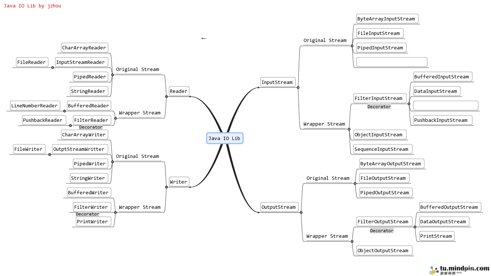
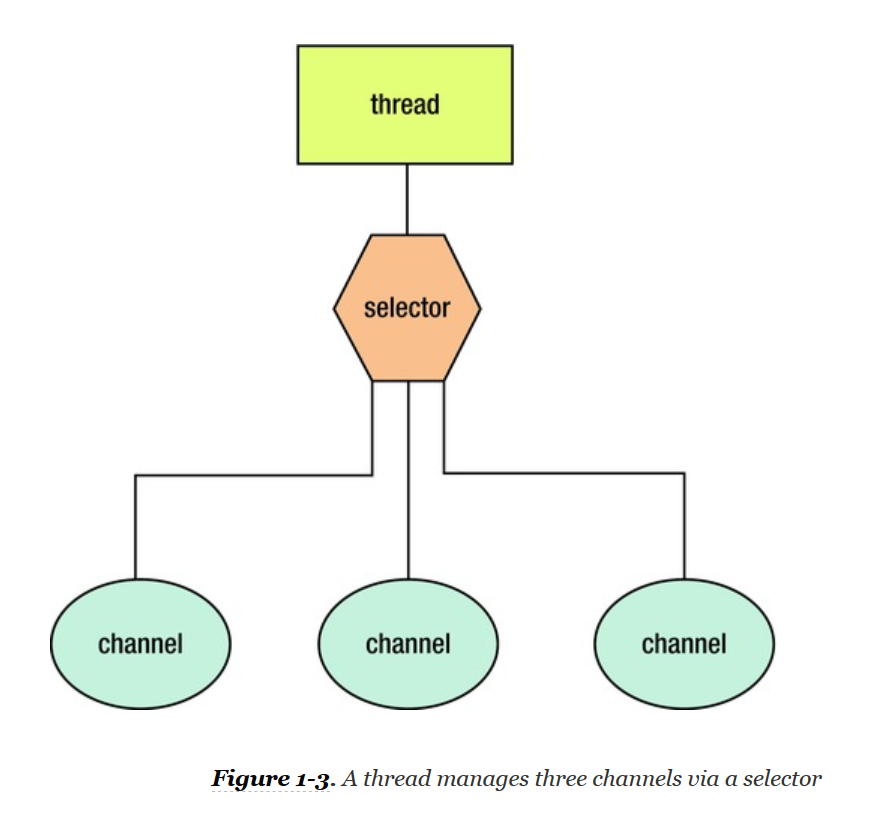

# 网络编程

## Java I/O

我们通过一张图来看下整个传统 I/O 框架的概貌：



值得注意的是，在相同操作下，原生的读写流性能非常差，比如 FileInputStream，FileOutputStream 等，而 BufferedInputStream 由于对流进行了缓冲处理，其相当于普通读写流一次读写大块数据，所以极大地提高了性能。但即便如此，Java I/O 仍然是 Blocking IO，对扩展性和性能有着天生的制约，接下来介绍一种新的 I/O。

## NIO

Non-Blocking IO （以下简称 NIO）是 java.nio 包中一些用于 I/O 操作的类和接口。其原理是通过使用更接近操作系统执行 I/O 的方式：**通道**、**缓冲器**以及**选择器**，从而提高了执行效率。

NIO 有下面几个主要抽象概念：

+ **Buffer** - A container for data of a specific primitive type. Buffers are not thread-safe.

+ **Channel** - A nexus for I/O operations. A channel represents an open connection to an entity such as a hardware device, a file, a network socket, or a program component that is capable of performing one or more distinct I/O operations, for example reading or writing. **Unlike sockets, socket channels are selectable and can function in nonblocking mode.** Unlike buffers, which are not thread-safe, socket channels are thread-safe.
+ **Selectors** - This “polling for available input” activity can be wasteful, especially when the thread needs to monitor many input streams (such as in a web server context). Modern operating systems can perform this checking efficiently, which is known as readiness selection, and which is often built on top of nonblocking mode. The operating system monitors a collection of streams and returns an indication to the thread of which streams are ready to perform I/O. As a result, a single thread can multiplex many active streams via common code and makes it possible, in a web server context, to manage a huge number of network connections.

  JDK 1.4 supports readiness selection by providing selectors, which are instances of the java.nio.channels.Selector class that can examine one or more channels and determine which channels are ready for reading or writing. This way a single thread can manage multiple channels (and, therefore, multiple network connections) efficiently. Being able to use fewer threads is advantageous where thread creation and thread context switching is expensive in terms of performance and/or memory use. See Figure 1-3.

  

  One or more selectable channels are registered with a selector.

## NIO.2

### Asynchronous IO

在 NIO 的基础上，JDK 7 加入了 Asynchronous IO（以下简称 AIO）操作。和传统 I/O 相比，AIO 在读写时，客户端不会阻塞（即便有数据可读也不会阻塞），而是继续往下执行。之后，通过某种“未来”的方式获取读取结果。如下示例代码：

```Java
try (AsynchronousFileChannel channel = AsynchronousFileChannel.open(Paths.get("pathTo/file"));) { // 凡是实现了 AutoCloseable 接口的资源会自动关闭并释放。

    Future<Integer> future = channel.read(ByteBuffer.allocate(900_000_000), 0); // 这里不会阻塞，而是继续执行下去。

    while (!future.isDone()) {
        // do some things else.
    }

    future.get();

} catch (IOException | InterruptedException | ExecutionException e) {
    e.printStackTrace();
}
```

注意 AIO 和 Non-Blocking IO 不同，主要区别在于获取数据的方式不同，NIO 是当没数据可读的时候，是非阻塞的，不用干等，但当有数据可读，读数据的时候是**同步在读**，而 AIO 的数据是通过异步的方式（`Future.get`）返回。阻塞、非阻塞和同异步不一样，异步一定是非阻塞，但非阻塞不一定就是异步，非阻塞是多方面的。

## NWP


### NWP with Java I/O

Java 用于文件 I/O 操作的 API，同时也适用于网络编程，这就使得操作网络资源如同本地文件一样。传统网络编程一般有如下模式：

服务端启动，然后建立 `ServerSocket`，并且监听客户端的连接，然后分配一个线程给客户端连接，在线程里处理相应的逻辑。

```Java
ServerSocket serverSocket = new ServerSocket(7000);

ExecutorService exec = Executors.newFixedThreadPool(100);
new Thread(() -> {
	while (true) {
		try {
			Socket clientSocket = serverSocket.accept(); // ①阻塞，监听客户端的连接
			exec.submit(new B64Worker(clientSocket));
		} catch (IOException e) {
			e.printStackTrace();
		}
	}
}).start();
```

```Java
package tech.liujianwei.nwp.socket.b64encodec.worker;

import tech.liujianwei.nwp.socket.b64encodec.util.IO;

import java.io.*;
import java.net.Socket;

public class B64Worker implements Runnable {
    private Socket clientSocket;
    private B64Handler handler;

    private IO io;

    public B64Worker(Socket clientSocket) {
        this.clientSocket = clientSocket;
        this.handler = new B64Handler();
        this.io = new IO();
    }

    @Override
    public void run() {
        try {
            InputStream is = new BufferedInputStream(clientSocket.getInputStream());
            DataOutputStream dos = new DataOutputStream(new BufferedOutputStream(clientSocket.getOutputStream()));
            while (true) {
                byte[] data = io.read(is); // ②阻塞
                dos.write(handler.toBase64(data).getBytes());
                dos.write("\4".getBytes()); // `EOT`
                dos.flush();
            }
        } catch (IOException e) {
            e.printStackTrace();
        } finally {
            try {
                clientSocket.close();
            } catch (IOException e) {
                e.printStackTrace();
            }
        }
    }
}
```

客户端的主要逻辑，就是连接到服务端（通过创建绑定到具体主机和端口的 `Socket`），然后通过 I/O 流收发数据。

```Java
package tech.liujianwei.nwp.socket.client;

import tech.liujianwei.nwp.socket.b64encodec.util.IO;

import java.io.*;
import java.net.Socket;
import java.util.Base64;
import java.util.Date;
import java.util.Random;

public class Client {
    private Socket clientSocket;
    private DataOutputStream dos;
    private DataInputStream dis;

    private IO io;

    public Client(String host) throws IOException {
        clientSocket = new Socket(host, 7000);
        io = new IO();
    }

    private String onMessage(byte[] bytes) throws IOException {
        output().write(bytes);
        output().write("\4".getBytes());
        output().flush();
        byte[] data = io.read(input()); // ③阻塞
        return new String(data);
    }

    private DataOutputStream output() throws IOException {
        if (dos == null) {
            dos = new DataOutputStream(new BufferedOutputStream(clientSocket.getOutputStream()));
        }
        return dos;
    }

    private DataInputStream input() throws IOException {
        if (dis == null) {
            dis = new DataInputStream(new BufferedInputStream(clientSocket.getInputStream()));
        }
        return dis;
    }

    public static void main(String[] args) {
        client.onMessage(...);
    }
}
```

就网络 I/O 流的操作来说，服务端和客户端可以共用一套代码。

```Java
package tech.liujianwei.nwp.socket.b64encodec.util;

import java.io.IOException;
import java.io.InputStream;
import java.util.ArrayList;
import java.util.List;

public class IO {
    List<Byte> data;
    byte[] buffer;

    public IO() {
        data = new ArrayList<>(100 * 1024 * 1024); // 100M
        buffer = new byte[100 * 1024 * 1024]; // 100M
    }

    public byte[] read(InputStream is) throws IOException {
        return doRead(is);
    }

    private byte[] doRead(InputStream is) throws IOException {
        int len;
        System.out.println("Reading data");
        while ((len = is.read(buffer)) != -1) {  // ④阻塞
            System.out.println("Received " + len + " bytes data");
            if (buffer[len - 1] == '\4'/*EOT*/) {
                data.addAll(Bytes.toList(buffer, 0, len - 1));
                break;
            }
            data.addAll(Bytes.toList(buffer, 0, len));
        }
        System.out.println("READ DONE.");
        byte[] bytes = Bytes.toArray(data);
        data.clear();
        return bytes;
    }
}
```

#### NWP with Java I/O 的问题

传统网络编程是阻塞模型，代码中的①②③都会被阻塞（②③是由于④是阻塞的），正由于是阻塞模型，因此不得不为每个连接分配一个线程，一直等待数据流。

- 一个连接对应一个线程，大量线程阻塞，等待 I/O 操作，造成资源浪费；
- 同时在大量线程间切换，非常消耗资源；
- 再就是数据读写是以字节流为单位，效率不高；

### NWP with NIO

NIO 模型针对上述几点，分别做了改进：

- 不像 `InputStream.read` 是阻塞的，`SocketChannel.read` 是非阻塞的；通过采用操作系统层面的 Selector 机制，即多个连接对应一个线程，这多个连接注册到一个 Selector 上，Selector 知道哪个连接可进行 I/O 操作了，线程只需要轮询（一个 `while-true`） Selector 即可，不用等待 I/O 操作；
- 由于一个线程可以间接监听多个连接，因此减少了需要的线程数，切换开销也相应减少；
- NIO 模型通过使用更接近操作系统执行 I/O 的方式，即通道和缓冲器，从而提高了执行速度；

同样是上述例子，我们看下 NIO 的方式怎么做。首先，也是服务端启动，然后一个线程通过轮询 Selector 监听新的连接，并把新连接注册到另外一个负责数据监听的 Selector 上（这是和 I/O 模型的本质区别），另外一个线程轮询数据监听 Selector 查看是否有哪些连接有数据可读。除此之外，没有其它线程。

```Java
package tech.liujianwei.nio.nwp.nio.b64encodec;

import tech.liujianwei.nio.nwp.nio.b64encodec.worker.B64Worker;

import java.io.IOException;
import java.net.InetSocketAddress;
import java.nio.channels.SelectionKey;
import java.nio.channels.Selector;
import java.nio.channels.ServerSocketChannel;
import java.nio.channels.SocketChannel;
import java.util.Iterator;
import java.util.Set;

public class B64Server {
    public static void main(String[] args) throws IOException {
        Selector acceptanceSelector = Selector.open();
        Selector readinessSelector = Selector.open();

        // 对应 I/O 编程中服务端启动
        ServerSocketChannel serverSocketChannel = ServerSocketChannel.open();
        serverSocketChannel.socket().bind(new InetSocketAddress(8000));
        serverSocketChannel.configureBlocking(false);
        serverSocketChannel.register(acceptanceSelector, SelectionKey.OP_ACCEPT);

        new Thread(() -> {
            while (true) {
                try {
                    // 监测是否有新的连接
                    //System.out.println("Checking Selector for new connection");
                    if (acceptanceSelector.select(1) > 0) {
                        Set<SelectionKey> selectedKeys = acceptanceSelector.selectedKeys();
                        Iterator<SelectionKey> keys = selectedKeys.iterator();
                        while (keys.hasNext()) {
                            SelectionKey key = keys.next();
                            if (key.isAcceptable()) {
                                try {
                                    // 每来一个新连接，不需要创建一个线程，而是直接注册到 Selector
                                    SocketChannel clientChannel = ((ServerSocketChannel) key.channel()).accept();
                                    clientChannel.configureBlocking(false);
                                    clientChannel.register(readinessSelector, SelectionKey.OP_READ);
                                } finally {
                                    keys.remove();
                                }
                            }
                        }
                    }
                } catch (IOException e) {
                    e.printStackTrace();
                }
            }
        }).start();

        new Thread(() -> {
            while (true) {
                try {
                    // 批量轮询是否有哪些连接有数据可读
                    //System.out.println("Checking Selector for ready channel");
                    if (readinessSelector.select(1) > 0) {
                        Set<SelectionKey> selectedKeys = readinessSelector.selectedKeys();
                        Iterator<SelectionKey> keys = selectedKeys.iterator();
                        while (keys.hasNext()) {
                            SelectionKey key = keys.next();
                            if (key.isReadable()) {
                                try {
                                    SocketChannel clientChannel = (SocketChannel) key.channel();
                                    B64Worker worker = new B64Worker(clientChannel);
                                    worker.run();
                                } finally {
                                    keys.remove();
                                    key.interestOps(SelectionKey.OP_READ);
                                }
                            }
                        }
                    }
                } catch (IOException e) {
                    e.printStackTrace();
                }
            }
        }).start();

        System.out.println("B64 Server started");
    }
}
```

就具体逻辑处理来说，没什么太大变化。

```Java
package tech.liujianwei.nio.nwp.nio.b64encodec.worker;

import tech.liujianwei.nio.nwp.nio.b64encodec.util.Bytes;
import tech.liujianwei.nio.nwp.nio.b64encodec.util.NIO;

import java.io.*;
import java.nio.ByteBuffer;
import java.nio.channels.SocketChannel;
import java.util.LinkedList;

public class B64Worker {
    private SocketChannel clientChannel;
    private B64Handler handler;

    private NIO nio;

    public B64Worker(SocketChannel clientChannel) {
        this.clientChannel = clientChannel;
        this.handler = new B64Handler();
        this.nio = new NIO(this.clientChannel);
    }

    public void run() throws IOException {
        byte[] data = nio.read();
        byte[] encoded = handler.toBase64(data).getBytes(); // handler.toBase64(Bytes.decode(buffer).getBytes()).getBytes();
        nio.write(encoded, "\4".getBytes()); // '\4' aims to be compatible with Java I/O which is ued by client.
    }
}
```

```Java
package tech.liujianwei.nio.nwp.nio.b64encodec.util;

import java.io.IOException;
import java.nio.ByteBuffer;
import java.nio.channels.SocketChannel;
import java.util.LinkedList;

public class NIO {

    private SocketChannel clientChannel;

    public NIO(SocketChannel clientChannel) {
        this.clientChannel = clientChannel;
    }

    public byte[] read() throws IOException {
        LinkedList<Byte> data = new LinkedList<>();
        ByteBuffer buffer = ByteBuffer.allocate(1024 * 1024);
        int size = clientChannel.read(buffer);
        while (size > 0) {
            buffer.flip();
            while (buffer.hasRemaining()) {
                byte b = buffer.get(); // this is in memory, should be fast.
                if (b != "\4".getBytes()[0]) { // '\4' aims to be compatible with Java I/O which is ued by client.
                    data.add(b);
                }
            }
            buffer.clear();
            size = clientChannel.read(buffer); // 非阻塞，return 0 if no more data, so no need to check `EOT`.
        }
        return Bytes.toArray(data);
    }

    public void write(byte[]... content) throws IOException {
        byte[] data = Bytes.toArray(Bytes.toList(content));
        ByteBuffer buffer = ByteBuffer.allocate(data.length + 1);
        buffer.clear();
        buffer.put(data);
        buffer.flip();
        clientChannel.write(buffer); // 非阻塞
    }
}
```

客户端可以直接用老式的 I/O 客户端，连接新式的 NIO 服务端。

一般在实际应用当中，不会自己写这套实现，而是使用经过验证的成熟的框架，比如 Netty 框架。

### NWP with Netty

Netty 是一个异步事件驱动的网络应用框架。基于 NIO 实现。关于 Netty 的更多内容，静待后续。

## NWP, NIO and RPC

NWP, NIO（包括 NIO.2）, RPC 之间究竟是什么关系？可以用下图表示：


NIO 是 NWP 的子集，是 Java I/O 的升级版，RPC 又是基于 NIO 的封装。无论是 NWP 还是 NIO，亦或 RPC 一般都是走的 TCP 协议。个别 RPC 框架基于 HTTP 2.0，则另当别论。

## 附录

### 内存映射文件

另外，FileChannel 可以把其所代表的文件的部分或全部（最大可达2GB）区域映射到内存，称为内存映射文件，这样就允许我们创建和修改那些因为太大而不能整个放入内存的文件。有了内存映射文件，我们就相当于操作的是整个文件一样，其底层实现通过数据的**交换**确保不会发生内存溢出。我们还可以为要操作的文件区域（FileChannel 提供的方法）加锁，确保数据读写不会冲突。如下示例代码：

```Java
MappedByteBuffer buffer = new RandomAccessFile(new File("pathTo/file"), "rw").getChannel().map(FileChannel.MapMode.READ_WRITE, 0, 999_999_999); // buffer 有 get 和 set 方法，供读写用。
```

**注意**：映射文件的输出必须使用`RandomAccessFile`类，虽然`FileOutputStream`也是输出流；输入则可以是 RandomAccessFile 或者 FileInputStream。

### NIO File

Java 7 加入了 java.nio.file 包，以及相关的 java.nio.file.attribute 包，提供对文件系统的全面支持，比如文件复制，创建符号链接以及文件属等。如下示例代码：

```Java
Files.copy(Paths.get("pathTo/file"), Paths.get("path"));
```

```Java
Files.createSymbolicLink(Paths.get("pathTo/symbolicLink"), Paths.get("pathTo/file")); // The FileAttributes vararg enables you to specify initial file attributes that are set atomically when the link is created. However, this argument is intended for future use and is not currently implemented.
```

```Java
BasicFileAttributes attributes = Files.readAttributes(Paths.get("pathTo/file"), BasicFileAttributes.class);
FileTime fileTime = attributes.lastModifiedTime();

Map<String, Object> attributes = Files.readAttributes(Paths.get("pathTo/file"), "basic:lastModifiedTime,size"); // 可以用 * 来表示所有 basic-file-attributes.
FileTime fileTime = (FileTime) attributes.get("lastModifiedTime");

FileTime fileTime = (FileTime) Files.getAttribute(Paths.get("pathTo/file"), "basic:lastModifiedTime");

Files.setAttribute(path, "basic:lastModifiedTime", FileTime.fromMillis(System.currentTimeMillis())); // 其它属性包括 basic:creationTime，basic:lastAccessTime，basic:lastModifiedTime，basic:isSymbolicLink，basic:isDirectory，basic:isRegularFile，basic:size，dos:hidden 等；另外，Java 还提供了更直接的设置属性的方法，比如 setLastModifiedTime(Path path, FileTime time) 等。
```

另外，Java 7 还加入了对文件操作的事件的监听机制：

```Java
WatchService watchService = FileSystems.getDefault().newWatchService();
Paths.get("pathTo/file").register(watchService, StandardWatchEventKinds.ENTRY_CREATE, StandardWatchEventKinds.ENTRY_DELETE, StandardWatchEventKinds.ENTRY_MODIFY);

while (true) {
    WatchKey key = watchService.take();
    for (WatchEvent<?> event : key.pollEvents()) {
        // do something using event
    }
    if (!key.reset()) {
        break;
    }
}
```

更多用法和细节，请看官方文档 [File I/O (featuring NIO.2)](http://download.oracle.com/javase/tutorial/essential/io/fileio.html)。

**注意**：目录 {JAVA_HOME}/sample/nio/chatserver 下面包含使用 java.nio.file 包的演示程序，{JAVA_HOME}/demo/nio/zipfs 包含 NIO.2 NFS 文件系统的演示程序。

### 文件系统

什么是文件系统？我们来看下 Java 文档的定义：

>  A file system is essentially a container with organized, homogenous elements referred to as file system objects. A file system provides access to file system objects. A file system object can be a file store, file, or directory. A file store is a volume or partition in which files are stored.

NIO.2 提供了 `java.nio.file.spi.FileSystemProvider` 抽象类，允许我们实现一个自己的文件系统。更多细节，请查看[这里](http://docs.oracle.com/javase/7/docs/technotes/guides/io/fsp/filesystemprovider.html)。
