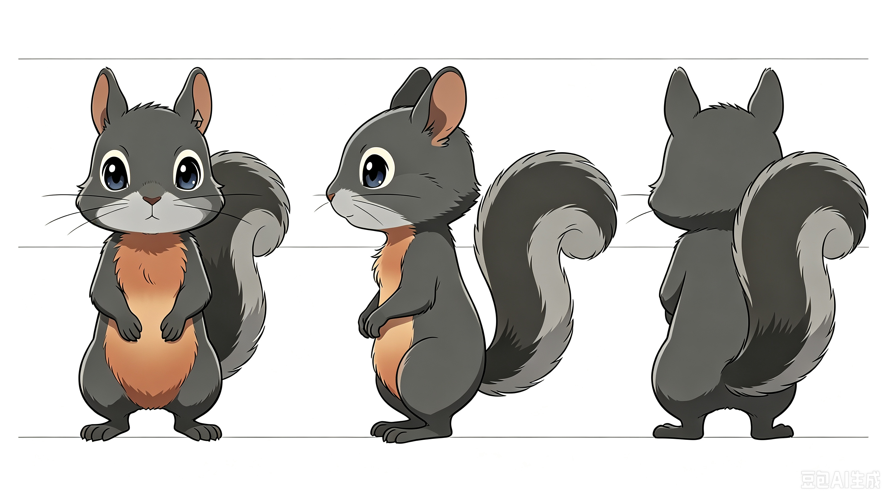
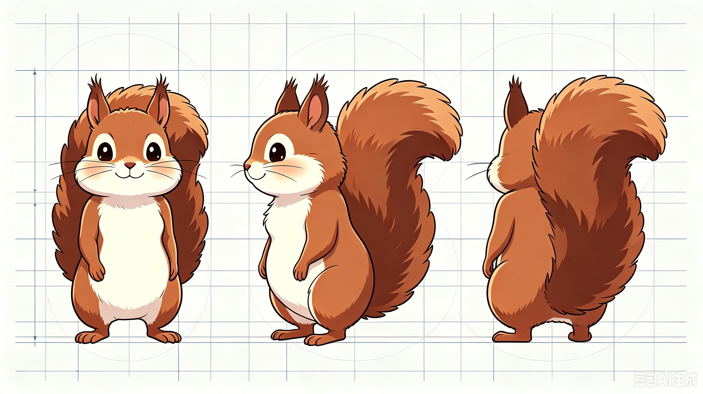

# 视频生成（聪聪的生活）

[[故事原稿](Agent-VideoGen.md#故事原稿)]
[[剧本](Agent-VideoGen.md#剧本拍摄脚本)]
[[分镜](Agent-VideoGen.md#分镜脚本)]
[[角色设定](Agent-VideoGen.md#角色设定)]
[[参考图片或视频](Agent-VideoGen.md#参考图片或视频)]
[[制作](Agent-VideoGen.md#制作)]

## 故事原稿

```
很久很久以前，有一只小松鼠（他的名字叫聪聪），他生来就是个孤儿。他每次饿的时候只能自己去找吃的，有的时候他还会遇到敌人，他只能自己去应对，受伤的时候，也只能等它慢慢好。有的时候，他去采果子，穿过荆棘树林，被扎伤，也只能等它或许会慢慢好。如果是被刺扎伤了，就挤着皮肤，把它挤出来拔掉。

一天，天上乌云密布，下起了大雨。小松鼠无处可躲，只能躲在大树下。他想了想，说：“我是不是能把这棵树，打一个洞，钻进去避雨啊！”于是他爬上树，露出他的两颗大板牙，啃呀啃……掉下来的碎屑掉到了地上，等小松鼠把洞啃完，清理完，他把碎屑搬到洞里，这样就可以做一个地毯。他觉得一直坐在洞里很无聊，他就想去找点吃的。这回他没有受伤，因为没有敌人和荆棘树林。他把吃的放回洞里，他还是觉得很无聊，又做了一些自己发明的东西，放在树洞里。

等他第二次去采果子，回来的时候，他发现树洞里有四只小麻雀，那几只小麻雀冲着小松鼠叫，小松鼠看见了吓得果子都掉了，赶紧跑。于是他跑到另外一棵树旁边，又打洞，铺地毯，采果子，和把自己创造的东西放进去。那个树洞很小，只能容纳一只松鼠，他觉得太小了，他把它扩大了一些，现在能容纳两只松鼠，聪聪现在觉得很不错。于是，他每一天都过着这样的生活。直到一天，他终于发现了一只松鼠，聪聪和那只松鼠成为了好朋友，每天都约好在一个地方一块儿玩。

有一天，他回到树洞，发现里面有一只老鹰，他看着那么可怕的东西，赶紧跑走了。他跑呀跑，他发现了一棵很粗的树，比原来那棵粗很多，于是他又打了一个树洞，铺地毯，采果子，把自己发明的东西放进里面，又过上了之前的生活。

可是有一天，天上突然降下了一道道雷，劈中了小松鼠住的大树，可小松鼠正好在树洞里，他也被劈伤了。聪聪的好朋友及时地跑来，救了聪聪。从此以后，聪聪和那只小松鼠成为了最好的朋友。


刘执口述
刘剑威笔录
二〇二六年七月二十五日 星期六
```

## 剧本（分场）

```
人物小传

每个主要角色的背景、性格、欲望、创伤、人物弧光，包含人物前史，是塑造角色的基础。
```

```
场 1  外 森林 暮

环境动作描述环境动作描述环境动作描述环境动作描述环境动作描述环境动作描

人物名字(O.S.)
(提示)

说话内容说话内容说话内容说话内容

```

## 分镜

## 角色设定



*注：原本对聪聪的设定是“耳朵有伤疤”，但当前AI工具生成的伤口愈合后留下伤疤的效果欠佳。*



## 参考图片或视频

## 制作
