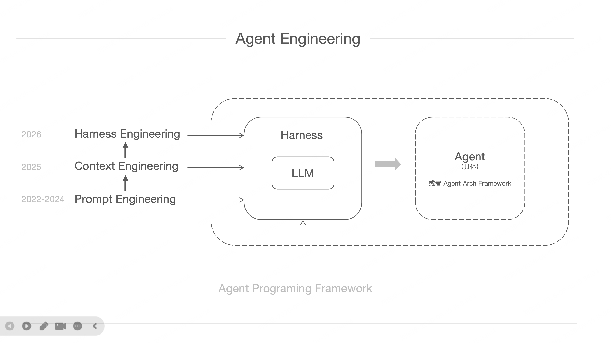
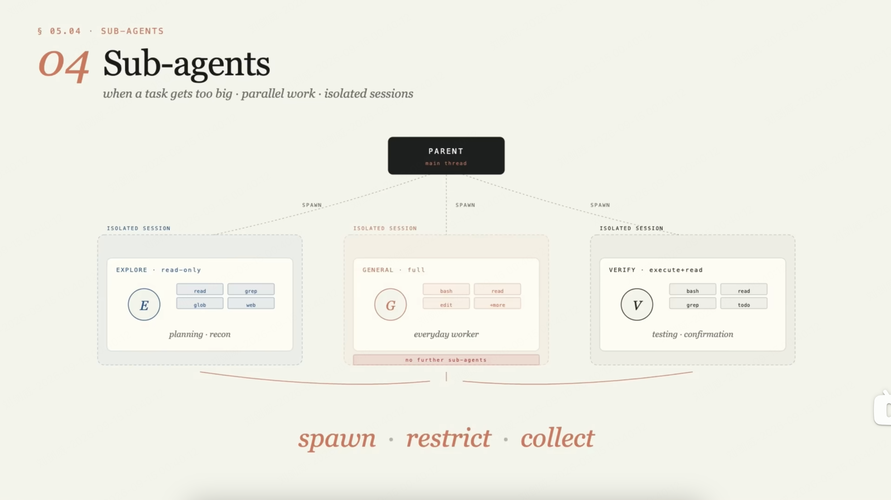
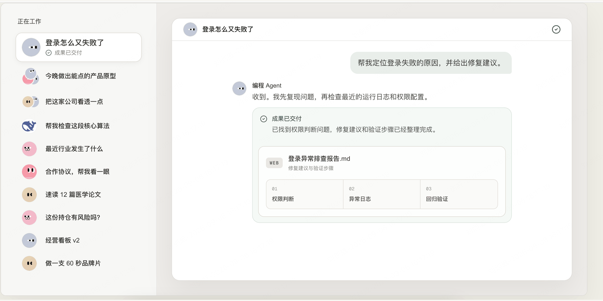
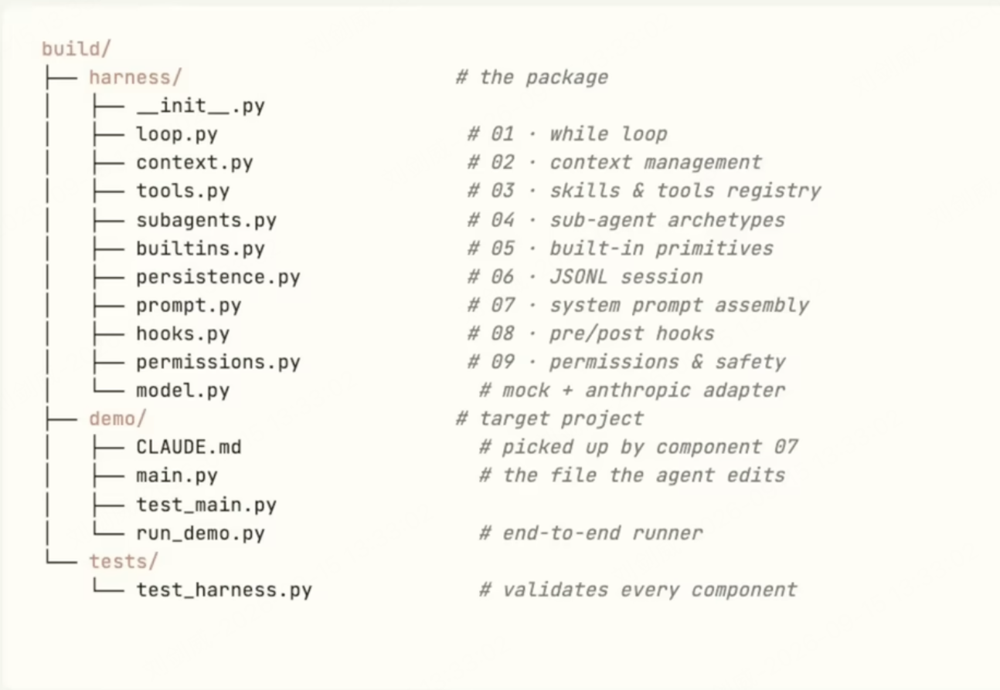

# 大语言模型应用

## 当前有哪些主流大语言模型

| 模型 | 公司 | 国家 | 应用产品 |
| :--- | :--- | :--- | :--- |
| GPT📍 | OpenAI | 美国 | ChatGPT(网页/App)、ChatGPT Work、[Codex](https://openai.com/codex/) |
| Claude📍 | Anthropic | 美国 | Claude(网页/App)、Claude Cowork、Claude Code、[...](llm-anthropic-models-and-agents.png)|
| Grok | SpaceXAI | 美国 | Grok(网页/App)、Cursor |
| Gemini | Google(DeepMind) | 美国 | Gemini(网页/App)、Gemini Omni |
| DeepSeek📍 | 深度求索 | 中国 | DeepSeek(网页/App)、DeepSeek Harness |
| Qwen📍  Wan | 阿里巴巴 | 中国 | 千问(网页/App)、Qoder、千问创作 |
| GLM | 智谱 | 中国(清华) | 智谱清言(网页/App)、ZCode |
| Kimi | 月之暗面 | 中国 | Kimi(网页/App)~~、Kimi Work~~、Kimi Code |
| MiniMax | 稀宇 | 中国 | MiniMax(网页/App)、MiniMax Code、MiniMax Design |
| Seed Seedream Seedance | 字节跳动 | 中国 | 豆包(网页/App)、豆包工作、即梦、剪映 |
| Hy/混元 | 腾讯 | 中国 | 元宝(网页/App)、WorkBuddy、CodeBuddy |

## 当前有哪些主流应用场景

| 场景 | 主要工具 | 样例 |
| :--- | :--- | :--- |
| 问答 - *网页或App交互* 🟢 | ChatGPT📍 DeepSeek📍 千问📍 | [whats_mlflow](../BigData/DataUsePlatforms.md#模型部署预测平台) ChatGPT注册认证 |
| 生成 - *生成文字、图片、视频等* 🟢 | [工具套件](Agent-VideoGen.md#工具选择) | [聪聪的生活](Agent-VideoGen.md) |
| 办公 - *Work Agent* 🟢 | ChatGPT Work Claude Cowork Genspark.ai Perplexity.ai Computer WorkBuddy📍 豆包工作 ~~千问办公~~ ~~百度搭子~~ | 全球AI发展趋势周报 自动操作微信发消息 视频内容总结 图片编辑 [一句话网页](https://htah4ugd.qwenwork.host/) |
| 编程 - *Coding Agent* | Codex Claude Code Cursor [GitHub Copilot](https://docs.github.com/en/copilot/concepts/agents/cloud-agent/about-cloud-agent) | [Jim](https://github.com/liujianuuei/Jim) |
| 智能数据分析¹/智能BI ⏳ | 基于 Agent 技术二次开发 | ⏳ |
| 行业垂直应用 | 基于行业知识二次开发 | NA |
| Invisible AI to Cheat on Conversations | 略 | NA |

## AI Agent (Harness)

智能体（Agent）⁵是**系统化**应用大语言模型决策执行的自主系统，持续进行`执行-感知-规划`循环直至达成目标，其主要目标在于解决复杂场景**多步骤**任务。Agent 是基于大语言模型的**控制流**，能够自主拆解复杂任务，调用（外部）工具，执行多步骤操作，持续推进工作流程。

换句话说，Agent 就是具备 Agency（社会行为者独立选择的能力）的终端工具。有一个很形象的比喻，大语言模型是脑，Agent 是手。

Agent 演化的最终目标，是从“你说任务，我给你执行”，过渡到“你说目标，我给你结果”。

> ...agent designed for longer, multi-step work and finished deliverables. —— https://help.openai.com/en/articles/20001275-chatgpt-work-and-codex

> [What exactly is a harness?](https://www.bilibili.com/video/BV1k1RZBuEBm) —— bilibili

### 主要概念

#### 🛠 Skills (and tools, and registry)

Skills 是**可复用**的**指令集**（下一次还会用到），告诉 Agent 做特定类型任务的标准、执行步骤或方法，也就是固化下来的可复用的能力。

有的产品组合多个 Skills 抽象出一些实体概念⁴，并附带领域知识或偏好指令，本质相同，都是 Skills 在不同维度上的组合应用。

Skills 是在 Agent **全局生效**。

> *With Skills, you can teach Codex your team’s standards, workflows, and ways of working. Codex applies them consistently across tasks, so it can contribute more effectively with less supervision. —— https://openai.com/codex/*

> *Skills are more than reusable instruction sets — they deploy agents. A skill gives Perplexity Computer a methodology for a type of task... ——https://www.perplexity.ai/help-center/en/articles/13914413-how-to-use-computer-skills*

> *Skills are reusable AI tools for specific jobs. ——https://www.genspark.ai/skills*

#### 🎛 Workflows (or Multi-agents?)（附加能力）

Workflows 是一种执行复杂任务的方式，将其拆解为由简单步骤组成的执行流程，从而管控整个任务的执行过程。Workflows 并不是必须的，有的产品可能也不支持 Workflows。Workflows 的每个执行步骤可能用到上面的一个或多个 Skills。

> *Guided flows that turn complex tasks into simple steps. ——https://www.perplexity.ai/computer/workflows*

> *Create Workflow to manage tasks. ——https://www.genspark.ai/workflows*

#### 💾 Memory

记忆是分层的，按照生效范围，从上到下依次为：`账号记忆（一般系统自动提炼）——用户（本地）记忆——工作空间记忆——会话记忆`。

`账号记忆`一般是 Agent 在长期使用过程中记住的关于用户的偏好等信息，用户无法直接操纵修改这部分记忆。账号记忆跨设备。

`用户（本地）记忆`是在 Agent 全局生效的记忆，用户可以操纵修改这部分记忆。

`工作空间记忆`是在工作空间³范围生效的记忆，Agent 自动记住的执行特定任务的指令集或决策记录，以及背景信息等，在工作空间范围内复用。

`会话记忆`是在一次会话中的全部信息（输入输出等）。

对模型本身来说，无所谓记忆，模型是**无状态推理**。记忆是一种**应用概念**，因此不同产品可能在不同层面实现不同的记忆功能。

> Perplexity automatically remembers useful details across conversations. ——https://www.perplexity.ai/computer/memory

> Remembers everything. Thinks with you. ——https://www.genspark.ai/second-brain/home

#### 👤 ~~Multi-agent~~ Sub-agents(-spawning)

~~Multi-agent~~ Sub-agents 是一种工程优化手段。对于复杂任务，最佳实践是建立一个**工作空间**（别忘了，记忆可以在工作空间共享），在工作空间里发起多个 subagent（即所谓AI员工） 进行协作工作，每个 subagent 负责处理任务的一小点。这样避免单一会话上下文爆炸。

另一种应用场景是交叉验证和发散探索。比如，一个 Agent 完成任务后，另一个 Agent 负责检查，两个 Agent 相互对话，从中产生新的想法等。

~~Multi-agent~~ Sub-agents 本质上解决的问题就是拆解任务，简化处理，缩小会话上下文。

#### 🔘 While Loop

Agent 的运行核心就是一个 while loop，执行指导成功或终止。

#### 🔘 Context Management

Agent 具备自动 compact 上下文的能力。

#### 🔘 Extensibility / Lifecycle Hooks

允许通过插件系统或其它方式扩展 Agent 能力。

[DeepSeek Harness](https://github.com/deepseek-ai/deepseek-harness/blob/master/README.zh.md)（dsh）is HERE.

#### 🔘 Permissions & Safety

操作安全性管控。

### 当前主流编程 Agent（用 Agent 开发）

编程 Agent 即 Coding Agent，也称作 Agentic Coding、Code with Agents、AI Coding。

> Copilot can research a repository, create an implementation plan, and make code changes on a branch. You can review the diff, iterate, and create a pull request when you're ready. —— GitHub Copilot

| 编程 Agent | 产品形态 | 使用说明 |
| :--- | :--- | :--- |
| Codex *CLI-Native Coding Agents* | Codex in ChatGPT (Codex mode) (as a desktop app) Codex IDE extension Codex CLI Codex web | [...](https://help.openai.com/en/articles/11369540-using-codex-with-your-chatgpt-plan) [...](https://blog.jetbrains.com/ai/2026/01/codex-in-jetbrains-ides/) |
| Claude Code *CLI-Native Coding Agents* |  | [...](https://zhuanlan.zhihu.com/p/2028268722809316061) |
| Cursor *AI-Native IDE* |  |  |
| [GitHub Copilot](https://docs.github.com/en/copilot/concepts/agents/cloud-agent/about-cloud-agent) *IDE-Integrated AI Editor/Extension* |  |  |
| Trae |  |  |
| Qoder |  |  |
| CodeBuddy |  |  |
| Kimi Code |  |  |
| MiniMax Code |  |  |
| ZCode |  |  |

https://cloud.tencent.com/developer/article/2649106, https://bbs.huaweicloud.com/blogs/484999

#### 科学上网工具

| bing.com 搜索: "科学上网工具²" |
| :--- |
| [西部世界(⌘+↖)](https://fast88sj.com/i/sg045) |
| [北极星(⌘+↖)](https://beijixing.space/) |
| [飞鸟加速(⌘+↖)](https://47.243.132.233:3828/) |
| [v2rayN(⌘+↖)](https://v2rayn.xyz/) |
| [Surfshark(⌘+↖)](https://www.surfsharki.com/) |
| [V2free(⌘+↖)](https://cdn.maxo.top/) |
| [更多...(⌘+↖)](https://v2rayn.xyz/clients/) [...(⌘+↖)](https://github.com/Kagion-Wang/Something) [...(⌘+↖)](https://clashvpns.net/download.html) | 

### 搭建定制化 Agent（以及开发 Agent）

#### Agent Arch Framework⁷

市面上有商业化成品 Agent（办公的、编程的）可以使用，同时我们也可以基于开源项目**自己搭建** Agent（只需要付模型的费用）。

[OpenClaw](https://openclaw.ai/) ⁶是一个开源的大语言模型**执行框架**（智能体框架，Arch Framework）。可以基于 OpenClaw 搭建定制化的 Agent。

[Hermes Agent](https://hermes-agent.nousresearch.com/) 也是一个开源的大语言模型执行框架（智能体框架，Arch Framework）。可以基于 Hermes Agent 搭建定制化的 Agent。

[DeepSeek Harness](https://github.com/deepseek-ai/deepseek-harness/blob/master/README.zh.md)（dsh）是由 DeepSeek AI 开发的开源 Agent Harness（智能体框架，Arch Framework）。

#### Agent Programming Framework

Agent Programming Framework（开发框架）：LangChain、LangGraph、AutoGen、[CrewAI](https://crewai.com.cn/open-source)、LlamaIndex、Dify、Coze。

#### 开发新 Skills

Skills 本身的开发待研究。

--------------------------------------------------------

注释

*⒌ 本文不区分 Agent 和 Agent Harness，一般认为 Agent = Model + Harness，单独的 Harness 概念必要性不是很大。*

*⒈ 业务人员无需掌握 SQL 等技能，只需用自然语言提问（如“上个月销售额为什么下降”），系统即可自动查询数据、生成图表并给出归因分析。*

*⒊ 工作空间（也有产品称作项目、团队、Hub 等）适合需要持续跟踪、分阶段完成的任务，可以跨会话共享背景信息、文件、技能、决策记录等。*

*⒋ 比如专家、专家团、技能包、技能套件等；有的产品也称其为AI员工或 [Agent](https://docs.coze.cn/cozespace_agent_overview#bfae8b36)（其实是 subagent），注意和运行时 [subagent](#-multi-agent) 概念的区别。*

*⒉ 学习科学上网原理，查看[《科学上网完全指南》](https://ihmily.github.io/proxy-guide/)。*

*⒍ 关于 OpenClaw 的定位，部分参考了[这里](https://www.cnblogs.com/ycfenxi/p/20061396)。*

*⒎ 架构框架，也称作运行时框架（Runtime Framework），本质是一个可重组的底层运行时。*
