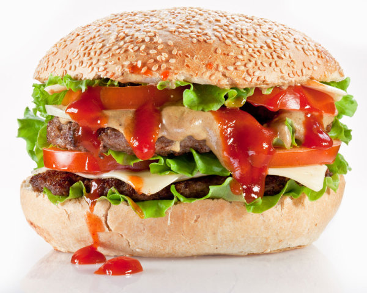

# 设计模式之装饰者模式

## 什么是装饰者模式

所谓装饰者模式，就是**动态继承**——通过组合的方式，动态地（或叫运行时）将责任附加到对象上，从而达到扩展功能的目的。装饰者模式在现实生活中的一种应用就是制作汉堡包：

我们就来分析下制作汉堡包的诀窍。首先，我们需要的是一个汉堡包，这是根本前提，不要小看这个看似平常的条件，它告诉我们我们做出来的不能是匹萨也不能是包子；其次，只要你愿意，你可以往两片面包里夹任何东西，无论是奶酪还是蔬菜，也可以用任何东西包裹面包片。那么，匹萨和汉堡包的区别在哪儿？匹萨是覆盖东西到面饼上，是一种**累加**，而汉堡包是**迭代**（上下一层层对称迭代）；那么包子和汉堡包的区别在哪儿？包子也是嵌套，可以看成馅料和面皮的嵌套，但是不能反过来，馅料不能位于面皮的外面。

对应到程序，我们来看下装饰者模式的精髓。
