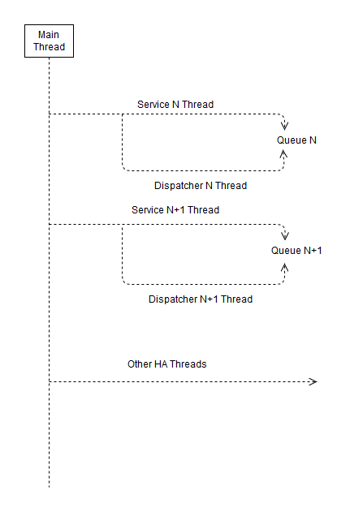
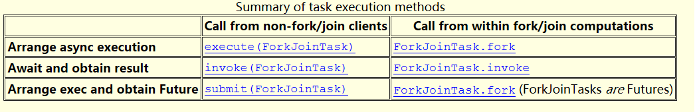

# 并发

## 线程的生命周期

线程的生命周期会经历哪些阶段呢？新建的线程处于New状态，start之后处于Runnable状态，执行完毕处于Terminated状态。其中Runnable状态又在Ready和真正Running之间转换。如果线程被调用了sleep、wait或者join，则进入Waiting状态，如果等待对象锁则会进入Blocked状态。如下图所示：


### 启动线程

有两种方法启动线程：

+ 创建Thread类的实例（需要传入实现Runnable接口的类），然后调用其`start()`方法。
+ 创建继承自Thread类的实例，然后调用其`start()`方法。

启动之后，线程的`run()`方法会被自动调用，执行逻辑代码，我们不能显式调用`run()`方法。

### 线程休眠

我们可以调用`sleep()`方法来让线程进入休眠状态，除非被中断（interrupt），否则直到休眠时间结束，线程继续执行。休眠的线程并不会释放ownership of monitor。

### 等待对象锁

我们可以调用`wait()`使一个线程进入等待状态，并释放ownership of monitor，直到收到其他线程的通知（notify）或者到了timeout时间，该线程恢复执行，除非被中断。

> The current thread must own this object's monitor. The thread releases ownership of this monitor and waits until another thread notifies threads waiting on this object's monitor to wake up either through a call to the notify method or the notifyAll method. The thread then waits until it can re-obtain ownership of the monitor and resumes execution.

### 线程串行化

线程是并行执行的，但我们可以通过`join()`方法，让线程串行化执行，也就是直到被调用join方法的线程执行结束，才继续执行当前线程。

另外，`CountDownLatch` 也可以达到同样的效果：

**CountDownLatch**

```Java
package tech.liujianwei;

import java.util.concurrent.CountDownLatch;

public class CountDownLatchTest implements Runnable {

    private CountDownLatch latch;

    public CountDownLatchTest(CountDownLatch latch) {
        this.latch = latch;
    }

    @Override
    public void run() {
        this.latch.countDown();
        System.out.println(Thread.currentThread().getName() + " executed");
    }

    public static void main(String[] args) throws InterruptedException {
        CountDownLatch latch = new CountDownLatch(3);
        CountDownLatchTest t = new CountDownLatchTest(latch);

        new Thread(t).start();
        new Thread(t).start();
        new Thread(t).start();

        latch.await();
        System.out.println(Thread.currentThread().getName() + " DONE");
    }
}
```

**CyclicBarrier**

```Java
package tech.liujianwei;

import java.util.concurrent.BrokenBarrierException;
import java.util.concurrent.CyclicBarrier;

public class CyclicBarrierTest implements Runnable {

    private CyclicBarrier barrier;

    public CyclicBarrierTest(CyclicBarrier barrier) {
        this.barrier = barrier;
    }

    @Override
    public void run() {
        System.out.println(Thread.currentThread().getName() + " ready");
        try {
            this.barrier.await();
        } catch (BrokenBarrierException | InterruptedException e) {
            //
        }
        System.out.println(Thread.currentThread().getName() + " executed");
    }

    public static void main(String[] args) throws InterruptedException {
        CyclicBarrier barrier = new CyclicBarrier(3);
        CyclicBarrierTest t = new CyclicBarrierTest(barrier);

        new Thread(t).start();
        new Thread(t).start();
        new Thread(t).start();

        System.out.println(Thread.currentThread().getName() + " DONE");
    }
}
```

### 让步执行

有时候我们并不需要线程完全串行（等待某线程执行结束），也不能完全并行执行，而是在有限时间内交替执行，则就会用到`yield()`方法。yield的正确意思是让步，被让的线程可能执行也可能没有执行，根据调度让步线程可能仍然接着执行。

### 中断线程

当一个线程正在执行，或正在sleep、wait及join的时候，可以调用`interrupt()`方法中断该线程的当前状态，抛出`InterruptedException`，这是唯一从外部**停止**线程的方法。

> Unless the current thread is interrupting itself, which is always permitted, the checkAccess method of this thread is invoked, which may cause a SecurityException to be thrown.

> If this thread is blocked in an invocation of the wait(), wait(long), or wait(long, int) methods of the Object class, or of the join(), join(long), join(long, int), sleep(long), or sleep(long, int), methods of this class, then its interrupt status will be cleared and it will receive an InterruptedException.

> If this thread is blocked in an I/O operation upon an InterruptibleChannel then the channel will be closed, the thread's interrupt status will be set, and the thread will receive a ClosedByInterruptException.

> If this thread is blocked in a Selector then the thread's interrupt status will be set and it will return immediately from the selection operation, possibly with a non-zero value, just as if the selector's wakeup method were invoked.

> If none of the previous conditions hold then this thread's interrupt status will be set. 

### 结束线程

有三种方法可以安全的结束一个还在运行的线程：

+ `run()`方法执行完毕，自动结束。
+ 通过标识符（在`run()`的外面设定标识符，在`run()`的里面判断标识符）来指定线程结束，适用于循环执行某一操作的线程。
+ 通过`interrupt()`方法中断正在执行的线程，适用于所有线程。

### 守护（Daemon）线程

Java中存在两种线程：用户（user-thread）线程和守护线程。所谓的守护线程，是指用户程序在运行的时候后台提供的一种通用服务的线程。这类线程并不是用户线程不可或缺的部分，只是用于提供服务的**服务线程**。我们来看JDK官方文档有关Thread的说明：

> When a Java Virtual Machine starts up, there is usually a single non-daemon thread (which typically calls the method named main of some designated class). The Java Virtual Machine continues to execute threads until either of the following occurs:

> + The exit method of class Runtime has been called and the security manager has permitted the exit operation to take place.
> + All threads that are not daemon threads have died, either by returning from the call to the run method or by throwing an exception that propagates beyond the run method.

那么如何设置一个线程是守护线程呢？线程本身的`setDaemon(boolean)`方法可以设置该线程为守护线程还是用户线程。当所有的在运行的线程都是守护线程的时候，JVM就会退出。

## 线程池

线程也有“池”技术，其实任何一般性的资源敏感的对象都可以“池”化。具体来说，线程池的好处是：

1. 重用存在的线程，减少对象创建、消亡的开销，性能更佳。
2. 可有效控制最大并发线程数，提高系统资源的使用率，同时避免过多资源竞争，避免堵塞。
3. 提供定时执行，定期执行，单线程，并发数控制等功能。

Java 原生支持线程池技术。我们可以用 `java.util.concurrent.Executors` 创建不同类型的线程池。线程池有如下几个重要概念：

**corePoolSize**

线程池维护的核心线程数。在创建了线程池后，默认情况下，线程池中并没有任何线程，而是等待有任务到来才创建线程去执行任务。等按照需要创建了 corePoolSize 个线程之后，这些数量的线程即使闲置，也不会被线程池收回。这时就是线程池维护的最小线程数了。当线程池中的线程数目达到 corePoolSize 后，就会把到达的任务放到缓存队列当中。corePoolSize 针对 FixedThreadPool、ScheduledThreadPool 有意义。

**maximumPoolSize**

线程池维护的最大线程数，它表示在线程池中最多能创建多少个线程。

**keepAliveTime**

当线程池中的线程数量大于 corePoolSize，多出那部分数量的线程空闲 keepAliveTime 后会被收回。

**unit**

参数keepAliveTime的时间单位，有7种取值，在TimeUnit类中有7种静态属性：
- TimeUnit.DAYS;               //天
- TimeUnit.HOURS;             //小时
- TimeUnit.MINUTES;           //分钟
- TimeUnit.SECONDS;           //秒
- TimeUnit.MILLISECONDS;      //毫秒
- TimeUnit.MICROSECONDS;      //微妙
- TimeUnit.NANOSECONDS;       //纳秒

**workQueue**

一个阻塞队列，用来缓存等待执行的任务，阻塞队列有以下几种选择：
- ArrayBlockingQueue;
- LinkedBlockingQueue;
- SynchronousQueue;
- PriorityBlockingQueue

**threadFactory**

线程工厂，主要用来创建线程。

**handler**

表示当拒绝处理任务时的策略，有以下四种取值：
- ThreadPoolExecutor.AbortPolicy:丢弃任务并抛出RejectedExecutionException异常。
- ThreadPoolExecutor.DiscardPolicy：也是丢弃任务，但是不抛出异常。
- ThreadPoolExecutor.DiscardOldestPolicy：丢弃队列最前面的任务，然后重新尝试执行任务（重复此过程）
- ThreadPoolExecutor.CallerRunsPolicy：由调用线程处理该任务

## 一些例子

一个通过非线程安全的队列，实现的生产者-消费者模式：

```Java
package tech.liujianwei;

import java.util.LinkedList;
import java.util.Queue;
import java.util.concurrent.TimeUnit;

public class MyQueue<E> {
    private Queue<E> queue;

    public MyQueue() {
        this.queue = new LinkedList<E>();
    }

    public void offer(E e) {
        synchronized (queue) {
            this.queue.offer(e);
            this.queue.notify();
        }
    }

    public E poll() {
        synchronized (queue) {
            if (this.queue.isEmpty()) {
                try {
                    System.out.println(Thread.currentThread().getName() + ": waiting for new element...");
                    queue.wait();
                } catch (InterruptedException e) {
                    //
                }
            }
            E element = this.queue.poll();
            System.out.println(Thread.currentThread().getName() + ": got new element " + element);
            return element;
        }
    }

    public static void main(String[] args) {
        MyQueue<String> q = new MyQueue();
        new Thread(() -> {
            while (true) {
                q.poll();
            }
        }).start();

        new Thread(() -> {
            while (true) {
                q.poll();
            }
        }).start();

        new Thread(() -> {
            while (true) {
                q.offer("TA" + System.currentTimeMillis());
                try{TimeUnit.SECONDS.sleep(1);}catch (InterruptedException e){}
            }
        }).start();

        new Thread(() -> {
            while (true) {
                q.offer("TB" + System.currentTimeMillis());
                try{TimeUnit.SECONDS.sleep(1);}catch (InterruptedException e){}
            }
        }).start();
    }
}
```

```Java
package tech.liujianwei;

import tech.liujianwei.MarketDataService;

import java.util.LinkedList;
import java.util.Queue;

public class QueueWorker implements Runnable {

    private MarketDataService service;
    private boolean stopped = false;
    private Queue<byte[]> queue;

    public QueueWorker(MarketDataService service) {
        super();
        this.service = service;
        this.queue = new LinkedList<byte[]>();
    }

    public void run() {
        byte[] content = null;
        while (!stopped) {
            while (content == null) {
                synchronized (queue) {
                    if (queue.isEmpty()) {
                        try {
                            queue.wait(500);
                            if(!queue.isEmpty()) {
                                content = queue.remove();
                            }
                        } catch (InterruptedException e) {
                            continue;
                        }
                    }
                }
            }
            service.parseData(content);
            content = null;
        }
    }

    public void addAndNotify(byte[] content) {
        synchronized (queue) {
            queue.add(content);
            queue.notify();
        }
    }

    public boolean isStopped() {
        return stopped;
    }

    public void setStopped(boolean stopped) {
        this.stopped = stopped;
    }
}
```

一个通过线程安全的队列，实现的生产者-消费者模式：

```Java
package tech.liujianwei.client;

import org.apache.mina.common.IoSession;
import org.apache.mina.handler.demux.MessageHandler;
import tech.liujianwei.model.PlzHpMsg;
import tech.liujianwei.model.AbstractPlzMsg;
import tech.liujianwei.client.processors.PlzMsgHpProcessor;

import java.util.concurrent.ArrayBlockingQueue;
import java.util.concurrent.TimeUnit;

public class PlzMessageHandler implements MessageHandler<AbstractPlzMsg> {

    private ArrayBlockingQueue<AbstractPlzMsg> queue;
    private MessageDispatcher dispatcher;
    private volatile boolean stopped = false;

    public PlzMessageHandler() {
        dispatcher = new MessageDispatcher();
        queue = new ArrayBlockingQueue<>(2000);
    }

    @Override
    public void messageReceived(IoSession ioSession, AbstractPlzMsg plzMessage) {
        try {
            if (stopped) {
                return;
            }
            queue.offer(plzMessage, 50L, TimeUnit.MILLISECONDS);
        } catch (Exception e) {
            //
        }
    }

    private void messageDispatched(AbstractPlzMsg message) {
        if (message instanceof PlzHpMsg) {
            new PlzMsgHpProcessor().process(message);
        } else {
            //
        }
    }

    private class MessageDispatcher extends Thread {
        private AbstractPlzMsg message;

        @Override
        public void run() {
            while (!stopped && !isInterrupted()) {
                try {
                    while ((message = queue.poll(50L, TimeUnit.MILLISECONDS)) == null) {
                        if (stopped) {
                            return;
                        }
                    }
                    messageDispatched(message);
                } catch (InterruptedException e) {
                    break;
                }
            }
        }
    }

    public void start() {
        dispatcher.start();
        stopped = false;
    }

    public void stop() {
        try {
            stopped = true;
            dispatcher.join();
        } catch (Exception e) {
            //
        }
    }
}
```

上述项目的线程模型，用图表示出来就是这样：




\#Todo#：writeObject同步，序列化同步。。《Effective Java》P764
https://dzone.com/refcardz/core-java-concurrency
http://ifeve.com/

## Thread Local

http://www.ibm.com/developerworks/cn/java/j-lo-jta

## 线程安全状态机

PH

## 并行

这一主题我们来探讨 Java 对并行的支持。要提高应用程序（任务）的执行效率，一种方案就是使用多线程，让更多的任务同时处理，或者让一部分操作异步执行，即并发（Concurrency），另外一种方案就是把一个任务拆分为多个单元，每个单元分别执行最后合并每个单元的结果，即并行（Parallelism）。

并发的限制在于，同时处理的任务之间不能有直接依赖关系，而且并发并不是真正的同时执行多个任务，而是 JVM 在不同任务之间快速切换。并行依靠多处理器同时处理多个任务，最后把结果合并返回，并行是真正的同时执行多个任务。并发和并行的区别就是一个处理器同时处理多个任务和多个处理器或者是多核的处理器同时处理多个任务。前者是逻辑上的同时发生，而后者是物理上的同时发生。

### Fork/Join

Fork/Join 就是 Java 提供的并行框架。其核心就是 `ForkJoinPool` 和 `ForkJoinTask` 两个概念，ForkJoinPool 负责执行 ForkJoinTask。ForkJoinTask 可以拆分成更小的子任务，分别执行最后汇总结果。如下图示：


Java [文档](http://docs.oracle.com/javase/tutorial/essential/concurrency/forkjoin.html)给我们总结了一个代码结构模板：

```Java
if (my portion of the work is small enough)
    do the work directly
else
    split my work into two pieces
    invoke the two pieces and wait for the results
```

我们可以套用这个模板来构造自己的代码。我们以求和计算为例，代码如下：

```Java
ForkJoinPool pool = new ForkJoinPool(Runtime.getRuntime().availableProcessors()); // ForkJoinPool.commonPool();
pool.invoke(new SumTask(0, 10000));

// shutdown pool
pool.shutdown();
pool.awaitTermination(100, TimeUnit.SECONDS);
pool.isTerminated();
//pool().awaitQuiescence(100, TimeUnit.SECONDS);
```

```Java
public class SumTask extends RecursiveTask<Integer> { // 如果不需要返回值，则可以用 RecursiveAction。

    private static final int THRESHOLD = 100;

    private int start;
    private int end;

    public SumTask(int start, int end) {
        this.start = start;
        this.end = end;
    }

    @Override
    protected Integer compute() {
        int sum = 0;
        if ((end - start) < THRESHOLD) {
            for (int i = start; i <= end; i++) {
                sum += i;
            }
        } else {
            int middle = (start + end) / 2;
            SomeTask left = new SumTask(start, middle); // 拆分成子任务
            SomeTask right = new SumTask(middle + 1, end); // 拆分成子任务
            left.fork(); // 执行子任务
            right.fork(); // 执行子任务
            sum = left.join() + right.join(); // 等待子任务执行完毕，计算结果并返回；如果不需要返回值则可以不等待。
        }
        return sum;
    }

}
```

**注意**：目录 {JAVA_HOME}/sample/forkjoin 包含了 Fork/Join 框架的演示程序。

ForkJoinPool 一共有三种执行任务的方法，列出如下（来自于官方文档）：



另外需要说明的是，ForkJoinPool 内部维护着足够多的工作者线程，来处理提交的任务，而这些线程根据处理器的数目（parallelism level）并行也就是真正的同时工作着。

